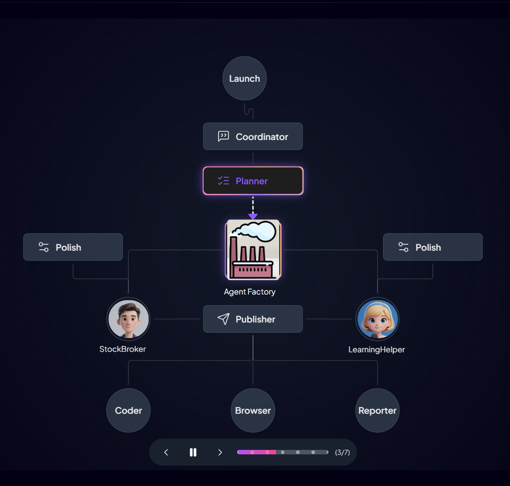

# cooragent

[](https://www.python.org/downloads/)
[](./assets/wechat_community.jpg)
[](https://github.com/LeapLabTHU/Cooragent/stargazers)

[English](./README.md) | [简体中文](./README_zh.md)

# What is Cooragent

Cooragent is an AI agent collaboration community. In this community, you can create powerful agents with a single sentence and collaborate with other agents to complete complex tasks. Agents can be freely combined, creating infinite possibilities. At the same time, you can also publish your agents to the community and share them with others.

# Core Philosophy of Cooragent
When building and refining agents becomes simple enough, the true AGI era will arrive.
The core goals of Cooragent are: helping users quickly build agents, quickly build workflows, and quickly refine workflows.

<h5 align="center">
<video src="https://github.com/user-attachments/assets/9af611e3-aed6-4a2f-8663-428a7707fe8d" width="70%" alt="introduce cooragent" controls></video>
</h5>

# Auto-Create Agents, Unlock Infinite Possibilities
Cooragent has two task modes: **Agent Factory** and **Agent Workflow**.
- In **Agent Factory** mode, you only need to describe the agent, and Cooragent will generate an agent based on your needs. In Agent Factory mode, the system automatically analyzes user needs, deeply understands the user through memory and expansion, and saves the complicated Prompt design. The Planner will select appropriate tools, automatically polish the Prompt, and gradually complete the agent construction based on a deep understanding of user needs. After the agent is constructed, it can be put into use immediately, but you can still edit the agent to optimize its behavior and functions.
- In **Agent Workflow** mode, you only need to describe the target task you want to complete, and Cooragent will automatically analyze the task requirements and select suitable agents for collaboration. The Planner combines agents based on their areas of expertise, plans task steps and completion order, and then hands them over to the task distribution node publish to release tasks. Each agent receives its own tasks and collaborates to complete them.
Cooragent can continuously evolve in both modes, thereby creating infinite possibilities.

# Efficiently Build Workflows
Streamlining workflow construction is crucial for leveraging Agents effectively in production environments. Traditional methods rely heavily on developer expertise, making tool selection, prompt engineering, and architectural decisions time-consuming and labor-intensive. Cooragent introduces an innovative approach with three distinct workflow modes: Launch, Polish, and Production.

-   **Launch Mode**: Users simply outline their desired task. Cooragent then automatically analyzes requirements, selects appropriate Agents, and constructs a complete workflow. Upon task completion, the workflow is saved locally (typically in `store/workflow`) for future reuse and modification. In the CLI tool, users can start Launch mode using the `run-l` command.
-   **Polish Mode**: This mode offers granular control. Users can manually refine workflow execution order, Agent tool selection, LLM configurations, and associated prompts. Alternatively, natural language commands can direct Cooragent to make specific adjustments. For instance, a user might instruct: "Refine the stock analysis Agent: replace the browser tool with Tavily for faster information retrieval." Cooragent, leveraging frameworks such as [APE](https://arxiv.org/abs/2211.01910) and [Absolute-Zero-Reasoner](https://andrewzh112.github.io/absolute-zero-reasoner/), will then autonomously adjust the Agent's prompts, tools, and other operational parameters. In the CLI tool, users can start Polish mode using the `run-o` command.
-   **Production Mode**: In this mode, Cooragent executes the fine-tuned workflow with maximal efficiency, minimizing operational overhead. A Supervisor module is employed to ensure output reliability and handle exceptions. In the CLI tool, users can start Production mode using the `run-p` command.

**Best Practices**: 
- Launch mode is used for automated rapid construction of runnable workflows
- Polish mode is used for fine-tuning and optimization of workflows
- Production mode is used for production scenarios, pursuing stable operation


<div align="center" style="display: flex; gap: 20px;">
    
</div>

# Quick Installation

1. Installation using conda
```bash
git clone https://github.com/LeapLabTHU/cooragent.git
cd cooragent

conda create -n cooragent python=3.12
conda activate cooragent

pip install -e .

# Optional: If you need to use the browser tool
playwright install

# Configure environment
cp .env.example .env
# Edit .env file and fill in your API keys

python cli.py
```

2. Installation using venv
```bash
git clone https://github.com/LeapLabTHU/cooragent.git
cd cooragent

uv python install 3.12
uv venv --python 3.12

source .venv/bin/activate   # For Windows: .venv\Scripts\activate

uv sync

# Optional: If you need to use the browser tool
playwright install

# Configure environment
cp .env.example .env
# Edit .env file and fill in your API keys

# Run the project
uv run cli.py 
```
**Note**: If running the project's CLI tool on Windows, besides the steps above, you also need to install additional dependencies. For details, please refer to [Windows Platform Support](./docs/QA.md).

## Configuration

Create a `.env` file in the project root directory and configure the following environment variables:

```bash
# Note: The Browse tool has a long wait time and is disabled by default. It can be enabled by setting: `USE_BROWSER=True`
cp .env.example .env
```

# CLI Tools
Cooragent provides a series of developer tools to help developers quickly build agents. Through the CLI tools, developers can quickly create, edit, and delete agents. The CLI is designed for efficiency and ease of use, significantly reducing the tediousness of manual operations and allowing developers to focus more on the design and optimization of the agents themselves.

## Create an Agent with a Single Command using the CLI Tool
Enter the cooragent command tool interface
```
python cli.py
```
<p align="center">

</p>

## Create a Xiaomi stock analysis agent with a single command
```
run-l -t agent_workflow -u test -m 'Create a stock analysis expert agent to analyze the Xiaomi stock trend, today is 22 April, 2025, look over the past month, analyze the big news about Xiaomi, then predict the stock price trend for the next trading day, and provide buy or sell recommendations.'
```

## Polish an Agentic Workflow
```
run-o -u <user-id>
```

## Run an Agentic Workflow in Production Mode
```
run-p -u <user-id> -w <workflow-id> -m <message>
```

## List Agents
```
list-agents -u <user-id> -m <regex>
```

## Remove an Agent
```
remove-agent -n <agent_name> -u <user-id>
```

## Use a Group of Agents to Collaboratively Complete Complex Tasks
```
run-l -t agent_workflow -u test -m 'Use the task planning agent, web crawler agent, code execution agent, browser operation agent, report writing agent, and file operation agent to plan a trip to Yunnan for the May Day holiday in 2025. First, run the web crawler agent to fetch information about Yunnan tourist attractions, use the browser operation agent to browse the attraction information and select the top 10 most worthwhile attractions. Then, plan a 5-day itinerary, use the report writing agent to generate a travel report, and finally use the file operation agent to save the report as a PDF file.'
```

## Integrate MCP Services (like Claude Desktop)

Enhance your Agents by integrating external services and tools via the Model Context Protocol (MCP). This is similar to how desktop AI assistants like Claude Desktop manage external functionalities.

**Configuration:**

1.  **Locate/Create Config File**:
    Find or create `config/mcp.json` in your project root.

    ```bash
    cd ./config
    cp mcp.json.example mcp.json
    ```

2.  **Add MCP Services**:
    Define your MCP services in this JSON file. Each service has a unique key and a configuration object.

    Example (`config/mcp.json`):
    ```json
    {
        "mcpServers": {
          "aws-kb-retrieval": {
            "command": "npx",
            "args": ["-y", "@modelcontextprotocol/server-aws-kb-retrieval"],
            "env": {
              "AWS_ACCESS_KEY_ID": "YOUR_ACCESS_KEY_HERE",
              "AWS_SECRET_ACCESS_KEY": "YOUR_SECRET_ACCESS_KEY_HERE",
              "AWS_REGION": "YOUR_AWS_REGION_HERE"
            }
          },
          "AMAP": {
            "url": "https://mcp.amap.com/sse",
            "env": {
              "AMAP_MAPS_API_KEY": "AMAP_MAPS_API_KEY"
            }
          }
        }
    }
    ```


**How it Works:**

Once configured, Cooragent registers these MCP services as available tools. Agents can then select and use these tools during task planning and execution, enabling more complex functionalities.
After configuration of AMAP mcpServers (GaoDe Map) as the example, you may be able to run the case below: 
```
Create a navigation agent that focuses on navigation and uses map-related tools to plan the route from Beijing West Railway Station to the Forbidden City.
```

## Documentation & Support
- [Frequently Asked Questions (FAQ)](./docs/QA.md)
- [Business Support Plan](./docs/business_support.md)


## Contribution

We welcome contributions of all forms! Whether it's fixing typos, improving documentation, or adding new features, your help will be greatly appreciated. Please check out our [contribution guidelines](CONTRIBUTING.md) to learn how to get started.

## Community Group
Join our group on wechat and share your experience with other developers!

<div align="center" style="display: flex; gap: 20px;">
    
</div>

## Citation

Core contributors: Zheng Wang, Shenzhi Wang, Yue Wu, Shiji Song, Gao Huang

```
@misc{wang2025cooragent,
  title        = {Cooragent: An AI Agent Collaboration Community},
  author       = {Zheng Wang, Shenzhi Wang, Yue Wu, Shiji Song, Gao Huang},
  howpublished = {\url{https://github.com/LeapLabTHU/cooragent}},
  year         = {2025}
}
```

## Star History


## Acknowledgments
Special thanks to all the open-source projects and contributors that made cooragent possible. We stand on the shoulders of giants.
