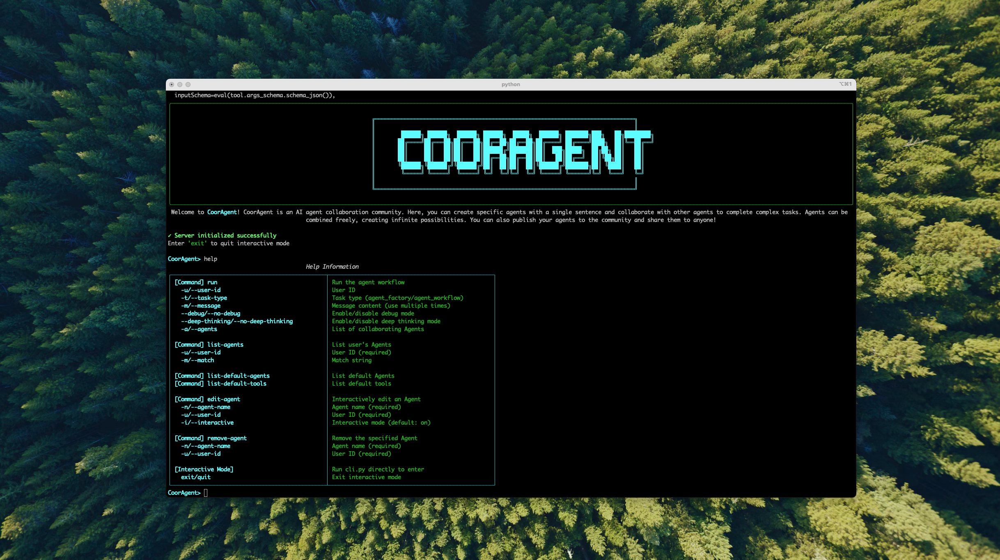

# cooragent

[](https://www.python.org/downloads/)
[](https://opensource.org/licenses/MIT)
[](./assets/wechat_community.jpg)

[English](./README.md) | [简体中文](./README_zh.md)

# What is Cooragent

Cooragent is an AI agent collaboration community. In this community, you can create powerful agents with a single sentence and collaborate with other agents to complete complex tasks. Agents can be freely combined, creating infinite possibilities. At the same time, you can also publish your agents to the community and share them with others.


<h5 align="center">
<video src="https://github.com/user-attachments/assets/9af611e3-aed6-4a2f-8663-428a7707fe8d" width="70%" alt="introduce cooragent" controls></video>
</h5>

# Infinite Possibilities
Cooragent has two working mode : **Agent Factory** and **Agent Workflow**.
- **Agent Factory** : You only need to describe the agent, and Cooragent will generate an agent based on your needs. In Agent Factory mode, the system automatically analyzes user requirements and gains a deep understanding of the user through memory and expansion, eliminating the need for complex Prompt design. Based on a deep understanding of user needs, the Planner selects appropriate tools, automatically refines the Prompt, and gradually completes the agent construction. After construction, the agent can be used immediately, but you can still edit it to optimize its behavior and functionality.
- **Agent Workflow** : You only need to describe the target task you want to complete, and Cooragent will automatically analyze the task requirements and select suitable agents for collaboration. The Planner combines agents based on their areas of expertise, plans the task steps and completion order, and then hands over the task to the task distribution node 'publish' for task release. Each agent receives its own task and collaborates to complete it.
Cooragent can continuously evolve in these two modes, thus creating infinite possibilities.

# Quick Installation

1. Installation using conda
```bash
git clone https://github.com/LeapLabTHU/cooragent.git
cd cooragent

conda create -n cooragent python=3.12
conda activate cooragent

pip install -e .

# Optional: If you need to use the browser tool
playwright install

# Configure environment
cp .env.example .env
# Edit .env file and fill in your API keys

python cli.py
```

2. Installation using venv
```bash
git clone https://github.com/LeapLabTHU/cooragent.git
cd cooragent

uv python install 3.12
uv venv --python 3.12

source .venv/bin/activate   # For Windows: .venv\Scripts\activate

uv sync

# Optional: If you need to use the browser tool
playwright install

# Configure environment
cp .env.example .env
# Edit .env file and fill in your API keys

# Run the project
uv run cli.py 
```
**Note**: If running the project's CLI tool on Windows, besides the steps above, you also need to install additional dependencies. For details, please refer to [Windows Platform Support](./docs/QA.md).

## Configuration

Create a `.env` file in the project root directory and configure the following environment variables:

```bash
# Note: The Browse tool has a long wait time and is disabled by default. It can be enabled by setting: `USE_BROWSER=True`
.
cp .env.example .env
```

## What Makes Cooragent Different

## Feature Comparison
<table style="width: 100%;">
  <tr>
    <th align="center">Feature</th>
    <th align="center">cooragent</th>
    <th align="center">open-manus</th>
    <th align="center">langmanus</th>
    <th align="center">OpenAI Assistant Operator</th>
  </tr>
  <tr>
    <td align="center">Implementation Principle</td>
    <td align="center">Collaboration between different Agents based on autonomous Agent creation to complete complex functions</td>
    <td align="center">Implementation of complex functions based on tool calls</td>
    <td align="center">Implementation of complex functions based on tool calls</td>
    <td align="center">Implementation of complex functions based on tool calls</td>
  </tr>
  <tr>
    <td align="center">Supported LLMs</td>
    <td align="center">Diverse</td>
    <td align="center">Diverse</td>
    <td align="center">Diverse</td>
    <td align="center">OpenAI only</td>
  </tr>
  <tr>
    <td align="center">MCP Support</td>
    <td align="center">✅</td>
    <td align="center">❌</td>
    <td align="center">❌</td>
    <td align="center">✅</td>
  </tr>
  <tr>
    <td align="center">Agent Collaboration</td>
    <td align="center">✅</td>
    <td align="center">❌</td>
    <td align="center">✅</td>
    <td align="center">✅</td>
  </tr>
  <tr>
    <td align="center">Multi-Agent Runtime Support</td>
    <td align="center">✅</td>
    <td align="center">❌</td>
    <td align="center">❌</td>
    <td align="center">❌</td>
  </tr>
  <tr>
    <td align="center">Observability</td>
    <td align="center">✅</td>
    <td align="center">✅</td>
    <td align="center">❌</td>
    <td align="center">❌</td>
  </tr>
  <tr>
    <td align="center">Local Deployment</td>
    <td align="center">✅</td>
    <td align="center">✅</td>
    <td align="center">✅</td>
    <td align="center">❌</td>
  </tr>
</table>

# CLI Tools
Cooragent provides a series of developer tools to help developers quickly build agents. Through the CLI tools, developers can quickly create, edit, and delete agents. The CLI is designed for efficiency and ease of use, significantly reducing the tediousness of manual operations and allowing developers to focus more on the design and optimization of the agents themselves.

## Create an Agent with a Single Command using the CLI Tool
Enter the cooragent command tool interface
```
python cli.py
```
<p align="center">

</p>

Create a Xiaomi stock analysis agent with a single command
```
run -t agent_factory -u test -m 'Create a stock analysis expert agent to analyze the Xiaomi stock trend, today is 22 April, 2025, look over the past month, analyze the big news about Xiaomi, then predict the stock price trend for the next trading day, and provide buy or sell recommendations.'
```

## Edit an Agent
```
edit-agent -n <agent_name> -i
```
## List Agents
```
list-agents -u <user-id> -m <regex>
```
## Remove an Agent
```
remove-agent -n <agent_name> -u <user-id>
```

## Use a Group of Agents to Collaboratively Complete Complex Tasks
```
run -t agent_workflow -u test -m 'Use the task planning agent, web crawler agent, code execution agent, browser operation agent, report writing agent, and file operation agent to plan a trip to Yunnan for the May Day holiday in 2025. First, run the web crawler agent to fetch information about Yunnan tourist attractions, use the browser operation agent to browse the attraction information and select the top 10 most worthwhile attractions. Then, plan a 5-day itinerary, use the report writing agent to generate a travel report, and finally use the file operation agent to save the report as a PDF file.'
```

## Create an Agent via MCP
```python
server_params = StdioServerParameters(
    command="python",
    args=[str(get_project_root()) + "/src/mcp/excel_mcp/server.py"]
)

async def excel_agent():
    async with stdio_client(server_params) as (read, write):
        async with ClientSession(read, write) as session:
            # Initialize the connection
            await session.initialize()
            # Get tools
            tools = await load_mcp_tools(session)
            # Create and run the agent
            agent = create_react_agent(model, tools)
            return agent


agent = asyncio.run(excel_agent())
agent_obj = Agent(user_id="share", 
                  agent_name="mcp_excel_agent", 
                  nick_name="mcp_excel_agent", 
                  description="The agent is good at manipulating excel files, which includes creating, reading, writing, and analyzing excel files", 
                  llm_type=LLMType.BASIC, 
                  selected_tools=[], 
                  prompt="")

MCPManager.register_agent("mcp_excel_agent", agent, agent_obj)
```
Code can be found at [src/mcp/excel_agent.py](./src/mcp/excel_agent.py).
**Note** : To enable MCP support, you need to set MCP_AGENT to True in the .env file (it defaults to False).


## Documentation & Support
- [Frequently Asked Questions (FAQ)](./docs/QA.md)
- [Business Support Plan](./docs/business_support.md)


## Comprehensive Compatibility
Cooragent is designed with extreme openness and compatibility in mind, ensuring seamless integration into the existing AI development ecosystem and providing maximum flexibility for developers. This is mainly reflected in its deep compatibility with the Langchain toolchain, support for the MCP (Model Context Protocol) protocol, and comprehensive API calling capabilities.

- Deep Compatibility with Langchain Toolchain:
  - You can directly use familiar Langchain components within Cooragent's agents or workflows, such as specific Prompts, Chains, Memory modules, Document Loaders, Text Splitters, and Vector Stores. This allows developers to fully leverage the rich resources and existing code accumulated by the Langchain community.
  - Smooth Migration and Integration: If you already have applications or components developed based on Langchain, you can more easily migrate or integrate them into the Cooragent framework, enhancing them with Cooragent's collaboration, scheduling, and management capabilities.
  - Beyond Basic Compatibility: Cooragent is not only compatible with Langchain but also offers advanced features built upon it, such as Agent Factory, Agent Workflow, and native A2A communication, aiming to provide a more powerful and user-friendly agent building and collaboration experience. You can use Langchain as a powerful toolkit within the Cooragent framework.
- Support for MCP (Model Context Protocol):
  - Standardized Interaction: MCP defines a set of specifications for agents to exchange information, state, and context, making it easier for agents built by different sources and developers to understand each other and collaborate.
  - Efficient Context Management: Through MCP, context information across multiple agents or multi-turn interactions can be managed and transferred more effectively, reducing information loss and improving the efficiency of complex task processing.
  - Enhanced Interoperability: Support for MCP enables Cooragent to better interoperate with other systems or platforms that follow the protocol, building a broader and more powerful intelligent ecosystem.
- Comprehensive API Call Support:
  Cooragent's core functions are exposed through comprehensive APIs, providing developers with powerful programmatic control.
  - Programmatic Management: Through API calls, you can automate the entire lifecycle management of agents, including creation, deployment, configuration updates, start/stop, etc.
  - Task Integration: Integrate Cooragent's task submission and result retrieval capabilities into your own applications, scripts, or workflow engines.
  - Status Monitoring and Logging: Obtain real-time operational status, performance metrics, and detailed logs of agents via API for convenient monitoring and debugging.
  - Build Custom Interfaces: Using the API, you can build custom front-end user interfaces or management backends for Cooragent to meet specific business needs and user experiences.


## Contribution

We welcome contributions of all forms! Whether it's fixing typos, improving documentation, or adding new features, your help will be greatly appreciated. Please check out our [contribution guidelines](CONTRIBUTING.md) to learn how to get started.

## Community Group
Join our group on wechat and share your experience with other developers!

<div align="center" style="display: flex; gap: 20px;">
    
</div>

## Citation

Core contributors: Zheng Wang, Jiachen Du, Shenzhi Wang, Yue Wu, Chi Zhang, Shiji Song, Gao Huang

```
@misc{wang2025cooragent,
  title        = {Cooragent: An AI Agent Collaboration Community},
  author       = {Zheng Wang, Jiachen Du, Shenzhi Wang, Yue Wu, Chi Zhang, Shiji Song, Gao Huang},
  howpublished = {\url{https://github.com/LeapLabTHU/cooragent}},
  year         = {2025}
}
```

## Star History


## Acknowledgments
Special thanks to all the open-source projects and contributors that made cooragent possible. We stand on the shoulders of giants.
