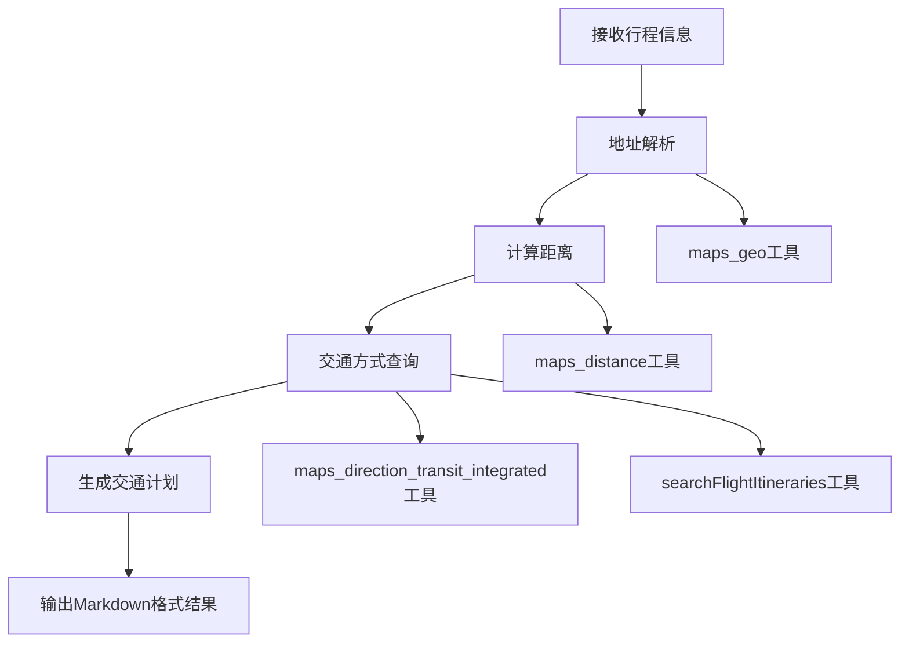

# Traffic_planner智能体代码存储分析说明

## 📋 概述

本文档详细分析了`traffic_planner`智能体在Cooragent系统中的代码存储位置、文件结构、配置内容和使用方式。该智能体已成功创建并持久化存储在系统中，具备完整的交通规划功能。

## 📁 智能体文件存储位置

### 1. **配置文件目录：`store/agents/`**

**文件路径**: `store/agents/traffic_planner.json`
- **文件大小**: 3.3KB, 26行
- **存储内容**: 智能体的完整配置信息

**配置详情**:
```json
{
    "user_id": "test",
    "agent_name": "traffic_planner", 
    "nick_name": "traffic_planner",
    "description": "一个交通规划智能体，可以根据行程安排出发与到达时间、推荐最佳路线、估算费用，并输出详尽的交通计划。",
    "llm_type": "reasoning",
    "selected_tools": [...]
}
```

**配置的工具**:
- `maps_direction_transit_integrated` - 综合公共交通规划（火车、公交、地铁）
- `searchFlightItineraries` - 航班搜索和票价查询  
- `maps_distance` - 距离测量（驾车、步行、球面距离）
- `maps_geo` - 地址转经纬度坐标

### 2. **提示词文件目录：`store/prompts/`**

**文件路径**: `store/prompts/traffic_planner.md`
- **文件大小**: 1.9KB, 1行
- **存储内容**: 智能体的角色定义和工作流程

**提示词结构**:
```markdown
# Role: 交通规划智能体 (Traffic Planner)
你是一个专门用于规划交通行程的智能体，名为 traffic_planner。
```

**核心功能定义**:
1. 分析输入的行程信息（起点、终点、时间要求）
2. 查询推荐最佳交通方式（公交、铁路、航班等）
3. 提供详细的时间表和费用估算
4. 输出完整交通计划，包含转乘点、预计耗时及总费用
5. 提供备选方案（如有）

### 3. **工作流记录目录：`store/workflows/test/`**

**文件路径**: `store/workflows/test/629f1f88c077e0bfb7e954f163bdbbb6.json`
- **文件大小**: 19KB, 295行
- **存储内容**: 完整的工作流执行记录

**工作流信息**:
```json
{
  "workflow_id": "test:629f1f88c077e0bfb7e954f163bdbbb6",
  "mode": "launch",
  "user_input_messages": [
    {
      "role": "user", 
      "content": "创建交通规划智能体：根据行程或其他智能体输出，安排出发/到达时间、路线、票价等，输出详尽交通计划。"
    }
  ]
}
```

## 🔧 智能体架构设计

### **核心能力配置**

#### **1. 地址解析能力**
- **工具**: `maps_geo`
- **功能**: 将详细地址转换为经纬度坐标
- **应用**: 支持地标性名胜景区、建筑物名称解析

#### **2. 距离计算能力**  
- **工具**: `maps_distance`
- **功能**: 测量两个经纬度坐标间距离
- **支持**: 驾车、步行、球面距离测量

#### **3. 公共交通规划能力**
- **工具**: `maps_direction_transit_integrated` 
- **功能**: 规划综合公共交通方案
- **覆盖**: 火车、公交、地铁等多种交通方式
- **特性**: 跨城场景支持，需传入起终点城市

#### **4. 航班查询能力**
- **工具**: `searchFlightItineraries`
- **功能**: 搜索可购买航班选项和最低价格
- **输入**: 起降城市三字码、出发日期
- **示例**: BJS(北京)、SHA(上海)、CAN(广州)、HFE(合肥)

### **工作流程设计**



**详细步骤**:
1. **接收行程信息**: 从用户或其他智能体接收行程详情
2. **地址解析**: 使用`maps_geo`工具转换地址为坐标
3. **计算距离**: 利用`maps_distance`工具测量距离
4. **交通方式查询**: 调用相应工具查询交通方案
5. **生成交通计划**: 综合查询结果生成详尽计划  
6. **输出结果**: 以Markdown格式输出清晰易读的交通计划

## 🗂️ 存储机制说明

### **系统存储结构**
```
store/
├── agents/           # 智能体配置文件（JSON格式）
│   └── traffic_planner.json
├── prompts/         # 智能体提示词（Markdown格式）
│   └── traffic_planner.md  
├── workflows/       # 工作流执行记录（按用户ID分组）
│   └── test/
│       └── {hash}.json
└── tools/           # 工具配置
```

### **文件命名规则**
- **配置文件**: `{agent_name}.json`
- **提示词文件**: `{agent_name}.md`  
- **工作流文件**: `{hash}.json`（存储在用户目录下）

### **持久化机制**
- **智能体配置**: 通过`AgentManager`类管理，存储在`agents_dir`
- **提示词**: 独立存储，便于编辑和版本管理
- **工作流记录**: 完整保存创建过程，支持追溯和重放

## ✅ 创建状态确认

### **创建完成验证**
- ✅ **配置文件完整**: 包含所有必要的元数据和工具配置
- ✅ **提示词清晰**: 详细定义了角色、步骤和输出要求  
- ✅ **工作流记录**: 完整保存了创建过程和系统配置
- ✅ **工具集成**: 成功配置了4个核心交通相关工具

### **功能验证要点**
1. **智能体定义**: 角色明确，功能描述完整
2. **工具配置**: 4个工具全部配置成功，覆盖交通规划核心需求
3. **提示词设计**: 包含6个详细步骤和明确的输出要求
4. **系统集成**: 已注册到AgentManager，可被工作流调用

## 💡 使用方式

### **1. API接口调用**
通过Cooragent的API直接调用`traffic_planner`智能体：
```bash
python cli.py run-l --user-id test --task-type agent_workflow \
  --message "规划从北京到上海的交通方案"
```

### **2. 工作流集成**
在多智能体协作中作为执行节点：
```json
{
  "agent_name": "traffic_planner",
  "title": "生成交通计划", 
  "description": "根据行程信息生成详尽交通计划"
}
```

### **3. Web界面使用**
通过Web界面（http://localhost:8000）直接输入交通规划需求。

### **4. 智能体协作**
可与其他智能体协作，接收其输出作为输入：
- 接收`researcher`的行程调研结果
- 为`reporter`提供交通计划数据
- 与`booking_agent`协作完成预订

## 🎯 应用场景

### **典型使用场景**
1. **商务出行规划**: 根据会议安排规划最优交通方案
2. **旅游行程设计**: 为旅游景点间移动提供交通建议
3. **多城市出差**: 规划涉及多个城市的复杂行程
4. **应急交通**: 在交通中断时提供备选方案
5. **成本优化**: 在时间和费用间找到最佳平衡

### **输出示例**
```markdown
# 交通规划方案

## 基本信息
- 起点: 北京市朝阳区
- 终点: 上海市浦东新区  
- 出发时间: 2025-07-26 09:00

## 推荐方案
### 方案一：高铁（推荐）
- 交通工具: G1次列车
- 出发时间: 09:00
- 到达时间: 13:28
- 预计费用: ¥553元
- 总耗时: 4小时28分钟

### 方案二：航班
- 航班号: CA1234
- 出发时间: 10:30
- 到达时间: 12:45
- 预计费用: ¥890元
- 总耗时: 2小时15分钟（不含地面交通）
```

## 🔄 维护和扩展

### **配置更新**
- **工具添加**: 在`selected_tools`中新增工具配置
- **提示词优化**: 修改`store/prompts/traffic_planner.md`
- **能力扩展**: 通过更新提示词增加新功能

### **性能监控**
- **执行日志**: 通过工作流记录监控执行状态
- **工具调用**: 跟踪各工具的使用频率和成功率
- **用户反馈**: 收集用户对规划结果的满意度

### **版本管理**
- **配置版本**: 通过Git管理配置文件变更
- **提示词版本**: 独立跟踪提示词的迭代优化
- **工作流版本**: 记录工作流模式的演进历史

---

## 📝 总结

`traffic_planner`智能体已成功创建并完整部署在Cooragent系统中。它具备完善的交通规划能力，支持多种交通方式查询和路线优化，可以独立使用或与其他智能体协作。通过标准化的存储机制，智能体的配置、提示词和执行记录都得到了妥善保存，确保了系统的可维护性和可扩展性。

现在你可以使用这个`traffic_planner`智能体来生成详尽的交通计划了！🚀 