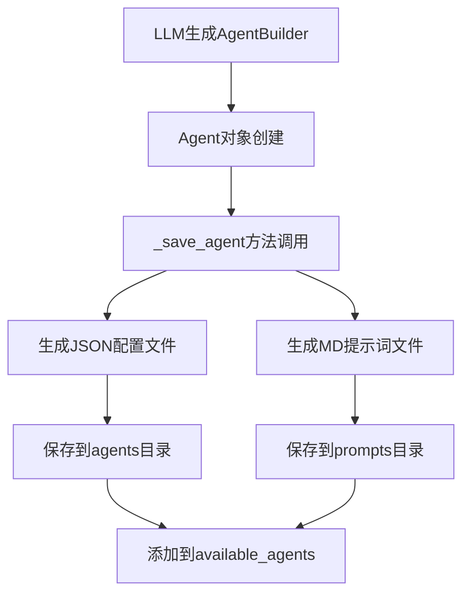

# Store目录文件生成逻辑分析

## 🎯 概述

本文档详细分析CoorAgent系统中store目录的文件组织结构和生成逻辑，重点分析智能体创建后在存储系统中如何生成、组织和管理相关文件。Store目录是CoorAgent持久化存储的核心，包含智能体配置、提示词、工作流状态等关键数据。

## 📁 Store目录结构概览

```
store/
├── agents/              # 智能体配置文件存储
│   ├── researcher.json     # 研究员智能体配置
│   ├── coder.json          # 编程智能体配置
│   ├── reporter.json       # 报告员智能体配置
│   ├── itinerary_designer.json  # 行程设计智能体配置
│   └── ...                 # 其他智能体配置
├── prompts/             # 智能体提示词文件存储
│   ├── researcher.md       # 研究员提示词
│   ├── coder.md           # 编程智能体提示词
│   ├── reporter.md        # 报告员提示词
│   ├── itinerary_designer.md  # 行程设计智能体提示词
│   └── ...                # 其他提示词文件
├── workflows/           # 工作流状态文件存储
│   └── {user_id}/       # 按用户ID分组
│       ├── {workflow_hash}.json  # 工作流状态文件
│       └── ...
└── tools/               # 工具配置文件存储（预留）
```

## 🔧 路径配置系统

### 1. 全局路径配置

**文件**: `config/global_variables.py`

```python
from src.utils.path_utils import get_project_root

# 各目录路径配置
workflow_dir = get_project_root() / "store" / "workflows"
tools_dir = get_project_root() / "store" / "tools"
agents_dir = get_project_root() / "store" / "agents"
prompts_dir = get_project_root() / "store" / "prompts"
workflows_dir = get_project_root() / "store" / "workflows"
```

### 2. 项目根目录确定

**文件**: `src/utils/path_utils.py`

```python
@lru_cache(maxsize=None)
def get_project_root() -> Path:
    """
    多策略确定项目根目录:
    1. 从当前文件向上搜索 .git, pyproject.toml, .project-root
    2. 从工作目录向上搜索
    3. 使用安装路径作为后备方案
    """
    current_path = Path(__file__).parent.absolute()
    max_depth = 10
    
    for _ in range(max_depth):
        if (current_path / '.git').exists() or \
           (current_path / 'pyproject.toml').exists() or \
           (current_path / '.project-root').exists():
            return current_path
        current_path = current_path.parent
    
    return Path(__file__).parent.parent.parent
```

### 3. AgentManager路径初始化

**文件**: `src/manager/agents.py` (第259-268行)

```python
from src.utils.path_utils import get_project_root

# 初始化各目录路径
tools_dir = get_project_root() / "store" / "tools"
agents_dir = get_project_root() / "store" / "agents"
prompts_dir = get_project_root() / "store" / "prompts"

# 创建AgentManager实例
agent_manager = AgentManager(tools_dir, agents_dir, prompts_dir)
asyncio.run(agent_manager.initialize())
```

## 🤖 智能体文件生成逻辑

### 1. 智能体创建流程



### 2. _save_agent方法实现

**文件**: `src/manager/agents.py` (第109-126行)

```python
async def _save_agent(self, agent: Agent, flush=False):
    """保存智能体配置和提示词文件"""
    # 构建文件路径
    agent_path = self.agents_dir / f"{agent.agent_name}.json"
    agent_prompt_path = self.prompt_dir / f"{agent.agent_name}.md"
    agents = []

    # 检查是否需要创建文件（flush=True且文件不存在）
    if flush and not agent_path.exists():
        # 序列化Agent对象为JSON格式
        agents.append((agent_path, agent.model_dump_json(indent=4)))

    if flush and not agent_prompt_path.exists():
        # 保存提示词内容
        agents.append((agent_prompt_path, agent.prompt))

    if not agents:
        logger.debug(f"skip saving agent")
        return

    # 异步并发写入文件
    agent_tasks = [self._write_file(path, content) for path, content in agents]
    await asyncio.gather(*agent_tasks)

    logger.info(f"agent {agent.agent_name} saved.")
```

### 3. 文件写入实现

**文件**: `src/manager/agents.py` (第104-107行)

```python
async def _write_file(self, path: Path, content: str):
    """使用UTF-8编码异步写入文件"""
    async with aiofiles.open(path, "w", encoding="utf-8") as f:
        await f.write(content)
```

### 4. Agent模型结构

**文件**: `src/interface/agent.py` (第86-104行)

```python
class Agent(BaseModel):
    """智能体定义模型"""
    user_id: str              # 用户ID
    agent_name: str           # 智能体名称
    nick_name: str            # 昵称
    description: str          # 描述
    llm_type: LLMType        # LLM类型
    selected_tools: List[Tool]  # 选择的工具列表
    prompt: str              # 提示词
    model_config = ConfigDict(extra="allow")
```

## 📄 生成文件格式分析

### 1. JSON配置文件格式

**示例**: `store/agents/itinerary_designer.json`

```json
{
    "user_id": "test",
    "agent_name": "itinerary_designer",
    "nick_name": "itinerary_designer",
    "description": "一个智能体，能够根据目的地和用户偏好推荐景点，提供推荐理由及相关照片 URL，并生成详细日程安排。",
    "llm_type": "reasoning",
    "selected_tools": [
        {
            "name": "tavily_tool",
            "description": "A search engine optimized for comprehensive, accurate, and trusted results."
        },
        {
            "name": "crawl_tool", 
            "description": "Use this to crawl a url and get a readable content in markdown format."
        }
    ],
    "prompt": "# Role: 行程设计智能体 (Itinerary Designer)\\n你是一个专门为用户提供个性化行程设计的智能助手..."
}
```

**字段说明**:
- `user_id`: 智能体归属用户，"share"表示共享智能体
- `agent_name`: 唯一标识符，用于文件命名和引用
- `nick_name`: 显示名称
- `description`: 功能描述，用于工作流中的智能体选择
- `llm_type`: 指定使用的LLM类型（basic, reasoning等）
- `selected_tools`: 智能体可使用的工具列表
- `prompt`: 完整的提示词内容，包含转义字符

### 2. Markdown提示词文件格式

**示例**: `store/prompts/itinerary_designer.md`

```markdown
# Role: 行程设计智能体 (Itinerary Designer)
你是一个专门为用户提供个性化行程设计的智能助手，擅长根据目的地和用户的兴趣偏好推荐景点，附带推荐理由、照片 URL，并制定详细日程。
目标是为用户提供一份清晰易读且实用的旅行计划。

## 步骤:
1. **接收用户输入**：获取用户提供的目的地和兴趣偏好（如自然风光、历史文化、美食等）。
2. **使用 tavily_tool 搜索景点信息**：
   - 根据目的地和偏好搜索出热门景点及相关信息。
   - 收集每个景点的推荐理由，例如为什么适合某种兴趣类型或独特之处。
3. **使用 crawl_tool 获取照片 URL**：
   - 对于每个推荐景点，找到高质量的相关图片链接。
...
```

**特点**:
- 纯文本Markdown格式，便于编辑和版本控制
- 包含完整的角色定义、任务描述、执行步骤
- 支持多语言内容
- 可包含格式化指令和注意事项

## 🔄 工作流文件生成逻辑

### 1. WorkflowCache类设计

**文件**: `src/workflow/cache.py` (第16-36行)

```python
class WorkflowCache:
    """工作流缓存管理器 - 单例模式"""
    _instance = None

    def __new__(cls, *args, **kwargs):
        if not cls._instance:
            cls._instance = super(WorkflowCache, cls).__new__(cls)
        return cls._instance

    def __init__(self, workflow_dir: Path):
        if not hasattr(self, 'initialized'):
            # 确保目录存在
            if not workflow_dir.exists():
                logger.info(f"path {workflow_dir} does not exist when workflow cache initializing, gona to create...")
                workflow_dir.mkdir(parents=True, exist_ok=True)
            
            self.workflow_dir = workflow_dir
            self.queue = {}              # 执行队列
            self.cache = {}              # 内存缓存
            self.latest_polish_id = {}   # 最新优化ID
            self.initialized = True
            self._lock_pool = {}         # 线程锁池
```

### 2. 工作流ID生成规则

**文件**: `src/workflow/process.py` (第76-82行)

```python
# 生成工作流ID
if not workflow_id:
    if workmode == "launch":
        # 基于用户输入生成MD5哈希
        msg = f"{user_id}_{task_type}_{user_input_messages}_{deep_thinking_mode}_{search_before_planning}_{coor_agents}"
        polish_id = hashlib.md5(msg.encode("utf-8")).hexdigest()
    else:
        polish_id = cache.get_latest_polish_id(user_id)
    
    workflow_id = f"{user_id}:{polish_id}"
```

**命名规则**:
- 格式: `{user_id}:{polish_id}`
- polish_id: 32位MD5哈希值，基于用户输入内容生成
- 确保相同输入产生相同的工作流ID，支持幂等性

### 3. 工作流文件保存机制

**文件**: `src/workflow/cache.py` (第307-339行)

```python
def save_workflow(self, workflow):
    """保存工作流到文件系统"""
    try:
        # 解析工作流ID
        user_id, polish_id = workflow["workflow_id"].split(":")
        workflow_path = self.workflow_dir / user_id / f"{polish_id}.json"

        # 线程安全写入
        if user_id not in self._lock_pool:
            self._lock_pool[user_id] = threading.Lock()
        
        with self._lock_pool[user_id]:
            with open(workflow_path, "w", encoding='utf-8') as f:
                f.write(json.dumps(workflow, indent=2, ensure_ascii=False))
                
    except Exception as e:
        logger.error(f"Error dumping workflow: {e}")
    
    logger.info(f"workflow {workflow['workflow_id']} saved.")

def dump(self, workflow_id: str, mode: str):
    """根据模式保存工作流"""
    try:
        workflow = self.cache[workflow_id]
        user_id, polish_id = workflow["workflow_id"].split(":")
        
        if user_id not in self._lock_pool:
            self._lock_pool[user_id] = threading.Lock()
            
        with self._lock_pool[user_id]:
            if mode == "launch":
                # 首次启动模式：保存完整工作流
                workflow_path = self.workflow_dir / user_id / f"{polish_id}.json"
                with open(workflow_path, "w", encoding='utf-8') as f:
                    f.write(json.dumps(workflow, indent=2, ensure_ascii=False))
                self.latest_polish_id[user_id] = polish_id
            elif mode == "production":
                # 生产模式：初始化执行队列
                self.queue[workflow_id] = []
                
    except Exception as e:
        logger.error(f"Error dumping workflow: {e}")
```

### 4. 用户目录自动创建

**文件**: `src/workflow/cache.py` (第39-58行)

```python
def _load_workflow(self, user_id: str):
    """加载用户工作流，自动创建目录"""
    try:
        if user_id not in self._lock_pool:
            self._lock_pool[user_id] = threading.Lock()
            
        with self._lock_pool[user_id]:
            user_workflow_dir = self.workflow_dir / user_id
            
            if not user_workflow_dir.exists():
                # 用户目录不存在，创建目录
                logger.info(f"path {user_workflow_dir} does not exist when user {user_id} workflow cache initializing, gona to create...")
                user_workflow_dir.mkdir(parents=True, exist_ok=True)
                return

            # 加载现有工作流文件
            user_workflow_files = user_workflow_dir.glob("*.json")
            for workflow_file in user_workflow_files:
                with open(workflow_file, "r", encoding='utf-8') as f:
                    workflow = json.load(f)
                    self.cache[workflow["workflow_id"]] = workflow
                    
    except Exception as e:
        logger.error(f"Error loading workflow: {e}")
        raise e
```

## 📊 工作流文件格式分析

### 1. 工作流JSON结构

**示例**: `store/workflows/test/71ac93050e4d0f733cedeb9a6e77333d.json`

```json
{
  "workflow_id": "test:71ac93050e4d0f733cedeb9a6e77333d",
  "mode": "launch",
  "version": 1,
  "lap": 1,
  "user_input_messages": [
    {
      "role": "user",
      "content": "创建行程设计智能体：根据目的地和用户偏好，推荐景点、给出理由及照片 URL，并设计详细日程。",
      "timestamp": "2025-07-27T16:44:25.663660"
    }
  ],
  "deep_thinking_mode": true,
  "search_before_planning": false,
  "coor_agents": [],
  "planning_steps": [
    {
      "agent_name": "agent_factory",
      "title": "创建行程设计智能体",
      "description": "使用 agent_factory 创建一个新的智能体...",
      "note": "确保新智能体具备分析用户偏好、整合推荐内容、生成日程安排的能力。"
    }
  ],
  "global_variables": {
    "has_lauched": "",
    "user_input": "",
    "history_messages": []
  },
  "memory": {
    "cache": {},
    "vector_store": {},
    "database": {},
    "file_store": {}
  },
  "graph": [
    {
      "component_type": "agent",
      "label": "agent_factory",
      "name": "agent_factory",
      "config": {
        "node_name": "agent_factory",
        "node_type": "execution_agent",
        "next_to": [],
        "condition": "supervised"
      }
    }
  ]
}
```

**字段详解**:
- `workflow_id`: 唯一标识符，格式为"用户ID:哈希值"
- `mode`: 执行模式（launch, production, polish）
- `version`: 版本号
- `lap`: 执行轮次
- `user_input_messages`: 原始用户输入消息
- `planning_steps`: 规划的执行步骤
- `global_variables`: 全局变量状态
- `memory`: 内存存储区域
- `graph`: 工作流图结构，包含节点和连接关系

## 🔒 线程安全和并发控制

### 1. 线程锁机制

```python
class WorkflowCache:
    def __init__(self, workflow_dir: Path):
        self._lock_pool = {}  # 按用户ID维护锁池
    
    def _get_user_lock(self, user_id: str):
        """获取用户专用锁"""
        if user_id not in self._lock_pool:
            self._lock_pool[user_id] = threading.Lock()
        return self._lock_pool[user_id]
```

### 2. 文件写入保护

```python
def save_workflow(self, workflow):
    user_id, polish_id = workflow["workflow_id"].split(":")
    
    # 使用用户专用锁保护写入操作
    with self._lock_pool[user_id]:
        with open(workflow_path, "w", encoding='utf-8') as f:
            f.write(json.dumps(workflow, indent=2, ensure_ascii=False))
```

**安全特性**:
- 按用户分离锁，避免不同用户间的锁竞争
- 保护文件读写操作的原子性
- 防止并发访问导致的数据损坏

## 🗂️ 目录组织策略

### 1. 按用户分组

```
store/workflows/
├── test/                    # 测试用户
│   ├── 71ac93050e4d0f733cedeb9a6e77333d.json
│   ├── f78ffbed02b2fa35e04e102ef9652c99.json
│   └── 8f693afeafa3a587c01c3812912a100e.json
├── user123/                 # 普通用户
│   ├── abc123...def.json
│   └── ...
└── admin/                   # 管理员用户
    ├── 456def...789.json
    └── ...
```

### 2. 智能体统一存储

```
store/agents/
├── researcher.json          # 共享智能体
├── coder.json              # 共享智能体
├── itinerary_designer.json # 用户自定义智能体
└── ...

store/prompts/
├── researcher.md           # 对应提示词
├── coder.md               # 对应提示词
├── itinerary_designer.md  # 对应提示词
└── ...
```

**组织原则**:
- 工作流按用户隔离，避免数据混淆
- 智能体统一存储，支持共享和复用
- 文件命名规范化，便于查找和管理

## 🔧 文件生命周期管理

### 1. 创建时机

**智能体文件**:
- Agent Factory节点成功创建智能体时
- 调用`_create_agent_by_prebuilt`方法时
- 仅在flush=True且文件不存在时创建

**工作流文件**:
- 工作流初始化时创建基础结构
- 执行过程中实时更新状态
- 完成时保存最终状态

### 2. 更新机制

```python
async def _save_agent(self, agent: Agent, flush=False):
    # 只有flush=True且文件不存在时才创建新文件
    if flush and not agent_path.exists():
        agents.append((agent_path, agent.model_dump_json(indent=4)))
```

**更新策略**:
- 智能体文件：创建后不再修改（幂等性）
- 工作流文件：执行过程中持续更新
- 使用flush参数控制写入时机

### 3. 清理机制

```python
async def _remove_agent(self, agent_name: str):
    """移除智能体文件"""
    agent_path = self.agents_dir / f"{agent_name}.json"
    agent_prompt_path = self.prompt_dir / f"{agent_name}.md"

    if agent_path.exists():
        await aiofiles.os.remove(agent_path)
        logger.info(f"Removed agent definition file: {agent_path}")
    
    if agent_prompt_path.exists():
        await aiofiles.os.remove(agent_prompt_path)
        logger.info(f"Removed agent prompt file: {agent_prompt_path}")
    
    if agent_name in self.available_agents:
        del self.available_agents[agent_name]
        logger.info(f"Removed agent '{agent_name}' from available agents.")
```

## 🔍 错误处理和恢复

### 1. 编码问题处理

```python
# 使用多编码安全读取
from src.utils.encoding_utils import read_file_with_encoding

try:
    json_str = read_file_with_encoding(agent_path)
    _agent = Agent.model_validate_json(json_str)
except (UnicodeDecodeError, FileNotFoundError) as e:
    logger.error(f"Error reading agent file {agent_path}: {e}")
    raise
```

### 2. 文件系统错误处理

```python
try:
    with open(workflow_path, "w", encoding='utf-8') as f:
        f.write(json.dumps(workflow, indent=2, ensure_ascii=False))
except Exception as e:
    logger.error(f"Error dumping workflow: {e}")
    # 不中断程序执行，记录错误
```

### 3. 目录自动恢复

```python
if not workflow_dir.exists():
    logger.info(f"path {workflow_dir} does not exist when workflow cache initializing, gona to create...")
    workflow_dir.mkdir(parents=True, exist_ok=True)
```

## 📈 性能优化策略

### 1. 异步文件操作

```python
# 使用aiofiles进行异步I/O
async def _write_file(self, path: Path, content: str):
    async with aiofiles.open(path, "w", encoding="utf-8") as f:
        await f.write(content)

# 并发写入多个文件
agent_tasks = [self._write_file(path, content) for path, content in agents]
await asyncio.gather(*agent_tasks)
```

### 2. 内存缓存机制

```python
class WorkflowCache:
    def __init__(self, workflow_dir: Path):
        self.cache = {}  # 内存缓存减少文件读取
        self.queue = {}  # 执行队列缓存
```

### 3. 单例模式

```python
class WorkflowCache:
    _instance = None
    
    def __new__(cls, *args, **kwargs):
        if not cls._instance:
            cls._instance = super(WorkflowCache, cls).__new__(cls)
        return cls._instance
```

**优化效果**:
- 减少文件I/O操作
- 避免重复实例创建
- 提高并发处理能力

## 🎯 总结

### 关键设计模式

1. **分层存储**: 按文件类型和用户分离存储
2. **命名规范**: 基于内容哈希的确定性命名
3. **线程安全**: 用户级别的锁机制
4. **异步I/O**: 提高文件操作性能
5. **错误恢复**: 自动目录创建和编码处理
6. **缓存优化**: 内存缓存减少磁盘访问

### 存储优势

1. **可追溯性**: 完整保存工作流执行历史
2. **可复现性**: 基于哈希的一致性命名
3. **可扩展性**: 支持多用户并发操作
4. **可维护性**: 清晰的目录结构和文件格式
5. **可恢复性**: robust的错误处理机制

### 技术特点

- **持久化**: 所有重要状态都保存到文件系统
- **一致性**: 使用JSON标准格式确保数据一致性
- **安全性**: UTF-8编码和线程安全保障
- **效率**: 异步I/O和内存缓存优化性能
- **可读性**: 人类可读的JSON和Markdown格式

CoorAgent的存储系统通过精心设计的目录结构和文件生成逻辑，实现了智能体配置、工作流状态的高效持久化管理，为系统的稳定运行和可扩展性提供了坚实基础。 