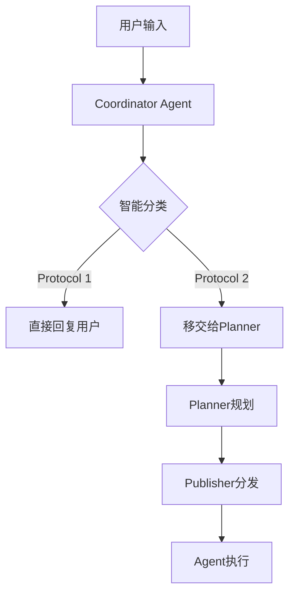

# Coordinator Agent 使用功能及作用说明

## 📋 概述

`Coordinator Agent`是Cooragent系统中的**智能分类器**和**工作流入口节点**，负责分析用户输入并决定处理路径。它是用户与系统交互的第一个智能体，承担着请求分类、路由决策和初始响应的关键作用。

---

## 🎯 核心功能

### 1. **智能请求分类**
Coordinator Agent基于预定义的两个协议进行智能分类：

#### **Protocol 1: 直接回复 (Direct Reply)**
适用于简单、直接的请求：
- **小对话**: 问候和日常交流
- **基础事实问题**: 单一事实查询
- **安全拒绝**: 拒绝不当请求  
- **基础命令**: 简单的文本操作、翻译、计算
- **身份查询**: 关于助手本身的问题

#### **Protocol 2: 任务移交 (Task Handoff)**
适用于复杂、需要规划的请求：
- **需要规划、创造性、深度分析的任务**
- **代码生成、策略建议、个性化指导**
- **多步骤完成的复杂任务**

### 2. **工作流路由决策**


### 3. **上下文感知处理**
- 维护对话历史
- 理解用户意图
- 提供语言一致性（中文输入→中文回复）

---

## 🏗️ 代码实现分析

### 1. **提示词定义**
**文件位置**: `src/prompts/coordinator.md`

**核心规则**:
```markdown
# CORE DIRECTIVE
You are cooragent, a friendly AI assistant. Your core function is to accurately classify user requests and respond according to one of two protocols.

# CLASSIFICATION & EXECUTION PROTOCOLS
## PROTOCOL 1: Direct Reply (简单直接回复)
## PROTOCOL 2: Task Handoff (复杂任务移交)
```

**判断逻辑**:
- 响应中包含`handover_to_planner()`→ Protocol 2
- 其他情况 → Protocol 1

### 2. **主要实现文件**

#### **src/workflow/coor_task.py** (完整版实现)
```python
async def coordinator_node(state: State) -> Command[Literal["planner", "__end__"]]:
    """Coordinator node that communicate with customers."""
    
    # 应用coordinator提示词模板
    messages = apply_prompt_template("coordinator", state)
    
    # 调用LLM进行分类决策
    response = await get_llm_by_type(AGENT_LLM_MAP["coordinator"]).ainvoke(messages)
    content = clean_response_tags(response.content)
    
    # 决策路由
    if "handover_to_planner" in content:
        goto = "planner"  # Protocol 2: 任务移交
    else:
        goto = "__end__"   # Protocol 1: 直接回复
    
    return Command(
        update={"messages": [{"content": content, "tool": "coordinator", "role": "assistant"}], 
                "agent_name": "coordinator"},
        goto=goto
    )
```

**特色功能**:
- ✅ 详细的中文日志记录
- ✅ 工作流缓存管理  
- ✅ 分类决策日志
- ✅ 协调器完成状态追踪

#### **src/workflow/agent_factory.py** (简化版实现)
```python
async def coordinator_node(state: State) -> Command[Literal["planner", "__end__"]]:
    """Coordinator node that communicate with customers."""
    
    messages = apply_prompt_template("coordinator", state)
    response = await get_llm_by_type(AGENT_LLM_MAP["coordinator"]).ainvoke(messages)
    content = clean_response_tags(response.content)
    
    if "handover_to_planner" in content:
        goto = "planner"
    
    return Command(goto=goto, ...)
```

**区别**:
- 简化版主要用于agent_factory工作流
- 缺少详细日志和状态管理

### 3. **配置映射**
**文件位置**: `src/llm/agents.py`
```python
AGENT_LLM_MAP: dict[str, LLMType] = {
    "coordinator": "basic",  # 使用基础LLM类型
    "planner": "reasoning",  # 规划器使用推理LLM
    # ...
}
```

### 4. **工作流集成**
**应用场景**:
- `agent_workflow`: 智能体协作工作流的入口节点
- `agent_factory`: 智能体工厂工作流的分类节点

---

## 🔧 在项目中的使用情况

### 1. **工作流中的角色**
```python
# src/workflow/coor_task.py
workflow.add_node("coordinator", coordinator_node)
workflow.set_start("coordinator")  # 设置为起始节点
```

### 2. **系统架构中的位置**
```
用户输入 → Coordinator(分类) → Planner(规划) → Publisher(分发) → Agent_Proxy(执行) → Reporter(汇总)
```

### 3. **调用统计**
根据代码搜索结果，coordinator在以下模块中被使用：
- `src/workflow/coor_task.py` - 主要工作流
- `src/workflow/agent_factory.py` - 智能体工厂
- `src/workflow/dynamic.py` - 动态工作流注册
- `src/workflow/template.py` - 工作流模板定义
- `config/workflow.json` - 工作流配置

---

## 🎨 旅游智能体定制方案

### 1. **需求分析**
基于项目中现有的`travel_agent.py`和相关文档分析，旅游智能体需要以下专业能力：
- 个性化行程规划
- 多目的地路线优化
- 实时价格查询
- 天气情况调整
- 地理位置服务

### 2. **定制Strategy A: 创建专用Coordinator**

#### **创建travel_coordinator.md**
```markdown
---
CURRENT_TIME: <<CURRENT_TIME>>
---

# TRAVEL COORDINATOR DIRECTIVE
You are a specialized travel coordinator for cooragent. Your function is to classify travel-related requests and route them appropriately.

## TRAVEL CLASSIFICATION PROTOCOLS

### PROTOCOL 1: Simple Travel Info
- **Travel Facts**: "什么是签证？", "北京有什么著名景点？"
- **Basic Queries**: "上海到北京多远？", "泰国现在什么天气？"
- **Quick Answers**: 简单的旅游信息查询

### PROTOCOL 2: Travel Planning & Complex Services  
- **Trip Planning**: "帮我规划3天北京行程"
- **Itinerary Generation**: "制定上海-杭州-苏州旅游路线"
- **Budget Planning**: "预算5000元的云南旅游方案"
- **Multi-modal Services**: 涉及酒店+交通+景点的综合规划

## TRAVEL-SPECIFIC EXAMPLES
User: 北京有什么好玩的地方？
Model: 北京有故宫、长城、天坛、颐和园等著名景点。故宫是明清皇宫...

User: 帮我规划一个3天的北京深度游，预算3000元，喜欢历史文化
Model: handover_to_planner()
```

#### **实现专用coordinator节点**
```python
# src/workflow/travel_coordinator.py
async def travel_coordinator_node(state: State) -> Command[Literal["travel_planner", "__end__"]]:
    """专用旅游协调器节点"""
    
    # 使用旅游专用提示词
    messages = apply_prompt_template("travel_coordinator", state)
    
    # 使用推理型LLM提高旅游领域理解能力  
    response = await get_llm_by_type("reasoning").ainvoke(messages)
    content = clean_response_tags(response.content)
    
    # 旅游专用路由逻辑
    if "handover_to_planner" in content:
        goto = "travel_planner"  # 转给旅游规划器
    else:
        goto = "__end__"
    
    # 旅游专用日志
    travel_log = generate_chinese_log(
        "travel_coordinator",
        f"🗺️ 旅游协调器处理完成，路由到: {goto}",
        travel_request_type="complex" if goto == "travel_planner" else "simple",
        user_query_preview=state.get("USER_QUERY", "")[:100]
    )
    
    return Command(goto=goto, ...)
```

### 3. **定制Strategy B: 增强现有Coordinator**

#### **修改coordinator.md添加旅游专业知识**
```markdown
# ENHANCED TRAVEL CLASSIFICATION

## Travel Domain Expertise
When dealing with travel-related requests, apply these specialized rules:

### TRAVEL PROTOCOL 1: Simple Travel Info
- Quick facts about destinations, visa requirements, weather
- Distance queries, basic transportation info
- Historical/cultural information about places

### TRAVEL PROTOCOL 2: Complex Travel Planning
- Multi-day itinerary planning  
- Budget-based trip planning
- Multi-destination route optimization
- Accommodation + transportation + activity coordination
- Real-time booking and price comparison

### Travel Classification Examples:
Input: "北京有什么好吃的？"
→ Protocol 1 (简单信息查询)

Input: "帮我设计一个5天4夜的京都深度游，预算8000元，包含住宿和交通"  
→ Protocol 2 (复杂规划任务)
```

#### **配置专用LLM类型**
```python
# src/llm/agents.py
AGENT_LLM_MAP: dict[str, LLMType] = {
    "coordinator": "reasoning",  # 从basic升级到reasoning
    "travel_coordinator": "reasoning",  # 专用旅游协调器
    # ...
}
```

### 4. **集成旅游专用工具链**
871 
#### **旅游MCP工具集成**
```python
# config/mcp.json 旅游专用配置
{
    "mcpServers": {
        "travel-tools": {
            "command": "npx",
            "args": ["-y", "@travel/mcp-server"],
            "env": {"API_KEY": "your_travel_api_key"}
        },
        "maps-service": {
            "command": "python", 
            "args": ["src/tools/travel/maps_server.py"]
        },
        "hotel-booking": {
            "command": "node",
            "args": ["src/tools/travel/hotel_server.js"]
        }
    }
}
```

#### **旅游智能体工具映射**
```python
# src/manager/agents.py 中添加旅游工具映射
TRAVEL_TOOLS = [
    "maps_direction_transit_integrated",  # 交通规划
    "searchFlightItineraries",           # 航班搜索
    "hotel_search_and_booking",          # 酒店预订
    "weather_forecast_travel",           # 旅游天气
    "currency_converter",                # 汇率转换
    "visa_requirements_check",           # 签证查询
    "local_events_finder",               # 当地活动
    "restaurant_recommendations"         # 餐厅推荐
]
```

### 5. **实现示例：完整旅游协调器**

#### **创建travel_workflow.py**
```python
# src/workflow/travel_workflow.py
from typing import Literal
from src.interface.agent import State
from langgraph.types import Command

async def travel_coordinator_node(state: State) -> Command[Literal["travel_planner", "travel_booker", "__end__"]]:
    """旅游专用协调器 - 三路由架构"""
    
    messages = apply_prompt_template("travel_coordinator", state) 
    response = await get_llm_by_type("reasoning").ainvoke(messages)
    content = clean_response_tags(response.content)
    
    # 旅游专用三级分类
    if "travel_planning_needed" in content:
        goto = "travel_planner"     # 行程规划路径
    elif "booking_assistance" in content:  
        goto = "travel_booker"      # 预订服务路径
    else:
        goto = "__end__"            # 简单信息回复
    
    # 旅游状态增强
    travel_context = {
        "travel_intent": extract_travel_intent(state["USER_QUERY"]),
        "destination": extract_destination(state["USER_QUERY"]),
        "budget": extract_budget(state["USER_QUERY"]),
        "duration": extract_duration(state["USER_QUERY"]),
        "travel_type": classify_travel_type(content)
    }
    
    return Command(
        update={
            "messages": [{"content": content, "tool": "travel_coordinator", "role": "assistant"}],
            "agent_name": "travel_coordinator",
            "travel_context": travel_context  # 注入旅游上下文
        },
        goto=goto
    )

def build_travel_workflow():
    """构建旅游专用工作流"""
    workflow = AgentWorkflow()
    
    # 旅游专用节点
    workflow.add_node("travel_coordinator", travel_coordinator_node)
    workflow.add_node("travel_planner", travel_planner_node)  
    workflow.add_node("travel_booker", travel_booker_node)
    workflow.add_node("travel_reporter", travel_reporter_node)
    
    # 旅游路由逻辑
    workflow.set_start("travel_coordinator")
    workflow.add_conditional_edge("travel_coordinator", travel_router)
    
    return workflow.compile()
```

---

## 🛠️ 最佳实践建议

### 1. **针对特定领域的Coordinator定制原则**

#### **Strategy Selection Guidelines**
- **简单领域** (如基础FAQ) → 增强现有coordinator.md
- **复杂专业领域** (如旅游、医疗、金融) → 创建专用coordinator  
- **多领域混合** → 实现分层coordinator架构

#### **提示词设计最佳实践**
```markdown
# 结构化设计
1. 明确领域边界和专业术语
2. 提供充足的分类示例 (Few-shot Learning)
3. 定义清晰的决策规则和判断标准
4. 包含异常情况处理逻辑

# 示例质量
- ✅ 具体、真实的用户输入场景
- ✅ 明确的分类依据说明
- ✅ 边界case的处理方式
- ❌ 模糊、通用的示例
```

### 2. **性能优化建议**

#### **LLM选择策略**
```python
# 根据复杂度选择合适的LLM类型
DOMAIN_LLM_MAP = {
    "simple_domains": "basic",      # 基础分类
    "travel": "reasoning",          # 需要逻辑推理
    "medical": "reasoning",         # 专业知识推理  
    "coding": "code",              # 代码相关
    "creative": "creative"          # 创意生成
}
```

#### **缓存和性能优化**
```python
# 实现coordinator决策缓存
@lru_cache(maxsize=1000)
def classify_request_cached(request_hash: str, domain: str) -> str:
    """缓存常见请求的分类结果"""
    # 对相似请求进行缓存，减少LLM调用
```

### 3. **监控和调试**

#### **分类准确性监控**
```python
# 添加分类决策监控
def log_classification_decision(user_input: str, decision: str, confidence: float):
    """记录分类决策用于后续优化"""
    classification_metrics.record({
        "input": user_input,
        "decision": decision, 
        "confidence": confidence,
        "timestamp": datetime.now()
    })
```

#### **A/B测试框架**
```python
# 支持多版本coordinator对比
async def coordinator_with_ab_testing(state: State) -> Command:
    """支持A/B测试的coordinator"""
    
    variant = get_user_variant(state["user_id"])
    
    if variant == "enhanced_travel":
        return await travel_coordinator_node(state)
    else:
        return await coordinator_node(state)  # 默认版本
```

---

## 📊 总结

### 核心价值
1. **智能分流**: 自动区分简单查询和复杂任务，提高系统效率
2. **用户体验**: 提供即时响应和专业路由，优化交互体验  
3. **可扩展性**: 支持领域定制和专业化扩展
4. **资源优化**: 避免简单任务的过度处理，节省计算资源

### 定制要点
1. **领域专业化**: 根据业务需求创建专用coordinator
2. **提示词优化**: 设计清晰的分类规则和丰富示例
3. **工具链集成**: 配置专业MCP工具和服务
4. **监控调优**: 持续监控分类准确性并优化

### 技术要点
- **异步处理**: 支持高并发用户请求
- **状态管理**: 维护对话上下文和工作流状态  
- **多语言支持**: 保持语言一致性
- **可观测性**: 提供详细的决策日志和性能指标

Coordinator Agent作为Cooragent系统的"智能调度中心"，其设计和优化直接影响整个系统的用户体验和处理效率。通过合理的定制和优化，可以显著提升特定领域的智能服务质量。 