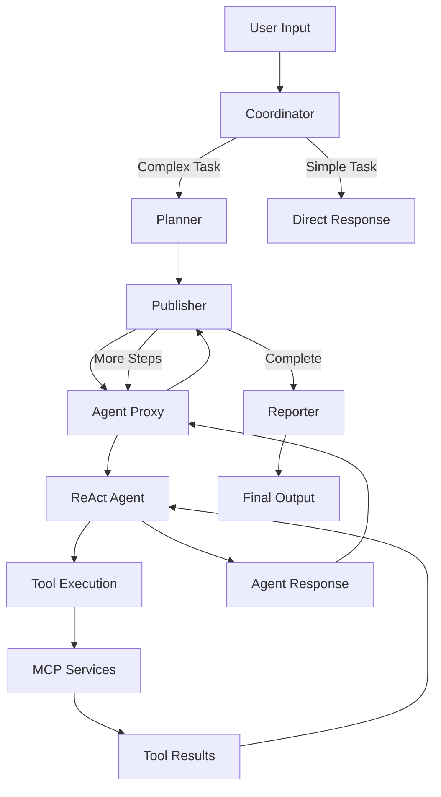

# Agent Proxy 调度执行系统详细分析说明

## 📋 概述

`Agent Proxy`是Cooragent系统中的**智能体执行代理**和**任务执行引擎**，负责为每个智能体创建独立的执行环境、加载工具链、应用提示词并执行具体任务。它是连接**工作流调度层**和**智能体执行层**的关键桥梁，确保每个智能体能够在完整的上下文环境中高效执行任务。

---

## 🎯 核心功能与职责

### 1. **智能体生命周期管理 (Agent Lifecycle Management)**
- **动态加载**: 从agent_manager获取智能体配置
- **环境构建**: 为每个智能体创建独立的执行环境
- **状态追踪**: 监控智能体执行状态和进度
- **资源清理**: 执行完成后的资源释放和状态保存

### 2. **ReAct智能体实例化 (ReAct Agent Instantiation)**
- **模式应用**: 使用Reasoning-Acting模式创建智能体
- **LLM集成**: 根据智能体配置选择合适的大语言模型
- **工具绑定**: 将智能体配置的工具链绑定到执行实例
- **提示词注入**: 应用智能体专属的提示词模板

### 3. **工具链管理与调用 (Tool Chain Management)**
- **工具注册**: 管理可用工具的注册表
- **MCP集成**: 整合Model Context Protocol组件
- **权限控制**: 确保智能体只能访问授权的工具
- **调用代理**: 为工具调用提供统一的代理接口

### 4. **执行上下文管理 (Execution Context Management)**
- **状态继承**: 从工作流状态继承执行上下文
- **参数传递**: 处理智能体间的参数传递
- **会话管理**: 维护multi-turn对话的上下文一致性
- **配置注入**: 注入用户ID、递归限制等执行配置

### 5. **结果处理与路由返回 (Result Processing & Routing)**
- **输出解析**: 解析智能体执行结果
- **状态更新**: 更新工作流状态
- **缓存管理**: 保存执行状态到缓存系统
- **路由返回**: 将执行结果路由回Publisher进行下一步调度

---

## 🏗️ 代码结构与实现分析

### 1. **核心实现文件**

#### **src/workflow/coor_task.py: agent_proxy_node()**
```python
async def agent_proxy_node(state: State) -> Command[Literal["publisher", "__end__"]]:
    """智能体代理执行节点 - 系统核心执行引擎"""
    
    # === 第一阶段：初始化和配置加载 ===
    agent_name = state["next"]  # 从Publisher获取要执行的智能体名称
    
    # 1. 智能体配置提取
    _agent = agent_manager.available_agents[state["next"]]
    state["initialized"] = True
    
    # 2. 详细的中文日志记录
    proxy_start_log = generate_chinese_log(
        "agent_proxy_start",
        f"🤖 智能体代理启动，准备执行智能体: {agent_name}",
        target_agent=agent_name,
        workflow_mode=state["workflow_mode"],
        agent_chinese_name=get_agent_chinese_name(agent_name)
    )
    
    # === 第二阶段：ReAct智能体创建 ===
    # 3. LLM选择和配置
    llm = get_llm_by_type(_agent.llm_type)
    
    # 4. 工具链组装
    tools = [
        agent_manager.available_tools[tool.name] 
        for tool in _agent.selected_tools
    ]
    
    # 5. 提示词应用
    prompt = apply_prompt(state, _agent.prompt)
    
    # 6. ReAct智能体实例化
    agent = create_react_agent(
        llm=llm,
        tools=tools,
        prompt=prompt
    )
    
    # === 第三阶段：执行配置和任务执行 ===
    # 7. 执行配置构建
    config = {
        "configurable": {"user_id": state.get("user_id")},
        "recursion_limit": int(MAX_STEPS),  # 最大执行步数限制
    }
    
    # 8. 异步任务执行
    response = await agent.ainvoke(state, config=config)
    
    # === 第四阶段：结果处理和状态管理 ===
    # 9. 缓存状态管理
    if state["workflow_mode"] == "launch":
        cache.restore_node(state["workflow_id"], _agent, state["initialized"], state["user_id"])
    elif state["workflow_mode"] == "production":
        cache.update_stack(state["workflow_id"], state["user_id"])
    
    # 10. 结果封装和返回
    return Command(
        update={
            "messages": [{
                "content": response["messages"][-1].content,
                "tool": state["next"],
                "role": "assistant",
            }],
            "processing_agent_name": _agent.agent_name,
            "agent_name": _agent.agent_name,
        },
        goto="publisher"  # 返回Publisher继续调度
    )
```

#### **关键特性分析**
- ✅ **异步执行**: 全流程异步处理，避免阻塞
- ✅ **状态一致性**: 完善的状态管理和缓存机制
- ✅ **错误隔离**: 单个智能体故障不影响整体工作流
- ✅ **资源管理**: 合理的资源分配和释放机制
- ✅ **可观测性**: 详细的日志记录和状态追踪

### 2. **调度接口与协议**

#### **输入接口 (Input Interface)**
```typescript
interface AgentProxyInput {
  next: string;                    // 要执行的智能体名称
  workflow_mode: "launch" | "production" | "polish";  // 工作流模式
  workflow_id: string;             // 工作流实例ID
  user_id: string;                 // 用户标识
  messages: Message[];             // 对话历史
  initialized: boolean;            // 初始化状态
  // 其他上下文参数...
}
```

#### **输出接口 (Output Interface)**
```typescript
interface AgentProxyOutput {
  update: {
    messages: Message[];           // 新增的对话消息
    processing_agent_name: string; // 处理智能体名称
    agent_name: string;           // 智能体标识
  };
  goto: "publisher";              // 固定返回Publisher
}
```

#### **工作流集成协议**
```
Publisher → Agent Proxy → ReAct Agent → Tool Execution → Response Processing → Publisher
    ↓           ↓              ↓              ↓                 ↓                 ↓
  路由决策    环境构建       任务执行       工具调用          结果处理           继续调度
```

---

## 🔧 MCP组件调用逻辑深度分析

### 1. **MCP组件架构概览**

#### **MCP (Model Context Protocol) 系统架构**
```
┌─────────────────┐    ┌──────────────────┐    ┌─────────────────┐
│   Agent Proxy   │ ── │  Agent Manager   │ ── │   MCP Client    │
│   (执行层)      │    │   (管理层)       │    │   (协议层)      │
└─────────────────┘    └──────────────────┘    └─────────────────┘
         │                       │                       │
         │                       │                       │
         ▼                       ▼                       ▼
┌─────────────────┐    ┌──────────────────┐    ┌─────────────────┐
│ ReAct Instance  │    │  Tool Registry   │    │  MCP Servers    │
│ (ReAct智能体)   │    │  (工具注册表)    │    │  (服务提供者)   │
└─────────────────┘    └──────────────────┘    └─────────────────┘
```

### 2. **MCP工具加载时机分析**

#### **系统启动时加载 (System Initialization)**
```python
# src/manager/agents.py: AgentManager.initialize()
async def initialize(self, user_agent_flag=USR_AGENT):
    """系统启动时的MCP工具加载"""
    
    # 1. 先加载智能体配置
    await self._load_agents(user_agent_flag)
    
    # 2. 再加载所有工具（包括MCP工具）
    await self.load_tools()  # ← MCP工具在此时加载
    
    logger.info(f"AgentManager initialized. {len(self.available_agents)} agents and {len(self.available_tools)} tools available.")

async def load_tools(self):
    """工具加载的详细过程"""
    
    # 1. 加载内置工具
    self.available_tools.update({
        bash_tool.name: bash_tool,
        browser_tool.name: browser_tool,
        crawl_tool.name: crawl_tool,
        python_repl_tool.name: python_repl_tool,
        tavily_tool.name: tavily_tool,
    })
    
    # 2. 条件性加载MCP工具
    if USE_MCP_TOOLS:  # 配置开关控制
        await self.load_mcp_tools()  # ← 关键MCP加载点

async def load_mcp_tools(self):
    """MCP工具的具体加载逻辑"""
    
    # 1. 创建MCP客户端
    mcp_client = MultiServerMCPClient(mcp_client_config())
    
    # 2. 异步获取所有MCP工具
    mcp_tools = await mcp_client.get_tools()
    
    # 3. 注册到工具管理器
    for _tool in mcp_tools:
        self.available_tools[_tool.name] = _tool
```

#### **动态工作流中的MCP加载 (Dynamic Workflow Loading)**
```python
# src/workflow/dynamic.py: DynamicWorkflow._build_agent_node()
async def agent_node(state: State):
    """动态工作流中的MCP实时加载"""
    
    # 1. 智能体可用性检查
    if node["agent"]["agent_name"] not in agent_manager.available_agents:
        # 动态加载或创建智能体...
    
    # 2. MCP工具实时加载
    async with MultiServerMCPClient(mcp_client_config()) as client:
        mcp_tools = client.get_tools()  # ← 实时获取MCP工具
        
        # 3. 动态注册工具
        for _tool in mcp_tools:
            agent_manager.available_tools[_tool.name] = _tool
        
        # 4. 创建ReAct智能体（包含最新MCP工具）
        agent = create_react_agent(
            get_llm_by_type(_agent.llm_type),
            tools=[agent_manager.available_tools[tool.name] for tool in _agent.selected_tools],
            prompt=apply_prompt(state, _agent.prompt),
        )
        
        # 5. 执行任务
        response = await agent.ainvoke(state)
```

### 3. **MCP工具在大模型中的调用机制**

#### **关键问题解答：MCP工具是在大模型提示词整合前调用，还是在大模型里面调用？**

**答案：MCP工具是在大模型里面调用的，通过ReAct模式实现智能调用**

#### **详细调用流程**
```python
# ReAct智能体的工具调用机制
def create_react_agent(llm, tools, prompt):
    """
    ReAct模式的工具调用流程：
    
    1. 大模型接收用户输入和工具描述
    2. 大模型进行推理（Reasoning）
    3. 大模型决定是否需要使用工具（Acting）
    4. 如果需要工具，大模型生成工具调用指令
    5. 系统执行工具调用，获取结果
    6. 工具结果作为观察（Observation）返回给大模型
    7. 大模型基于观察结果继续推理
    8. 重复步骤2-7直到任务完成
    """
    pass

# 具体的调用时序
"""
┌─────────────────────────────────────────────────────────────────┐
│                    ReAct 工具调用时序图                          │
├─────────────────────────────────────────────────────────────────┤
│                                                                 │
│  1. User Input → LLM                                           │
│     "帮我查询北京的天气"                                        │
│                                                                 │
│  2. LLM Reasoning                                               │
│     "我需要查询天气信息，应该使用天气查询工具"                   │
│                                                                 │
│  3. LLM Acting (工具调用决策)                                   │
│     Action: weather_forecast_tool                               │
│     Action Input: {"location": "北京"}                         │
│                                                                 │
│  4. Tool Execution (MCP工具执行)                               │
│     weather_forecast_tool.invoke({"location": "北京"})         │
│                                                                 │
│  5. Tool Result (观察结果)                                      │
│     Observation: "北京今天晴，温度25°C，湿度60%"                 │
│                                                                 │
│  6. LLM Final Reasoning                                         │
│     "基于天气查询结果，我可以为用户提供准确的天气信息"           │
│                                                                 │
│  7. Final Response                                              │
│     "北京今天天气晴朗，温度25°C，湿度60%，适合出行。"            │
│                                                                 │
└─────────────────────────────────────────────────────────────────┘
"""
```

#### **提示词与工具集成示例**
```python
# 智能体提示词中的工具描述集成
def apply_prompt(state: State, agent_prompt: str) -> ChatPromptTemplate:
    """
    提示词应用过程中，工具描述会被自动集成到提示词中
    """
    
    # 1. 基础提示词模板
    base_prompt = """
    你是一个专业的智能体，可以使用以下工具完成任务：
    
    可用工具列表：
    {tools}
    
    请按照ReAct模式进行推理和行动：
    - Thought: 分析当前情况，决定下一步行动
    - Action: 选择要使用的工具
    - Action Input: 工具的输入参数
    - Observation: 工具执行的结果
    - ... (重复上述过程直到完成任务)
    - Final Answer: 最终答案
    
    用户任务: {input}
    """
    
    # 2. 工具描述会被LangChain自动注入到{tools}占位符中
    # 包括MCP工具的名称、描述、参数schema等
    
    return ChatPromptTemplate.from_template(base_prompt)
```

### 4. **MCP配置与服务管理**

#### **MCP配置文件结构**
```python
# src/manager/mcp.py: mcp_client_config()
def mcp_client_config():
    """MCP客户端配置解析"""
    
    # 1. 读取MCP配置文件
    config_path = Path("config/mcp.json")
    with open(config_path, "r") as f:
        config = json.load(f)
    
    # 2. 解析服务器配置
    _mcp_client_config = {}
    for key, value in config["mcpServers"].items():
        if value.get("transport", "stdio") == "stdio":
            # 标准输入输出传输
            _mcp_client_config[key] = {
                "command": value["command"],
                "args": value["args"],
                "env": value.get("env", {}),
                "transport": "stdio"
            }
        elif value.get("transport") == "sse":
            # 服务器发送事件传输
            sse_config = value.copy()
            if "env" in sse_config:
                del sse_config["env"]  # SSE不支持env参数
            sse_config["transport"] = "sse"
            _mcp_client_config[key] = sse_config
    
    return _mcp_client_config
```

#### **MCP服务类型与配置示例**
```json
// config/mcp.json - MCP服务配置
{
  "mcpServers": {
    "filesystem": {
      "command": "npx",
      "args": ["-y", "@modelcontextprotocol/server-filesystem", "/path/to/directory"],
      "transport": "stdio"
    },
    "mcp-doc": {
      "command": "python",
      "args": ["/path/to/mcp-doc/server.py"],
      "env": {},
      "transport": "stdio"
    },
    "image-downloader": {
      "command": "node",
      "args": ["/path/to/image-downloader/build/index.js"],
      "env": {},
      "transport": "stdio"
    },
    "amap-service": {
      "url": "http://localhost:8080/sse",
      "transport": "sse"
    }
  }
}
```

---

## 📁 Store目录详细分析

### 1. **Store目录结构概览**

```
store/
├── agents/           # 智能体配置存储
│   ├── researcher.json
│   ├── coder.json
│   ├── browser.json
│   ├── reporter.json
│   ├── crawler.json
│   ├── itinerary_designer.json
│   ├── custom_itinerary_designer.json
│   ├── report_integrator.json
│   └── cost_calculator.json
├── prompts/          # 提示词模板存储
├── workflows/        # 工作流配置存储
├── tools/            # 自定义工具存储
└── .DS_Store
```

### 2. **智能体配置文件结构分析**

#### **标准智能体配置格式**
```json
// store/agents/researcher.json - 研究员智能体
{
    "user_id": "share",                    // 共享智能体标识
    "agent_name": "researcher",            // 智能体唯一名称
    "nick_name": "researcher",             // 显示名称
    "description": "专业的研究智能体，擅长信息搜索、网页爬取和报告生成...",
    "llm_type": "basic",                   // LLM类型: basic/reasoning/code/vision
    "selected_tools": [                    // 选择的工具列表
        {
            "name": "tavily_tool",         // 工具名称
            "description": "优化的搜索引擎，提供全面、准确、可信的结果..."
        },
        {
            "name": "crawl_tool",
            "description": "爬取URL内容并转换为markdown格式"
        }
    ],
    "prompt": "('---\\nCURRENT_TIME: {CURRENT_TIME}\\n---\\n\\n你是一个研究员...')"
}
```

#### **专业智能体配置示例**
```json
// store/agents/coder.json - 编程智能体
{
    "user_id": "share",
    "agent_name": "coder",
    "nick_name": "coder", 
    "description": "专业的软件工程智能体，精通Python和bash脚本...",
    "llm_type": "code",                    // 使用代码专用LLM
    "selected_tools": [
        {
            "name": "python_repl_tool",   // Python执行环境
            "description": "执行Python代码进行数据分析或计算..."
        },
        {
            "name": "bash_tool",          // Bash命令执行
            "description": "执行bash命令进行系统操作"
        }
    ],
    "prompt": "('---\\nCURRENT_TIME: {CURRENT_TIME}\\n---\\n\\n你是一个专业的软件工程师...')"
}
```

### 3. **智能体加载与调用机制**

#### **智能体管理器的加载流程**
```python
# src/manager/agents.py: AgentManager._load_agents()
async def _load_agents(self, user_agent_flag):
    """智能体批量加载流程"""
    
    # 1. 加载默认智能体
    await self._load_default_agents()
    
    # 2. 扫描store/agents目录
    load_tasks = []
    for agent_path in self.agents_dir.glob("*.json"):  # store/agents/*.json
        agent_name = agent_path.stem
        
        # 避免重复加载
        if agent_name not in self.available_agents:
            load_tasks.append(self._load_agent(agent_name, user_agent_flag))
    
    # 3. 并发加载所有智能体
    if load_tasks:
        results = await asyncio.gather(*load_tasks, return_exceptions=True)
        
        # 4. 错误处理
        for i, result in enumerate(results):
            if isinstance(result, Exception):
                logger.error(f"Error loading agent: {load_tasks[i]}. Error: {result}")

async def _load_agent(self, agent_name: str, user_agent_flag: bool = False):
    """单个智能体加载流程"""
    
    # 1. 文件路径构建
    agent_path = self.agents_dir / f"{agent_name}.json"  # store/agents/{agent_name}.json
    
    # 2. 文件存在性检查
    if not agent_path.exists():
        raise FileNotFoundError(f"agent {agent_name} not found.")
    
    # 3. 异步文件读取
    async with aiofiles.open(agent_path, "r") as f:
        json_str = await f.read()
        
        # 4. JSON解析和验证
        _agent = Agent.model_validate_json(json_str)
        
        # 5. 权限检查和注册
        if _agent.user_id == 'share':           # 共享智能体
            self.available_agents[_agent.agent_name] = _agent
        elif user_agent_flag:                   # 用户自定义智能体
            self.available_agents[_agent.agent_name] = _agent
```

#### **智能体调用的完整生命周期**
```python
# 智能体从store加载到执行的完整流程
"""
1. 系统启动阶段:
   AgentManager.initialize() 
   → _load_agents() 
   → 扫描store/agents/*.json 
   → 解析并注册到available_agents

2. 工作流规划阶段:
   Planner生成steps → 指定要使用的智能体名称

3. 任务分发阶段:
   Publisher解析steps → 决定下一个执行的智能体

4. 代理执行阶段:
   Agent Proxy接收智能体名称 
   → 从available_agents获取配置
   → 创建ReAct实例 
   → 执行任务

5. 结果处理阶段:
   收集执行结果 → 更新状态 → 返回Publisher
"""
```

### 4. **Store目录的扩展与定制**

#### **自定义智能体创建流程**
```python
# src/manager/agents.py: AgentManager._create_agent_by_prebuilt()
async def _create_agent_by_prebuilt(self, user_id: str, name: str, nick_name: str, 
                                   llm_type: str, tools: list[tool], 
                                   prompt: str, description: str):
    """创建和保存自定义智能体"""
    
    # 1. 工具配置转换
    _tools = []
    for tool in tools:
        _tools.append(Tool(
            name=tool.name,
            description=tool.description,
        ))
    
    # 2. 智能体对象构建
    _agent = Agent(
        agent_name=name,
        nick_name=nick_name,
        description=description,
        user_id=user_id,
        llm_type=llm_type,
        selected_tools=_tools,
        prompt=str(prompt)
    )
    
    # 3. 持久化保存到store目录
    await self._save_agent(_agent, flush=True)  # → store/agents/{name}.json
    
    # 4. 运行时注册
    self.available_agents[name] = _agent

async def _save_agent(self, agent: Agent, flush=False):
    """智能体配置保存到store目录"""
    
    # 1. 文件路径构建
    agent_path = self.agents_dir / f"{agent.agent_name}.json"  # store/agents/
    
    # 2. JSON序列化
    json_content = agent.model_dump_json(indent=2, ensure_ascii=False)
    
    # 3. 异步写入文件
    await self._write_file(agent_path, json_content)
    
    # 4. 提示词文件保存（如果需要）
    if agent.prompt:
        prompt_path = self.prompt_dir / f"{agent.agent_name}.md"
        await self._write_file(prompt_path, agent.prompt)
```

#### **智能体配置的高级特性**
```json
// 高级智能体配置示例
{
    "user_id": "user123",                  // 用户专属智能体
    "agent_name": "travel_expert",
    "nick_name": "旅游专家",
    "description": "专业的旅游规划智能体，具备地理、文化、预算优化等专业知识",
    "llm_type": "reasoning",               // 使用推理型LLM
    "selected_tools": [
        {
            "name": "maps_direction_transit_integrated",
            "description": "综合交通路线规划工具"
        },
        {
            "name": "hotel_search_and_booking", 
            "description": "酒店搜索和预订服务"
        },
        {
            "name": "weather_forecast_travel",
            "description": "旅游专用天气预报服务"
        }
    ],
    "prompt": "你是一个专业的旅游规划师...",
    "metadata": {                          // 元数据扩展
        "version": "1.0.0",
        "created_at": "2025-01-24T10:30:00Z",
        "domain": "travel",
        "capabilities": ["route_planning", "budget_optimization", "cultural_guidance"],
        "dependencies": ["maps_service", "booking_api", "weather_api"]
    }
}
```

---

## ⚙️ ReAct智能体创建与执行机制

### 1. **ReAct模式架构分析**

#### **ReAct (Reasoning + Acting) 核心原理**
```python
# ReAct模式的核心循环
"""
┌─────────────────────────────────────────────────────────────────┐
│                      ReAct 执行循环                              │
├─────────────────────────────────────────────────────────────────┤
│                                                                 │
│  Input: 用户任务 + 工具描述 + 历史对话                          │
│    ↓                                                            │
│  Thought: LLM进行推理思考                                       │
│    "我需要搜索相关信息来回答这个问题"                           │
│    ↓                                                            │
│  Action: LLM决定使用的工具                                      │
│    Action: tavily_tool                                          │
│    Action Input: {"query": "北京天气"}                         │
│    ↓                                                            │
│  Observation: 工具执行结果                                      │
│    "北京今天晴，温度25°C"                                       │
│    ↓                                                            │
│  Thought: LLM基于观察结果继续推理                               │
│    "现在我有了天气信息，可以给出完整回答"                       │
│    ↓                                                            │
│  Final Answer: 最终响应                                         │
│    "根据最新信息，北京今天天气晴朗..."                          │
│                                                                 │
└─────────────────────────────────────────────────────────────────┘
"""
```

### 2. **智能体实例化详细流程**

#### **create_react_agent函数调用链**
```python
# src/workflow/coor_task.py中的调用
from langgraph.prebuilt import create_react_agent

# Agent Proxy中的关键调用
agent = create_react_agent(
    llm=get_llm_by_type(_agent.llm_type),        # LLM选择
    tools=assembled_tools,                        # 工具链组装
    prompt=applied_prompt                         # 提示词应用
)

# LLM类型映射和选择
# src/llm/agents.py: AGENT_LLM_MAP
AGENT_LLM_MAP: dict[str, LLMType] = {
    "researcher": "basic",      # 基础LLM，适合信息搜索
    "coder": "code",           # 代码专用LLM，优化编程任务
    "planner": "reasoning",    # 推理LLM，适合复杂规划
    "browser": "basic",        # 基础LLM，适合网页操作
    "reporter": "basic",       # 基础LLM，适合文本生成
}

# 工具链组装逻辑
assembled_tools = [
    agent_manager.available_tools[tool.name] 
    for tool in _agent.selected_tools
    if tool.name in agent_manager.available_tools  # 安全检查
]
```

#### **提示词模板应用机制**
```python
# src/prompts/template.py: apply_prompt()
def apply_prompt(state: State, agent_prompt: str) -> str:
    """
    智能体提示词的动态应用过程
    """
    
    # 1. 解析提示词模板
    # agent_prompt格式: "('提示词内容', ['CURRENT_TIME', 'OTHER_VAR'])"
    prompt_content, variables = eval(agent_prompt)
    
    # 2. 上下文变量注入
    context_vars = {
        'CURRENT_TIME': datetime.now().strftime('%Y-%m-%d %H:%M:%S'),
        'USER_QUERY': state.get('USER_QUERY', ''),
        'WORKFLOW_ID': state.get('workflow_id', ''),
        'USER_ID': state.get('user_id', ''),
        # 工作流状态变量...
    }
    
    # 3. 模板变量替换
    formatted_prompt = prompt_content.format(**{
        var: context_vars.get(var, f'{{{var}}}') 
        for var in variables
    })
    
    # 4. 返回完整的提示词
    return formatted_prompt
```

### 3. **执行配置与限制管理**

#### **执行配置参数详解**
```python
# Agent Proxy中的执行配置
config = {
    "configurable": {
        "user_id": state.get("user_id")     # 用户身份配置
    },
    "recursion_limit": int(MAX_STEPS),      # 最大执行步数 (src/service/env.py)
}

# MAX_STEPS的配置和作用
# src/service/env.py
MAX_STEPS = os.getenv("MAX_STEPS", "30")    # 默认30步，防止无限循环

"""
recursion_limit的重要性:
- 防止ReAct循环陷入无限执行
- 控制工具调用的次数上限
- 确保系统资源的合理使用
- 在复杂任务中提供执行边界
"""
```

#### **异步执行与状态管理**
```python
# 智能体的异步执行调用
response = await agent.ainvoke(state, config=config)

"""
ainvoke的执行过程:
1. 解析输入状态 (state)
2. 应用执行配置 (config)
3. 启动ReAct循环
4. 处理工具调用请求
5. 管理执行步数限制
6. 返回最终结果
"""

# 返回结果的结构
response = {
    "messages": [
        {
            "content": "智能体的最终回复内容",
            "role": "assistant",
            "tool_calls": [...],        # 工具调用历史
            "tool_responses": [...]     # 工具响应历史
        }
    ],
    "metadata": {
        "steps_taken": 5,              # 实际执行步数
        "tools_used": ["tavily_tool", "python_repl_tool"],
        "execution_time": 2.34         # 执行时间(秒)
    }
}
```

---

## 🔄 工作流集成与协调机制

### 1. **与其他组件的协调关系**

#### **完整工作流协调图**


#### **状态传递与上下文管理**
```python
# 工作流状态的传递链条
"""
1. 初始状态 (Initial State):
   {
     "messages": [{"role": "user", "content": "用户输入"}],
     "user_id": "user123",
     "workflow_id": "wf_001",
     "workflow_mode": "launch"
   }

2. Coordinator处理后:
   state.update({
     "coordinator_analysis": "任务分类结果",
     "handover_decision": "planner"
   })

3. Planner处理后:
   state.update({
     "full_plan": "完整规划JSON",
     "steps": [...],
     "new_agents_needed": [...]
   })

4. Publisher处理后:
   state.update({
     "next": "researcher",  # 当前要执行的智能体
     "current_step": 1
   })

5. Agent Proxy处理后:
   state.update({
     "messages": [...],  # 新增智能体响应
     "processing_agent_name": "researcher",
     "agent_execution_result": "..."
   })
"""
```

### 2. **缓存系统与状态持久化**

#### **工作流缓存机制**
```python
# src/workflow/cache.py: WorkflowCache
class WorkflowCache:
    """工作流状态缓存管理"""
    
    def restore_node(self, workflow_id: str, agent: Agent, 
                    initialized: bool, user_id: str):
        """保存智能体执行状态"""
        
        cache_data = {
            "agent_name": agent.agent_name,
            "execution_status": "completed",
            "timestamp": datetime.now().isoformat(),
            "user_id": user_id,
            "initialized": initialized
        }
        
        # 保存到缓存文件
        cache_path = self.get_cache_path(workflow_id, user_id)
        self._save_cache_data(cache_path, cache_data)
    
    def update_stack(self, workflow_id: str, user_id: str):
        """更新执行堆栈 (Production模式)"""
        
        stack_data = self.get_execution_stack(workflow_id, user_id)
        stack_data.append({
            "step_completed": True,
            "timestamp": datetime.now().isoformat()
        })
        
        self._save_stack_data(workflow_id, user_id, stack_data)
```

### 3. **错误处理与容错机制**

#### **多层次错误处理**
```python
# Agent Proxy中的错误处理策略
async def agent_proxy_node(state: State) -> Command:
    try:
        # === 核心执行逻辑 ===
        agent = create_react_agent(...)
        response = await agent.ainvoke(state, config=config)
        
    except AgentNotFoundError as e:
        # 智能体不存在错误
        logger.error(f"Agent not found: {e}")
        return Command(
            update={"error": f"智能体不存在: {state['next']}"},
            goto="__end__"
        )
        
    except ToolExecutionError as e:
        # 工具执行错误
        logger.error(f"Tool execution failed: {e}")
        return Command(
            update={"error": f"工具执行失败: {e}"},
            goto="publisher"  # 尝试继续工作流
        )
        
    except RecursionLimitExceededError as e:
        # 执行步数超限
        logger.warning(f"Recursion limit exceeded: {e}")
        return Command(
            update={"warning": "任务过于复杂，已达到执行上限"},
            goto="publisher"
        )
        
    except Exception as e:
        # 通用错误处理
        logger.error(f"Unexpected error in agent proxy: {e}")
        return Command(
            update={"error": "智能体执行过程中发生未知错误"},
            goto="__end__"
        )
```

---

## 🎯 高级特性与优化

### 1. **性能优化策略**

#### **异步并发处理**
```python
# 工具加载的并发优化
async def load_mcp_tools_concurrent(self):
    """并发加载多个MCP服务"""
    
    # 1. 获取所有MCP服务配置
    mcp_configs = mcp_client_config()
    
    # 2. 创建并发任务
    load_tasks = []
    for service_name, config in mcp_configs.items():
        task = self._load_single_mcp_service(service_name, config)
        load_tasks.append(task)
    
    # 3. 并发执行，提高加载速度
    results = await asyncio.gather(*load_tasks, return_exceptions=True)
    
    # 4. 处理加载结果
    for i, result in enumerate(results):
        if isinstance(result, Exception):
            logger.warning(f"Failed to load MCP service {list(mcp_configs.keys())[i]}: {result}")
        else:
            # 成功加载的工具注册
            self.available_tools.update(result)
```

#### **智能缓存策略**
```python
# 智能体实例的缓存重用
class AgentInstanceCache:
    """智能体实例缓存管理"""
    
    def __init__(self):
        self.instance_cache = {}
        self.cache_ttl = 300  # 5分钟缓存有效期
    
    def get_cached_agent(self, agent_name: str, tools_hash: str) -> Optional[ReActAgent]:
        """获取缓存的智能体实例"""
        
        cache_key = f"{agent_name}_{tools_hash}"
        cache_entry = self.instance_cache.get(cache_key)
        
        if cache_entry:
            instance, timestamp = cache_entry
            if time.time() - timestamp < self.cache_ttl:
                return instance
            else:
                del self.instance_cache[cache_key]
        
        return None
    
    def cache_agent_instance(self, agent_name: str, tools_hash: str, instance):
        """缓存智能体实例"""
        cache_key = f"{agent_name}_{tools_hash}"
        self.instance_cache[cache_key] = (instance, time.time())
```

### 2. **监控与可观测性**

#### **详细的执行指标收集**
```python
# 执行指标收集系统
class AgentExecutionMetrics:
    """智能体执行指标收集"""
    
    def __init__(self):
        self.execution_stats = {}
        self.tool_usage_stats = {}
        self.performance_metrics = {}
    
    def record_agent_execution(self, agent_name: str, execution_data: dict):
        """记录智能体执行数据"""
        
        if agent_name not in self.execution_stats:
            self.execution_stats[agent_name] = {
                "total_executions": 0,
                "total_duration": 0,
                "success_count": 0,
                "error_count": 0,
                "average_steps": 0,
                "tool_usage": {}
            }
        
        stats = self.execution_stats[agent_name]
        stats["total_executions"] += 1
        stats["total_duration"] += execution_data["duration"]
        
        if execution_data["success"]:
            stats["success_count"] += 1
        else:
            stats["error_count"] += 1
        
        # 工具使用统计
        for tool_name in execution_data.get("tools_used", []):
            stats["tool_usage"][tool_name] = stats["tool_usage"].get(tool_name, 0) + 1
    
    def get_performance_report(self) -> dict:
        """生成性能报告"""
        
        report = {
            "total_agents": len(self.execution_stats),
            "overall_success_rate": self._calculate_overall_success_rate(),
            "average_execution_time": self._calculate_average_execution_time(),
            "most_used_tools": self._get_most_used_tools(),
            "agent_performance": {}
        }
        
        for agent_name, stats in self.execution_stats.items():
            report["agent_performance"][agent_name] = {
                "success_rate": stats["success_count"] / stats["total_executions"],
                "avg_duration": stats["total_duration"] / stats["total_executions"],
                "total_executions": stats["total_executions"]
            }
        
        return report
```

### 3. **扩展性与定制化**

#### **插件化智能体架构**
```python
# 插件化智能体扩展框架
class AgentPlugin:
    """智能体插件基类"""
    
    def __init__(self, name: str):
        self.name = name
    
    async def before_execution(self, state: State, agent: Agent) -> State:
        """执行前钩子"""
        return state
    
    async def after_execution(self, state: State, response: dict) -> dict:
        """执行后钩子"""
        return response
    
    async def on_tool_call(self, tool_name: str, tool_input: dict) -> dict:
        """工具调用钩子"""
        return tool_input

class TravelAgentPlugin(AgentPlugin):
    """旅游智能体专用插件"""
    
    async def before_execution(self, state: State, agent: Agent) -> State:
        """为旅游智能体注入地理上下文"""
        
        if self._is_travel_task(state):
            # 注入地理位置信息
            state["geo_context"] = await self._get_geo_context(state)
            
            # 注入天气信息
            state["weather_context"] = await self._get_weather_context(state)
            
            # 注入时区信息
            state["timezone_context"] = await self._get_timezone_context(state)
        
        return state
    
    async def on_tool_call(self, tool_name: str, tool_input: dict) -> dict:
        """优化旅游相关工具调用"""
        
        if tool_name in ["maps_tool", "hotel_search", "flight_search"]:
            # 注入用户偏好
            tool_input["user_preferences"] = self._get_user_travel_preferences()
            
            # 注入预算限制
            tool_input["budget_constraints"] = self._get_budget_constraints()
        
        return tool_input

# 插件系统集成
class EnhancedAgentProxy:
    """增强版智能体代理（支持插件）"""
    
    def __init__(self):
        self.plugins = []
    
    def register_plugin(self, plugin: AgentPlugin):
        """注册插件"""
        self.plugins.append(plugin)
    
    async def execute_with_plugins(self, state: State, agent: Agent):
        """带插件支持的智能体执行"""
        
        # 1. 执行前插件处理
        for plugin in self.plugins:
            state = await plugin.before_execution(state, agent)
        
        # 2. 创建ReAct智能体（带插件增强）
        enhanced_tools = self._create_enhanced_tools(agent.selected_tools)
        
        agent_instance = create_react_agent(
            llm=get_llm_by_type(agent.llm_type),
            tools=enhanced_tools,
            prompt=apply_prompt(state, agent.prompt)
        )
        
        # 3. 执行任务
        response = await agent_instance.ainvoke(state)
        
        # 4. 执行后插件处理
        for plugin in self.plugins:
            response = await plugin.after_execution(state, response)
        
        return response
```

---

## 📊 总结与最佳实践

### 核心价值
1. **统一执行接口**: 为所有智能体提供标准化的执行环境
2. **ReAct模式集成**: 实现推理与行动的有机结合
3. **工具链管理**: 统一管理内置工具和MCP组件
4. **状态一致性**: 确保工作流状态的正确传递和持久化

### MCP组件调用要点
1. **时机**: MCP工具在系统启动时加载，在智能体内部通过ReAct模式调用
2. **位置**: 工具调用发生在大模型内部，而非提示词整合前
3. **流程**: 大模型推理 → 工具调用决策 → 工具执行 → 结果观察 → 继续推理
4. **管理**: 通过AgentManager统一管理工具注册和权限控制

### Store目录管理要点
1. **结构化存储**: JSON格式统一智能体配置管理
2. **异步加载**: 支持并发加载多个智能体配置
3. **动态注册**: 运行时创建和注册新智能体
4. **权限控制**: 区分共享智能体和用户专属智能体

### 技术特性
- **异步处理**: 全流程异步执行，避免阻塞
- **错误隔离**: 单个智能体故障不影响整体工作流
- **缓存优化**: 智能体实例和状态的缓存重用
- **插件支持**: 支持智能体功能的插件化扩展

### 扩展能力
- **多模态支持**: 支持文本、代码、视觉等不同类型的LLM
- **工具生态**: 支持内置工具和MCP协议工具的混合使用
- **监控告警**: 完整的执行指标收集和性能监控
- **定制化**: 支持领域专用的智能体和工具定制

Agent Proxy作为Cooragent系统的"执行引擎"，其设计质量直接决定了智能体执行的效率、可靠性和扩展性。通过ReAct模式和MCP协议的深度集成，实现了智能工具调用和高效任务执行的有机统一。 