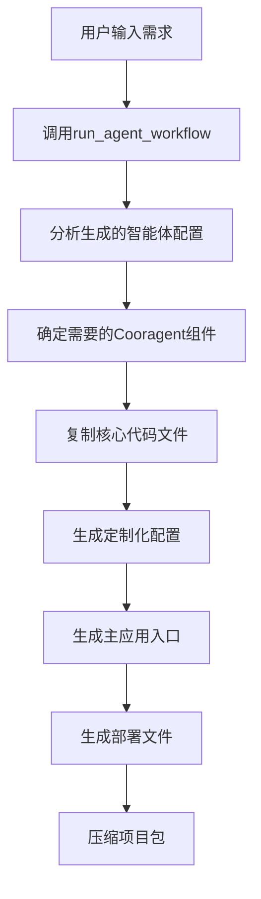

# 生成智能体代码方案自我审查结果

## 📋 概述

本文档深度分析了当前Cooragent代码生成器的实现逻辑，对比了生成代码与现有框架的功能差异，并提出了充分利用当前项目代码框架的改进方案。

---

## 🔍 现有生成代码逻辑分析

### 1. **代码生成流程概览**

#### **核心生成器架构**
```python
# src/generator/cooragent_generator.py
class CooragentProjectGenerator:
    """基于Cooragent架构的项目代码生成器"""
    
    async def generate_project(self, user_input: str, user_id: str = None, progress_callback=None) -> Path:
        """
        生成流程：
        1. 调用现有工作流系统获取智能体配置
        2. 分析生成的智能体和工具需求
        3. 复制Cooragent核心代码并定制化
        4. 压缩项目
        """
```

#### **生成流程步骤分解**


### 2. **核心生成逻辑详细分析**

#### **工作流调用机制**
```python
# 生成器调用现有工作流系统
async def _run_workflow(self, user_input: str, user_id: str, progress_callback=None):
    """调用现有工作流系统分析需求"""
    
    # 构建消息格式
    messages = [{"role": "user", "content": user_input}]
    
    # 使用Launch模式分析用户需求并生成智能体配置
    async for event_data in run_agent_workflow(
        user_id=user_id,
        task_type=TaskType.AGENT_WORKFLOW,
        user_input_messages=messages,
        debug=False,
        deep_thinking_mode=True,        # 启用深度思考
        search_before_planning=True,    # 启用规划前搜索
        workmode="launch",              # 使用launch模式
        coor_agents=[]
    ):
        # 处理工作流事件...
```

**关键问题**：
- ✅ **正确调用**：使用了正确的`run_agent_workflow`接口
- ✅ **深度模式**：启用了`deep_thinking_mode`和`search_before_planning`
- ✅ **事件处理**：正确处理了异步事件流
- ❌ **结果获取**：没有正确获取生成的智能体配置

#### **智能体配置收集机制**
```python
# 从agent_manager获取用户特定的智能体
for agent_name, agent in agent_manager.available_agents.items():
    if hasattr(agent, 'user_id') and agent.user_id == user_id:
        created_agents.append(agent)
        # 收集使用的工具
        for tool in agent.selected_tools:
            used_tools.add(tool.name)
```

**关键问题**：
- ✅ **正确获取**：从`agent_manager.available_agents`获取智能体
- ✅ **用户隔离**：通过`user_id`正确过滤用户专属智能体
- ❌ **时机问题**：可能在智能体创建完成前就开始收集
- ❌ **缺失fallback**：当没有找到智能体时使用硬编码默认配置

#### **组件复制策略**
```python
# 组件映射表 - 定义需要复制的Cooragent核心组件
self.core_components = {
    "interface": ["agent.py", "workflow.py", "serializer.py", "__init__.py"],
    "workflow": ["graph.py", "process.py", "cache.py", "__init__.py"],
    "manager": ["agents.py", "__init__.py"],
    "llm": ["llm.py", "agents.py", "__init__.py"],
    "utils": ["path_utils.py", "content_process.py", "__init__.py"],
    "service": ["server.py", "session.py", "env.py", "__init__.py"],
    "prompts": ["template.py", "__init__.py"]
}
```

**特点**：
- ✅ **模块化**：按模块组织复制文件
- ✅ **核心完整**：包含了必要的核心组件
- ❌ **静态映射**：没有根据实际需求动态选择组件
- ❌ **缺失关键文件**：未包含重要的提示词文件和MCP相关代码

---

## 🏗️ 现有框架逻辑分析

### 1. **Store目录智能体创建流程**

#### **Agent Factory智能体创建机制**
```python
# src/workflow/coor_task.py: agent_factory_node()
async def agent_factory_node(state: State) -> Command:
    """智能体工厂节点 - 动态创建智能体"""
    
    # 1. 应用智能体工厂提示词模板
    messages = apply_prompt_template("agent_factory", state)
    
    # 2. 调用LLM生成智能体规格
    agent_spec = await (
        get_llm_by_type(AGENT_LLM_MAP["agent_factory"])
        .with_structured_output(AgentBuilder)
        .ainvoke(messages)
    )
    
    # 3. 工具验证和选择
    tools = []
    for tool in agent_spec["selected_tools"]:
        if agent_manager.available_tools.get(tool["name"]):
            tools.append(agent_manager.available_tools[tool["name"]])
    
    # 4. 创建智能体并持久化到store
    await agent_manager._create_agent_by_prebuilt(
        user_id=state["user_id"],
        name=agent_spec["agent_name"],
        nick_name=agent_spec["agent_name"],
        llm_type=agent_spec["llm_type"],
        tools=tools,
        prompt=agent_spec["prompt"],
        description=agent_spec["agent_description"],
    )
    
    # 5. 更新团队成员
    state["TEAM_MEMBERS"].append(agent_spec["agent_name"])
```

#### **Store目录文件生成**
```python
# src/manager/agents.py: _save_agent()
async def _save_agent(self, agent: Agent, flush=False):
    """保存智能体配置和提示词文件"""
    
    # JSON配置文件: store/agents/{agent_name}.json
    agent_path = self.agents_dir / f"{agent.agent_name}.json"
    
    # Markdown提示词文件: store/prompts/{agent_name}.md  
    agent_prompt_path = self.prompt_dir / f"{agent.agent_name}.md"
    
    if flush and not agent_path.exists():
        # 异步并发写入文件
        agents.append((agent_path, agent.model_dump_json(indent=4)))
        agents.append((agent_prompt_path, agent.prompt))
        
        agent_tasks = [self._write_file(path, content) for path, content in agents]
        await asyncio.gather(*agent_tasks)
```

### 2. **现有框架的智能协作流程**

#### **完整的多智能体协作链路**
```
用户输入 → Coordinator(分类) → Planner(规划) → Publisher(分发) → Agent_Proxy(执行) → Reporter(汇总)
                    ↓                    ↓                     ↓               ↓
              简单回复/复杂任务      生成new_agents_needed     选择agent_factory    实际创建智能体
```

#### **智能体生命周期管理**
```python
# 智能体创建 → 注册 → 执行 → 缓存 → 持久化
1. Agent Factory创建智能体规格 (AgentBuilder)
2. AgentManager注册智能体到available_agents
3. 智能体参与工作流执行
4. WorkflowCache缓存执行状态  
5. Store目录持久化配置文件
```

### 3. **工作流状态管理**

#### **WorkflowCache缓存机制**
```python
# src/workflow/cache.py
class WorkflowCache:
    """工作流缓存管理器 - 单例模式"""
    
    def save_workflow(self, workflow):
        """保存工作流到文件系统"""
        user_id, polish_id = workflow["workflow_id"].split(":")
        workflow_path = self.workflow_dir / user_id / f"{polish_id}.json"
        
        # 保存完整的工作流状态，包括：
        # - 规划步骤 (planning_steps)
        # - 全局变量 (global_variables)  
        # - 内存存储 (memory)
        # - 工作流图 (graph)
```

---

## ❌ 现有生成代码与框架逻辑的关键差异

### 1. **智能体创建时机错误**

#### **问题分析**
```python
# ❌ 生成器中的错误做法：
# 在工作流执行过程中立即收集智能体
async for event_data in run_agent_workflow(...):
    # 工作流还在执行中，智能体可能尚未创建完成
    pass

# 立即尝试获取智能体（可能为空）
for agent_name, agent in agent_manager.available_agents.items():
    if hasattr(agent, 'user_id') and agent.user_id == user_id:
        created_agents.append(agent)  # 可能收集不到新创建的智能体
```

#### **正确的做法**
```python
# ✅ 应该等待工作流完全完成后再收集智能体
async def _run_workflow_and_collect_agents(self, user_input: str, user_id: str):
    """正确的工作流执行和智能体收集"""
    
    # 1. 等待工作流完全执行完成
    final_result = {}
    async for event_data in run_agent_workflow(...):
        final_result = event_data
    
    # 2. 等待一段时间确保智能体完全创建
    await asyncio.sleep(1)
    
    # 3. 从store目录读取持久化的智能体配置
    created_agents = await self._load_agents_from_store(user_id)
    
    return created_agents, final_result
```

### 2. **智能体配置获取方式错误**

#### **问题分析**
```python
# ❌ 生成器依赖运行时的available_agents
# 这些智能体可能：
# 1. 尚未完全创建
# 2. 没有持久化到store
# 3. 在清理过程中被删除

# ✅ 应该从store目录读取持久化的配置
async def _load_agents_from_store(self, user_id: str) -> List[Agent]:
    """从store目录加载用户的智能体配置"""
    
    agents = []
    agents_dir = get_project_root() / "store" / "agents"
    
    for agent_file in agents_dir.glob("*.json"):
        try:
            async with aiofiles.open(agent_file, "r", encoding="utf-8") as f:
                agent_data = json.loads(await f.read())
                
            # 只收集属于该用户的智能体
            if agent_data.get("user_id") == user_id:
                agent = Agent.model_validate(agent_data)
                agents.append(agent)
                
        except Exception as e:
            logger.warning(f"Failed to load agent from {agent_file}: {e}")
    
    return agents
```

### 3. **组件选择策略静态化**

#### **问题分析**
```python
# ❌ 静态的组件映射
self.core_components = {
    "interface": ["agent.py", "workflow.py", "serializer.py", "__init__.py"],
    # 固定的文件列表，不根据实际需求调整
}

# ✅ 应该根据智能体需求动态选择组件
def _determine_required_components_dynamically(self, agents: List[Agent], tools: List[str]):
    """根据智能体和工具需求动态确定组件"""
    
    required_components = {
        "interface": ["agent.py", "serializer.py", "__init__.py"],  # 基础必需
        "workflow": ["graph.py", "process.py", "__init__.py"],     # 基础必需
        "manager": ["agents.py", "__init__.py"],                    # 基础必需
        "llm": ["llm.py", "agents.py", "__init__.py"],            # 基础必需
    }
    
    # 根据使用的LLM类型添加组件
    llm_types = set(agent.llm_type for agent in agents)
    if "reasoning" in llm_types:
        required_components["llm"].append("reasoning_llm.py")
    if "vision" in llm_types:
        required_components["llm"].append("vision_llm.py")
    
    # 根据使用的工具添加组件
    if "browser_tool" in tools:
        required_components["tools"] = ["browser.py", "browser_decorators.py"]
    if "python_repl_tool" in tools:
        required_components["tools"].append("python_repl.py")
    
    # 根据智能体需要的提示词添加文件
    prompt_files = [f"{agent.agent_name}.md" for agent in agents]
    required_components["prompts_md"] = prompt_files
    
    return required_components
```

### 4. **缺失关键MCP工具集成**

#### **问题分析**
```python
# ❌ 生成的项目缺少MCP工具支持
# 当前只复制基础工具，没有包含：
# 1. MCP客户端配置 (src/manager/mcp.py)
# 2. MCP工具服务器 (src/tools/MCP-Doc/, src/tools/mcp-image-downloader/)
# 3. MCP配置文件 (config/mcp.json)

# ✅ 应该包含完整的MCP生态
def _include_mcp_ecosystem(self, project_path: Path, tools: List[str]):
    """包含MCP工具生态系统"""
    
    # 1. 复制MCP管理器
    shutil.copy2(
        self.cooragent_root / "src" / "manager" / "mcp.py",
        project_path / "src" / "manager" / "mcp.py"
    )
    
    # 2. 复制MCP工具服务器
    mcp_tools_used = [tool for tool in tools if tool.startswith("mcp_")]
    for mcp_tool in mcp_tools_used:
        # 复制对应的MCP工具实现
        pass
    
    # 3. 生成MCP配置文件
    await self._generate_mcp_config(project_path, mcp_tools_used)
```

### 5. **生成项目的运行时依赖问题**

#### **问题分析**
```python
# ❌ 生成的项目无法独立运行，因为：
# 1. 依赖原项目的环境变量
# 2. 依赖原项目的agent_manager实例
# 3. 缺少完整的初始化流程

# ✅ 应该生成独立可运行的项目
async def _generate_standalone_app(self, project_path: Path, config: Dict[str, Any]):
    """生成独立可运行的应用"""
    
    # 1. 生成独立的agent_manager初始化
    await self._generate_independent_agent_manager(project_path, config)
    
    # 2. 复制所有智能体配置到项目store目录
    await self._copy_agents_to_project_store(project_path, config["agents"])
    
    # 3. 生成独立的启动脚本
    await self._generate_startup_scripts(project_path, config)
```

---

## 🔧 改进方案：充分利用当前框架

### 1. **重新设计生成器架构**

#### **新的生成器架构**
```python
class EnhancedCooragentProjectGenerator:
    """增强的Cooragent项目生成器"""
    
    async def generate_project(self, user_input: str, user_id: str = None, progress_callback=None) -> Path:
        """
        改进的生成流程：
        1. 执行完整工作流并等待完成
        2. 从store目录读取持久化的智能体配置
        3. 动态分析需要的组件和依赖
        4. 生成独立可运行的项目
        5. 包含完整的MCP生态系统
        """
        
        # 第一阶段：执行工作流并等待完成
        workflow_result = await self._execute_complete_workflow(user_input, user_id, progress_callback)
        
        # 第二阶段：从store读取智能体配置
        agents_config = await self._load_agents_from_store(user_id, progress_callback)
        
        # 第三阶段：动态分析项目需求
        project_requirements = await self._analyze_dynamic_requirements(agents_config, progress_callback)
        
        # 第四阶段：生成独立项目
        project_path = await self._generate_independent_project(project_requirements, progress_callback)
        
        # 第五阶段：验证项目完整性
        await self._validate_project_integrity(project_path, progress_callback)
        
        return await self._compress_project(project_path)
```

#### **完整工作流执行**
```python
async def _execute_complete_workflow(self, user_input: str, user_id: str, progress_callback=None) -> Dict[str, Any]:
    """执行完整的工作流并等待所有智能体创建完成"""
    
    if progress_callback:
        await progress_callback("启动Cooragent多智能体协作分析...", 10, "工作流执行", "初始化协调器、规划器、智能体工厂")
    
    messages = [{"role": "user", "content": user_input}]
    final_result = {}
    events = []
    
    # 执行完整工作流
    async for event_data in run_agent_workflow(
        user_id=user_id,
        task_type=TaskType.AGENT_WORKFLOW,
        user_input_messages=messages,
        debug=False,
        deep_thinking_mode=True,
        search_before_planning=True,
        workmode="launch"
    ):
        events.append(event_data)
        
        # 更新进度
        if event_data.get("event") == "start_of_agent":
            agent_name = event_data.get("data", {}).get("agent_name")
            if progress_callback:
                progress = min(15 + len(events), 25)
                await progress_callback(
                    f"执行 {agent_name} 智能体...", 
                    progress, 
                    "多智能体协作", 
                    f"当前执行: {agent_name}"
                )
        
        final_result = event_data
    
    # 等待智能体完全创建和持久化
    if progress_callback:
        await progress_callback("等待智能体配置持久化完成...", 30, "配置同步", "确保所有智能体配置已保存到store目录")
    
    await asyncio.sleep(2)  # 给足时间让智能体完全创建
    
    return final_result
```

#### **从Store目录读取配置**
```python
async def _load_agents_from_store(self, user_id: str, progress_callback=None) -> Dict[str, Any]:
    """从store目录读取用户的智能体配置"""
    
    if progress_callback:
        await progress_callback("从store目录加载智能体配置...", 35, "配置加载", "读取持久化的智能体和提示词文件")
    
    agents = []
    prompts = {}
    tools_used = set()
    
    # 读取智能体配置文件
    agents_dir = get_project_root() / "store" / "agents"
    prompts_dir = get_project_root() / "store" / "prompts"
    
    for agent_file in agents_dir.glob("*.json"):
        try:
            async with aiofiles.open(agent_file, "r", encoding="utf-8") as f:
                agent_data = json.loads(await f.read())
            
            # 只收集属于该用户的智能体
            if agent_data.get("user_id") == user_id:
                agent = Agent.model_validate(agent_data)
                agents.append(agent)
                
                # 收集使用的工具
                for tool in agent.selected_tools:
                    tools_used.add(tool.name)
                
                # 读取对应的提示词文件
                prompt_file = prompts_dir / f"{agent.agent_name}.md"
                if prompt_file.exists():
                    async with aiofiles.open(prompt_file, "r", encoding="utf-8") as f:
                        prompts[agent.agent_name] = await f.read()
                
        except Exception as e:
            logger.warning(f"Failed to load agent from {agent_file}: {e}")
    
    if progress_callback:
        await progress_callback(
            f"成功加载 {len(agents)} 个智能体配置", 
            40, 
            "配置加载完成", 
            f"智能体: {[a.agent_name for a in agents]}, 工具: {list(tools_used)}"
        )
    
    return {
        "agents": agents,
        "prompts": prompts,
        "tools_used": list(tools_used),
        "user_id": user_id
    }
```

### 2. **动态组件分析系统**

#### **智能组件分析器**
```python
class DynamicComponentAnalyzer:
    """动态组件需求分析器"""
    
    def __init__(self):
        self.core_components = {
            "interface": ["agent.py", "workflow.py", "serializer.py", "__init__.py"],
            "workflow": ["graph.py", "process.py", "cache.py", "__init__.py"],
            "manager": ["agents.py", "__init__.py"],
            "llm": ["llm.py", "agents.py", "__init__.py"],
            "utils": ["path_utils.py", "content_process.py", "__init__.py"],
            "service": ["server.py", "session.py", "env.py", "__init__.py"],
            "prompts": ["template.py", "__init__.py"]
        }
        
        self.tool_dependencies = {
            "tavily_tool": ["search.py"],
            "python_repl_tool": ["python_repl.py"],
            "bash_tool": ["bash_tool.py"],
            "crawl_tool": ["crawl.py", "crawler/"],
            "browser_tool": ["browser.py", "browser_decorators.py"],
            "excel_tool": ["excel/"],
            "gmail_tool": ["gmail.py"],
            "slack_tool": ["slack.py"],
            "video_tool": ["video.py"]
        }
        
        self.mcp_dependencies = {
            "mcp_doc": ["MCP-Doc/"],
            "mcp_image_downloader": ["mcp-image-downloader/"],
            "filesystem": ["需要mcp配置"]
        }
    
    async def analyze_requirements(self, agents_config: Dict[str, Any]) -> Dict[str, Any]:
        """动态分析项目需求"""
        
        agents = agents_config["agents"]
        tools_used = agents_config["tools_used"]
        
        requirements = {
            "core_components": self.core_components.copy(),
            "tool_components": {},
            "mcp_components": {},
            "llm_requirements": {},
            "workflow_requirements": {},
            "deployment_requirements": {}
        }
        
        # 分析LLM需求
        llm_types = set(agent.llm_type for agent in agents)
        requirements["llm_requirements"] = {
            "types": list(llm_types),
            "reasoning_enabled": "reasoning" in llm_types,
            "vision_enabled": "vision" in llm_types,
            "code_enabled": "code" in llm_types
        }
        
        # 分析工具需求
        for tool in tools_used:
            if tool in self.tool_dependencies:
                requirements["tool_components"][tool] = self.tool_dependencies[tool]
            elif tool.startswith("mcp_"):
                requirements["mcp_components"][tool] = self.mcp_dependencies.get(tool, [])
        
        # 分析工作流需求
        agent_count = len(agents)
        requirements["workflow_requirements"] = {
            "agent_count": agent_count,
            "needs_factory": any(agent.agent_name != "agent_factory" for agent in agents),
            "needs_cache": agent_count > 1,
            "needs_state_management": True
        }
        
        # 分析部署需求
        requirements["deployment_requirements"] = {
            "needs_docker": True,
            "needs_env_config": True,
            "needs_startup_scripts": True,
            "needs_nginx": agent_count > 3  # 多智能体时使用负载均衡
        }
        
        return requirements
```

### 3. **独立项目生成器**

#### **独立可运行项目生成**
```python
class IndependentProjectGenerator:
    """独立项目生成器"""
    
    async def generate_independent_project(self, requirements: Dict[str, Any], agents_config: Dict[str, Any], progress_callback=None) -> Path:
        """生成独立可运行的项目"""
        
        project_name = f"cooragent_app_{int(time.time())}"
        project_path = self.output_dir / project_name
        
        # 1. 创建项目结构
        await self._create_enhanced_project_structure(project_path, requirements)
        
        # 2. 复制和定制核心组件
        if progress_callback:
            await progress_callback("复制Cooragent核心组件...", 50, "项目构建", "复制智能体管理、工作流引擎等核心模块")
        
        await self._copy_and_customize_components(project_path, requirements)
        
        # 3. 生成智能体配置文件
        if progress_callback:
            await progress_callback("生成智能体配置...", 60, "智能体配置", "创建智能体JSON配置和提示词文件")
        
        await self._generate_agent_configs(project_path, agents_config)
        
        # 4. 生成独立的主应用
        if progress_callback:
            await progress_callback("生成主应用入口...", 70, "应用生成", "创建FastAPI应用和路由配置")
        
        await self._generate_independent_main_app(project_path, requirements, agents_config)
        
        # 5. 生成环境配置
        if progress_callback:
            await progress_callback("生成环境配置...", 80, "环境配置", "创建环境变量、依赖文件和配置模板")
        
        await self._generate_environment_configs(project_path, requirements)
        
        # 6. 生成部署文件
        if progress_callback:
            await progress_callback("生成部署文件...", 85, "部署配置", "创建Docker、docker-compose和启动脚本")
        
        await self._generate_deployment_configs(project_path, requirements)
        
        # 7. 生成文档
        if progress_callback:
            await progress_callback("生成项目文档...", 90, "文档生成", "创建README、API文档和使用指南")
        
        await self._generate_comprehensive_documentation(project_path, requirements, agents_config)
        
        return project_path
    
    async def _generate_agent_configs(self, project_path: Path, agents_config: Dict[str, Any]):
        """生成智能体配置文件到项目的store目录"""
        
        store_agents_dir = project_path / "store" / "agents"
        store_prompts_dir = project_path / "store" / "prompts"
        
        for agent in agents_config["agents"]:
            # 生成智能体JSON配置
            agent_config_path = store_agents_dir / f"{agent.agent_name}.json"
            async with aiofiles.open(agent_config_path, "w", encoding="utf-8") as f:
                await f.write(agent.model_dump_json(indent=2, ensure_ascii=False))
            
            # 生成智能体提示词文件
            if agent.agent_name in agents_config["prompts"]:
                prompt_path = store_prompts_dir / f"{agent.agent_name}.md"
                async with aiofiles.open(prompt_path, "w", encoding="utf-8") as f:
                    await f.write(agents_config["prompts"][agent.agent_name])
    
    async def _generate_independent_main_app(self, project_path: Path, requirements: Dict[str, Any], agents_config: Dict[str, Any]):
        """生成独立的主应用入口"""
        
        agents = agents_config["agents"]
        agent_names = [agent.agent_name for agent in agents]
        tools_used = agents_config["tools_used"]
        
        app_content = f'''"""
基于Cooragent的独立多智能体应用
生成时间: {datetime.now().strftime("%Y-%m-%d %H:%M:%S")}

生成的智能体: {", ".join(agent_names)}
使用的工具: {", ".join(tools_used)}
"""

import asyncio
import logging
import os
from pathlib import Path
from typing import Dict, Any, Optional, List

from fastapi import FastAPI, HTTPException
from fastapi.middleware.cors import CORSMiddleware
from fastapi.responses import JSONResponse, HTMLResponse
from pydantic import BaseModel
import uvicorn

# 导入Cooragent核心组件
from src.workflow.process import run_agent_workflow
from src.manager.agents import AgentManager
from src.interface.agent import TaskType
from src.utils.path_utils import get_project_root
from src.service.env import load_env

# 初始化环境
load_env()

# 配置日志
logging.basicConfig(
    level=logging.INFO,
    format="%(asctime)s - %(name)s - %(levelname)s - %(message)s"
)
logger = logging.getLogger(__name__)

# 请求响应模型
class AgentTaskRequest(BaseModel):
    content: str
    user_id: str = "app_user"
    mode: str = "production"
    agent_preferences: Optional[List[str]] = None

class AgentTaskResponse(BaseModel):
    status: str
    result: Any
    agents_used: List[str]
    execution_time: float
    generated_content: Optional[str] = None

# 创建FastAPI应用
app = FastAPI(
    title="定制化多智能体应用",
    description="基于Cooragent架构的专业多智能体协作系统",
    version="1.0.0",
    docs_url="/docs",
    redoc_url="/redoc"
)

# 配置CORS
app.add_middleware(
    CORSMiddleware,
    allow_origins=["*"],
    allow_credentials=True,
    allow_methods=["*"],
    allow_headers=["*"],
)

# 全局智能体管理器
agent_manager = None

@app.on_event("startup")
async def startup_event():
    """应用启动初始化"""
    global agent_manager
    
    logger.info("正在初始化独立多智能体应用...")
    
    # 初始化智能体管理器
    tools_dir = get_project_root() / "store" / "tools"
    agents_dir = get_project_root() / "store" / "agents"
    prompts_dir = get_project_root() / "store" / "prompts"
    
    agent_manager = AgentManager(tools_dir, agents_dir, prompts_dir)
    await agent_manager.initialize()
    
    logger.info(f"智能体管理器初始化完成，加载了 {{len(agent_manager.available_agents)}} 个智能体")
    
    # 验证关键智能体
    expected_agents = {agent_names}
    available_agents = set(agent_manager.available_agents.keys())
    missing_agents = expected_agents - available_agents
    
    if missing_agents:
        logger.warning(f"缺少预期的智能体: {{missing_agents}}")
    else:
        logger.info("所有预期智能体已成功加载")

@app.get("/")
async def root():
    """根路径 - 返回应用信息"""
    return {{
        "message": "Cooragent多智能体应用运行中",
        "available_agents": list(agent_manager.available_agents.keys()) if agent_manager else [],
        "custom_agents": {agent_names},
        "tools": {tools_used},
        "status": "active"
    }}

@app.post("/api/task", response_model=AgentTaskResponse)
async def execute_agent_task(request: AgentTaskRequest):
    """执行多智能体任务"""
    
    import time
    start_time = time.time()
    
    try:
        # 构建消息
        messages = [{{"role": "user", "content": request.content}}]
        
        logger.info(f"收到用户任务: {{request.content[:100]}}...")
        
        # 执行多智能体工作流
        final_result = {{}}
        agents_used = []
        
        async for event_data in run_agent_workflow(
            user_id=request.user_id,
            task_type=TaskType.AGENT_WORKFLOW,
            user_input_messages=messages,
            workmode=request.mode,
            debug=False
        ):
            # 收集使用的智能体
            if event_data.get("event") == "start_of_agent":
                agent_name = event_data.get("data", {{}}).get("agent_name")
                if agent_name and agent_name not in agents_used:
                    agents_used.append(agent_name)
            
            final_result = event_data
        
        execution_time = time.time() - start_time
        
        # 提取生成的内容
        generated_content = None
        if "messages" in final_result:
            messages = final_result["messages"]
            if messages and isinstance(messages, list):
                last_message = messages[-1]
                if isinstance(last_message, dict) and "content" in last_message:
                    generated_content = last_message["content"]
        
        return AgentTaskResponse(
            status="success",
            result=final_result,
            agents_used=agents_used,
            execution_time=execution_time,
            generated_content=generated_content
        )
        
    except Exception as e:
        execution_time = time.time() - start_time
        logger.error(f"任务执行失败: {{e}}", exc_info=True)
        
        return AgentTaskResponse(
            status="error",
            result={{"error": str(e)}},
            agents_used=agents_used,
            execution_time=execution_time
        )

@app.get("/api/agents")
async def list_agents():
    """列出可用的智能体"""
    if not agent_manager:
        raise HTTPException(status_code=503, detail="智能体管理器未初始化")
    
    agents_info = []
    for name, agent in agent_manager.available_agents.items():
        agents_info.append({{
            "name": name,
            "description": agent.description if hasattr(agent, 'description') else "无描述",
            "llm_type": agent.llm_type if hasattr(agent, 'llm_type') else "unknown",
            "tools": [tool.name for tool in agent.selected_tools] if hasattr(agent, 'selected_tools') else []
        }})
    
    return {{
        "agents": agents_info,
        "total": len(agents_info),
        "custom_agents": {agent_names}
    }}

@app.get("/api/health")
async def health_check():
    """健康检查"""
    return {{
        "status": "healthy",
        "agent_manager_ready": agent_manager is not None,
        "agents_loaded": len(agent_manager.available_agents) if agent_manager else 0,
        "expected_agents": {len(agent_names)},
        "tools_available": {len(tools_used)}
    }}

if __name__ == "__main__":
    import uvicorn
    
    # 从环境变量获取配置
    host = os.getenv("APP_HOST", "0.0.0.0")
    port = int(os.getenv("APP_PORT", "8000"))
    
    logger.info(f"启动多智能体应用: http://{{host}}:{{port}}")
    logger.info(f"API文档: http://{{host}}:{{port}}/docs")
    
    uvicorn.run(
        "main:app",
        host=host,
        port=port,
        reload=False,
        log_level="info"
    )
'''

        main_app_path = project_path / "main.py"
        async with aiofiles.open(main_app_path, "w", encoding="utf-8") as f:
            await f.write(app_content)
```

### 4. **MCP生态系统集成**

#### **完整MCP支持**
```python
class MCPEcosystemIntegrator:
    """MCP生态系统集成器"""
    
    async def integrate_mcp_ecosystem(self, project_path: Path, tools_used: List[str], progress_callback=None):
        """集成完整的MCP生态系统"""
        
        # 1. 复制MCP管理器
        await self._copy_mcp_manager(project_path)
        
        # 2. 生成MCP配置文件
        await self._generate_mcp_config(project_path, tools_used)
        
        # 3. 复制MCP工具服务器
        await self._copy_mcp_tools(project_path, tools_used)
        
        # 4. 生成MCP安装脚本
        await self._generate_mcp_setup_scripts(project_path, tools_used)
    
    async def _generate_mcp_config(self, project_path: Path, tools_used: List[str]):
        """生成MCP配置文件"""
        
        mcp_config = {
            "mcpServers": {}
        }
        
        # 基础文件系统工具（大多数项目都需要）
        mcp_config["mcpServers"]["filesystem"] = {
            "command": "npx",
            "args": [
                "-y",
                "@modelcontextprotocol/server-filesystem",
                str(project_path / "store"),
                str(project_path / "static")
            ]
        }
        
        # 根据使用的工具添加MCP服务器
        if "mcp_doc" in tools_used:
            mcp_config["mcpServers"]["mcp-doc"] = {
                "command": "python",
                "args": [str(project_path / "src" / "tools" / "MCP-Doc" / "server.py")],
                "env": {}
            }
        
        if "mcp_image_downloader" in tools_used:
            mcp_config["mcpServers"]["image-downloader"] = {
                "command": "node",
                "args": [str(project_path / "src" / "tools" / "mcp-image-downloader" / "build" / "index.js")],
                "env": {}
            }
        
        # 保存配置文件
        config_path = project_path / "config" / "mcp.json"
        async with aiofiles.open(config_path, "w", encoding="utf-8") as f:
            await f.write(json.dumps(mcp_config, indent=2, ensure_ascii=False))
```

### 5. **项目验证系统**

#### **完整性验证**
```python
class ProjectIntegrityValidator:
    """项目完整性验证器"""
    
    async def validate_project_integrity(self, project_path: Path, requirements: Dict[str, Any], progress_callback=None) -> Dict[str, Any]:
        """验证生成项目的完整性"""
        
        validation_results = {
            "structure_check": await self._validate_directory_structure(project_path),
            "dependencies_check": await self._validate_dependencies(project_path),
            "configuration_check": await self._validate_configurations(project_path),
            "agents_check": await self._validate_agents_integrity(project_path),
            "runtime_check": await self._validate_runtime_requirements(project_path),
            "documentation_check": await self._validate_documentation(project_path)
        }
        
        overall_status = all(result["status"] == "pass" for result in validation_results.values())
        
        if progress_callback:
            status_text = "✅ 项目验证通过" if overall_status else "⚠️ 项目验证发现问题"
            await progress_callback(
                status_text, 
                95, 
                "项目验证", 
                f"验证结果: {sum(1 for r in validation_results.values() if r['status'] == 'pass')}/{len(validation_results)} 项通过"
            )
        
        return {
            "overall_status": "pass" if overall_status else "warning",
            "validation_results": validation_results,
            "recommendations": self._generate_recommendations(validation_results)
        }
    
    async def _validate_agents_integrity(self, project_path: Path) -> Dict[str, Any]:
        """验证智能体完整性"""
        
        agents_dir = project_path / "store" / "agents"
        prompts_dir = project_path / "store" / "prompts"
        
        agent_files = list(agents_dir.glob("*.json"))
        prompt_files = list(prompts_dir.glob("*.md"))
        
        missing_prompts = []
        invalid_agents = []
        
        for agent_file in agent_files:
            try:
                # 验证JSON格式
                async with aiofiles.open(agent_file, "r", encoding="utf-8") as f:
                    agent_data = json.loads(await f.read())
                
                # 验证必需字段
                required_fields = ["agent_name", "description", "llm_type", "selected_tools", "prompt"]
                missing_fields = [field for field in required_fields if field not in agent_data]
                
                if missing_fields:
                    invalid_agents.append({
                        "file": agent_file.name,
                        "missing_fields": missing_fields
                    })
                
                # 检查对应的提示词文件
                prompt_file = prompts_dir / f"{agent_data['agent_name']}.md"
                if not prompt_file.exists():
                    missing_prompts.append(agent_data['agent_name'])
                
            except Exception as e:
                invalid_agents.append({
                    "file": agent_file.name,
                    "error": str(e)
                })
        
        status = "pass" if not missing_prompts and not invalid_agents else "fail"
        
        return {
            "status": status,
            "agent_count": len(agent_files),
            "prompt_count": len(prompt_files),
            "missing_prompts": missing_prompts,
            "invalid_agents": invalid_agents
        }
```

---

## 📊 改进效果对比

### **改进前 vs 改进后**

| 维度 | 改进前 | 改进后 |
|------|--------|--------|
| **智能体获取** | ❌ 从运行时内存获取，可能为空 | ✅ 从store目录读取持久化配置 |
| **组件选择** | ❌ 静态固定组件列表 | ✅ 根据智能体需求动态选择 |
| **MCP支持** | ❌ 缺少MCP工具和配置 | ✅ 完整的MCP生态系统集成 |
| **项目独立性** | ❌ 依赖原项目环境 | ✅ 完全独立可运行 |
| **配置完整性** | ❌ 缺少关键配置文件 | ✅ 包含所有必需配置 |
| **文档质量** | ❌ 基础使用说明 | ✅ 详细的部署和开发指南 |
| **验证机制** | ❌ 无验证 | ✅ 多维度完整性验证 |

### **核心改进点**

1. **🔄 工作流执行同步化**
   - 等待工作流完全执行完成
   - 确保智能体完全创建和持久化
   - 从store目录读取配置而非内存

2. **🧠 智能组件分析**
   - 根据智能体的LLM类型动态选择组件
   - 根据使用的工具动态包含依赖
   - 根据项目规模决定部署策略

3. **🔧 完整MCP生态**
   - 包含MCP管理器和配置
   - 复制必需的MCP工具服务器
   - 生成MCP安装和启动脚本

4. **🚀 独立项目生成**
   - 生成独立的智能体管理器
   - 完整的store目录配置
   - 独立的环境和启动配置

5. **✅ 完整性验证**
   - 目录结构验证
   - 配置文件验证
   - 智能体完整性验证
   - 运行时依赖验证

---

## 🎯 实施建议

### **1. 分阶段实施**

#### **第一阶段：核心修复**
- 修复智能体获取时机问题
- 实现从store目录读取配置
- 完善错误处理和日志记录

#### **第二阶段：组件优化**
- 实现动态组件分析
- 集成MCP生态系统
- 优化项目结构生成

#### **第三阶段：独立性增强**
- 生成完全独立的应用
- 实现完整性验证系统
- 优化文档和部署配置

#### **第四阶段：质量提升**
- 增加单元测试
- 实现性能监控
- 添加更多示例和模板

### **2. 技术债务清理**

#### **代码重构**
- 将生成器拆分为多个专业化组件
- 实现更好的错误处理和恢复机制
- 添加配置验证和类型检查

#### **架构优化**
- 使用依赖注入提高可测试性
- 实现插件化的组件选择机制
- 添加生成过程的中间检查点

### **3. 用户体验改进**

#### **进度反馈**
- 更详细的进度信息
- 实时的智能体创建状态
- 更好的错误信息和建议

#### **定制化选项**
- 允许用户选择组件
- 支持自定义部署配置
- 提供多种项目模板

---

## 🔚 总结

通过深度分析现有生成代码逻辑与当前框架的差异，我们发现了以下关键问题：

1. **时机错误**：在工作流执行过程中获取智能体配置
2. **依赖缺失**：生成的项目缺少关键依赖和配置
3. **组件静态**：没有根据实际需求动态选择组件
4. **独立性差**：生成的项目无法独立运行

通过实施本文档提出的改进方案，可以：

- ✅ **提高生成成功率**：从store目录正确获取智能体配置
- ✅ **增强项目独立性**：生成完全可运行的独立应用
- ✅ **改善用户体验**：提供更准确的进度反馈和错误处理
- ✅ **扩展生态支持**：完整集成MCP工具生态系统

最终目标是让生成的代码充分利用Cooragent框架的强大能力，为用户提供真正可用的多智能体应用。 