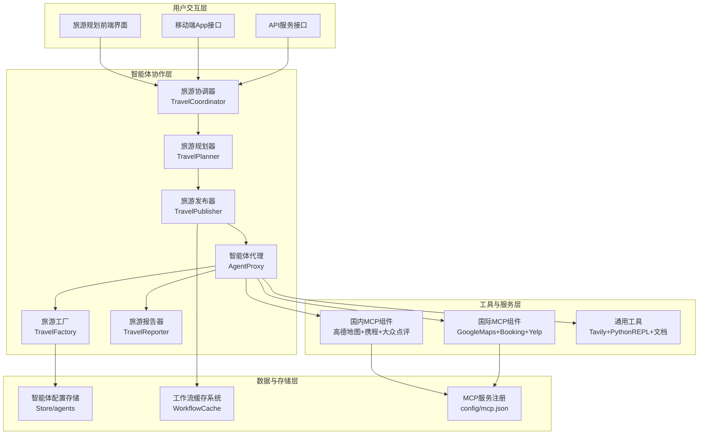

# 旅游行业智能体产品方案

## 📋 产品概述

基于Cooragent多智能体协作框架和MCP生态的**全栈旅游规划智能体产品**，通过整合国内外优质MCP组件和专业化智能体设计，为用户提供从需求分析到完整执行的一站式旅游规划服务。

### 核心价值主张
- **智能化规划**：基于ReAct模式的多智能体协作，实现复杂旅游需求的智能分解和执行
- **标准化集成**：采用MCP协议统一集成地图、预订、天气等第三方服务
- **个性化体验**：动态创建专业化智能体，针对不同旅游类型提供定制服务
- **全球覆盖**：国内外差异化工具配置，智能适配中国和海外旅游场景

---

## 🏗️ 产品架构设计

### 1. 整体架构概览



### 2. 核心组件设计

#### **2.1 旅游协调器 (TravelCoordinator)**
基于 `23coordinatoragent使用功能及作用说明.md` 的增强实现
```python
# 旅游专用协调器特性
- 智能识别旅游需求类型（文化游、商务游、亲子游等）
- 地理位置感知路由（国内vs海外）
- 预算和时间约束分析
- 多语言支持（中文、英文等）

# 分类逻辑
PROTOCOL 1: 简单旅游信息查询
- "北京有什么好玩的？"
- "泰国签证怎么办？"
→ 直接回复基础信息

PROTOCOL 2: 复杂旅游规划任务  
- "帮我规划3天北京深度游"
- "制定欧洲7国15日游攻略"
→ 移交给TravelPlanner
```

#### **2.2 旅游规划器 (TravelPlanner)**
基于 `24planneragent使用功能及作用说明.md` 的专业化实现
```python
# 旅游专用规划能力
- 地理空间优化：路线规划、交通衔接
- 时间窗口管理：营业时间、预订截止时间
- 预算智能分配：住宿、交通、餐饮、活动
- 天气适应规划：室内外活动动态调整
- 文化整合：当地习俗、节庆活动考虑

# 输出结构
interface TravelPlan {
  thought: string;                    // 旅游规划思路分析
  title: string;                     // 行程标题
  destination_analysis: string;       // 目的地深度分析
  budget_breakdown: BudgetItem[];     // 预算明细
  new_agents_needed: TravelAgent[];   // 专业旅游智能体需求
  itinerary_steps: TravelStep[];      // 优化后的行程步骤
}
```

#### **2.3 旅游发布器 (TravelPublisher)**
基于 `25publisher使用功能及作用说明.md` 的智能协调实现
```python
# 旅游任务智能分发特性
- 地理聚类优化：按位置就近分组执行
- 实时条件适应：天气、交通状况动态调整
- 时间窗口验证：确保任务在有效时间内执行
- 资源冲突检测：避免预订时间冲突

# 智能路由逻辑
if weather_dependent_task and bad_weather:
    → 跳转到室内替代活动
elif booking_urgent and within_business_hours:
    → 优先执行预订任务
elif same_location_tasks:
    → 地理聚类批量执行
```

#### **2.4 智能体代理 (AgentProxy)**
基于 `26agent_proxy说明.md` 的增强执行引擎
```python
# 旅游智能体执行特性
- 旅游上下文注入：地理位置、天气、预算
- MCP工具智能调用：国内外工具自动切换
- 多模态能力：支持文本、图像、地图等
- 实时信息获取：动态获取最新价格、可用性

# ReAct模式旅游应用
User: "帮我找北京性价比高的酒店"
→ Thought: "需要搜索北京酒店信息，考虑价格和评价"
→ Action: hotel_search_and_booking
→ Observation: "找到10家酒店，价格200-800元"
→ Thought: "基于价格和评分筛选最优选择"
→ Final Answer: "推荐3家性价比最优酒店..."
```

#### **2.5 旅游工厂 (TravelFactory)**
基于 `27agent_factory使用功能及作用说明.md` 的专业智能体创建
```python
# 旅游智能体专业化创建
- 需求分析：识别专业旅游能力缺口
- 工具精选：智能选择旅游专用工具组合
- 提示词工程：创建旅游领域专业行为指南
- 地域适配：针对不同地区创建本地化智能体

# 智能体类型设计
TravelPlannerExpert: 综合行程规划专家
LocalGuide: 本地文化导游专家  
BudgetOptimizer: 旅游预算优化专家
TransportCoordinator: 交通协调专家
```

---

## 🔧 MCP组件集成方案

### 1. 国内旅游MCP组件配置

```json
{
  "mcpServers": {
    "amap": {
      "url": "https://mcp.amap.com/sse",
      "env": {"AMAP_MAPS_API_KEY": "your_key"},
      "tools": [
        "maps_direction_driving",
        "maps_direction_transit", 
        "maps_around_search",
        "maps_text_search"
      ]
    },
    "ctrip": {
      "command": "python",
      "args": ["src/tools/travel/ctrip_server.py"],
      "env": {"CTRIP_API_KEY": "your_key"},
      "tools": [
        "search_flights",
        "search_trains", 
        "search_hotels",
        "book_tickets"
      ]
    },
    "dianping": {
      "command": "node",
      "args": ["src/tools/travel/dianping_server.js"],
      "env": {"DIANPING_API_KEY": "your_key"},
      "tools": [
        "recommend_restaurants",
        "search_activities",
        "get_reviews"
      ]
    },
    "weather_cn": {
      "command": "python", 
      "args": ["src/tools/travel/weather_cn_server.py"],
      "env": {"WEATHER_API_KEY": "your_key"},
      "tools": ["weather_forecast_travel"]
    }
  }
}
```

### 2. 国际旅游MCP组件配置

```json
{
  "mcpServers": {
    "google_maps": {
      "url": "https://mcp.google.com/maps",
      "env": {"GOOGLE_API_KEY": "your_key"},
      "tools": [
        "get_directions",
        "find_place", 
        "nearby_search",
        "geocoding"
      ]
    },
    "flights_mcp": {
      "command": "npx",
      "args": ["-y", "flights-mcp-server"],
      "env": {"DUFFEL_API_KEY": "your_key"},
      "tools": [
        "search_flight_offers",
        "get_seat_maps",
        "create_orders"
      ]
    },
    "booking": {
      "url": "https://mcp.booking.com/sse",
      "env": {"BOOKING_API_KEY": "your_key"},
      "tools": [
        "search_hotels",
        "get_hotel_details",
        "create_booking"
      ]
    },
    "yelp": {
      "command": "python",
      "args": ["src/tools/travel/yelp_server.py"], 
      "env": {"YELP_API_KEY": "your_key"},
      "tools": [
        "search_businesses",
        "get_reviews",
        "get_business_details"
      ]
    }
  }
}
```

### 3. 智能工具选择策略

```python
class IntelligentTravelToolOrchestrator:
    """智能旅游工具编排器"""
    
    def __init__(self):
        self.tool_configs = {
            "china": {
                "maps": "amap",
                "booking": "ctrip", 
                "dining": "dianping",
                "weather": "weather_cn"
            },
            "international": {
                "maps": "google_maps",
                "booking": "booking",
                "dining": "yelp", 
                "weather": "openweather"
            }
        }
    
    async def get_mcp_client_for_destination(self, destination: str):
        """根据目的地智能选择MCP配置"""
        
        if self._is_china_destination(destination):
            config = self.tool_configs["china"]
            print("🇨🇳 Loading China travel MCP configuration")
        else:
            config = self.tool_configs["international"] 
            print("🌍 Loading International travel MCP configuration")
        
        return MultiServerMCPClient(config)
    
    def _is_china_destination(self, destination: str) -> bool:
        """判断是否为中国境内目的地"""
        china_indicators = [
            '中国', '北京', '上海', '广州', '深圳', '成都', 
            '杭州', '西安', '南京', '重庆', '天津', '武汉'
        ]
        return any(indicator in destination for indicator in china_indicators)
```

---

## 🎯 多智能体协作工作流

### 1. 完整工作流设计

```python
def build_travel_workflow():
    """构建旅游专用工作流"""
    
    workflow = AgentWorkflow()
    
    # 核心节点定义
    workflow.add_node("travel_coordinator", travel_coordinator_node)
    workflow.add_node("travel_planner", travel_planner_node)
    workflow.add_node("travel_publisher", travel_publisher_node) 
    workflow.add_node("travel_agent_proxy", travel_agent_proxy_node)
    workflow.add_node("travel_factory", travel_factory_node)
    workflow.add_node("travel_reporter", travel_reporter_node)
    
    # 工作流路由
    workflow.set_start("travel_coordinator")
    
    workflow.add_conditional_edge(
        "travel_coordinator",
        lambda state: "travel_planner" if state.get("complex_planning") else "__end__"
    )
    
    workflow.add_edge("travel_planner", "travel_publisher")
    
    workflow.add_conditional_edge(
        "travel_publisher",
        travel_publisher_router  # 智能任务分发
    )
    
    workflow.add_edge("travel_agent_proxy", "travel_publisher")
    workflow.add_edge("travel_factory", "travel_publisher") 
    workflow.add_edge("travel_publisher", "travel_reporter")
    
    return workflow.compile()

def travel_publisher_router(state: State) -> str:
    """旅游发布器智能路由"""
    
    next_agent = state.get("next", "")
    
    if next_agent == "FINISH":
        return "travel_reporter"
    elif next_agent in ["travel_agent_factory", "local_guide_creator"]:
        return "travel_factory"
    else:
        return "travel_agent_proxy"
```

### 2. 典型用例执行流程

#### **用例：规划北京3日游**

```python
# 输入: "帮我规划一个3天的北京深度游，预算3000元，喜欢历史文化"

# Step 1: TravelCoordinator 分析
→ 识别为复杂规划任务
→ 提取关键信息：目的地=北京，天数=3天，预算=3000元，偏好=历史文化
→ 路由到 TravelPlanner

# Step 2: TravelPlanner 规划
→ 加载中国MCP配置（高德地图+携程+大众点评）
→ 搜索北京历史文化景点信息
→ 生成详细规划：
{
  "steps": [
    {"agent_name": "beijing_culture_expert", "task": "设计历史文化路线"},
    {"agent_name": "transport_coordinator", "task": "优化交通方案"},
    {"agent_name": "budget_optimizer", "task": "控制预算分配"}
  ]
}

# Step 3: TravelPublisher 智能分发
→ 检测需要创建专业智能体
→ 路由到 TravelFactory

# Step 4: TravelFactory 创建智能体
→ 创建 BeijingCultureExpert 智能体
→ 配置工具：amap + dianping + tavily_tool
→ 生成专业提示词

# Step 5: TravelAgentProxy 执行
→ 执行 BeijingCultureExpert
→ 调用高德地图规划路线
→ 调用大众点评推荐餐厅
→ 生成详细的3日游方案

# Step 6: TravelReporter 汇总
→ 整合所有执行结果
→ 生成结构化旅游报告
→ 提供Markdown导出
```

---

## 💻 前端界面设计

### 1. 核心功能界面

基于已实现的 `travel_planner_frontend.html`，扩展以下功能：

```html
<!-- 核心输入区域 -->
<div class="travel-input-section">
    <div class="grid md:grid-cols-2 gap-6">
        <!-- 基础信息 -->
        <input id="departure" placeholder="出发地" required>
        <input id="destination" placeholder="目的地" required>
        <input type="date" id="startDate" required>
        <input type="date" id="endDate" required>
        
        <!-- 偏好设置 -->
        <select id="travelType">
            <option value="cultural">文化历史</option>
            <option value="natural">自然风光</option> 
            <option value="food">美食体验</option>
            <option value="adventure">冒险刺激</option>
        </select>
        
        <select id="budget">
            <option value="economy">经济型(2000-5000)</option>
            <option value="comfort">舒适型(5000-10000)</option>
            <option value="luxury">豪华型(10000+)</option>
        </select>
    </div>
</div>

<!-- 实时进度显示 -->
<div id="progressContainer" class="hidden">
    <div class="progress-stages">
        <div class="stage active">需求分析</div>
        <div class="stage">规划生成</div>
        <div class="stage">智能体创建</div> 
        <div class="stage">方案执行</div>
        <div class="stage">结果整合</div>
    </div>
    <div class="progress-bar">
        <div id="progressBar" class="progress-fill"></div>
    </div>
</div>

<!-- 结果展示区域 -->
<div id="resultContainer" class="hidden">
    <div class="result-tabs">
        <button class="tab active" data-tab="overview">行程概览</button>
        <button class="tab" data-tab="detailed">详细计划</button>
        <button class="tab" data-tab="budget">预算分析</button>
        <button class="tab" data-tab="maps">地图路线</button>
    </div>
    
    <div class="tab-content">
        <div id="overview" class="tab-pane active">
            <!-- 行程亮点和概要 -->
        </div>
        <div id="detailed" class="tab-pane">
            <!-- 按天详细安排 -->
        </div>
        <div id="budget" class="tab-pane">
            <!-- 预算分解图表 -->
        </div>
        <div id="maps" class="tab-pane">
            <!-- 集成地图显示 -->
        </div>
    </div>
</div>
```

### 2. 智能交互特性

```javascript
class TravelPlannerUI {
    constructor() {
        this.orchestrator = new IntelligentTravelToolOrchestrator();
        this.currentTaskId = null;
        this.stages = [
            "需求分析", "智能体选择", "MCP工具加载", 
            "方案生成", "路线优化", "预算计算", "结果整合"
        ];
    }
    
    async generateTravelPlan(formData) {
        try {
            // 1. 智能检测目的地类型
            const destinationType = this.detectDestinationType(formData.destination);
            
            // 2. 调用后端API
            const response = await fetch('/api/travel/generate', {
                method: 'POST',
                headers: {'Content-Type': 'application/json'},
                body: JSON.stringify({
                    ...formData,
                    destination_type: destinationType,
                    user_id: this.getUserId()
                })
            });
            
            // 3. 启动实时进度追踪
            const data = await response.json();
            this.currentTaskId = data.task_id;
            this.startProgressPolling();
            
        } catch (error) {
            this.handleError(error);
        }
    }
    
    async startProgressPolling() {
        const pollInterval = setInterval(async () => {
            try {
                const response = await fetch(`/api/travel/status/${this.currentTaskId}`);
                const data = await response.json();
                
                // 更新进度显示
                this.updateProgress(data.stage, data.progress, data.message);
                
                if (data.status === 'completed') {
                    clearInterval(pollInterval);
                    await this.displayResults(data.result);
                } else if (data.status === 'failed') {
                    clearInterval(pollInterval);
                    this.handleError(data.error);
                }
                
            } catch (error) {
                clearInterval(pollInterval);
                this.handleError(error);
            }
        }, 2000);
    }
    
    detectDestinationType(destination) {
        const chinaIndicators = ['中国', '北京', '上海', '广州', '深圳'];
        return chinaIndicators.some(indicator => 
            destination.includes(indicator)) ? 'china' : 'international';
    }
}
```

---

## 🚀 部署实施方案

### 1. 环境准备

```bash
# 1. 基础环境配置
conda create -n travel_agent python=3.12
conda activate travel_agent

# 2. 安装核心依赖
pip install -r requirements.txt
pip install langchain-community langchain-mcp

# 3. MCP组件安装
npm install -g @modelcontextprotocol/server-filesystem
npm install -g flights-mcp-server
npm install -g @negokaz/excel-mcp-server

# 4. 旅游专用MCP组件
git clone https://github.com/travel-mcp/maps-server
git clone https://github.com/travel-mcp/booking-server
pip install -e ./maps-server
pip install -e ./booking-server
```

### 2. 配置文件设置

```python
# config/travel_config.py
TRAVEL_CONFIG = {
    "default_language": "zh-CN",
    "supported_destinations": {
        "china": {
            "mcp_servers": ["amap", "ctrip", "dianping", "weather_cn"],
            "default_currency": "CNY",
            "timezone": "Asia/Shanghai"
        },
        "international": {
            "mcp_servers": ["google_maps", "flights_mcp", "booking", "yelp"],
            "default_currency": "USD", 
            "timezone": "UTC"
        }
    },
    "agent_templates": {
        "cultural_guide": "src/templates/cultural_guide.md",
        "budget_optimizer": "src/templates/budget_optimizer.md",
        "transport_coordinator": "src/templates/transport_coordinator.md"
    }
}

# 环境变量配置
REQUIRED_ENV_VARS = [
    "AMAP_API_KEY",           # 高德地图
    "GOOGLE_MAPS_API_KEY",    # Google地图
    "CTRIP_API_KEY",          # 携程
    "BOOKING_API_KEY",        # Booking.com
    "DIANPING_API_KEY",       # 大众点评
    "YELP_API_KEY",           # Yelp
    "OPENAI_API_KEY",         # OpenAI
    "DUFFEL_API_KEY"          # Duffel航班
]
```

### 3. 服务启动脚本

```bash
#!/bin/bash
# start_travel_agent.sh

echo "🌍 启动旅游智能体服务..."

# 1. 检查环境变量
echo "检查必需的API密钥..."
required_vars=("AMAP_API_KEY" "GOOGLE_MAPS_API_KEY" "OPENAI_API_KEY")
for var in "${required_vars[@]}"; do
    if [[ -z "${!var}" ]]; then
        echo "❌ 缺少环境变量: $var"
        exit 1
    fi
done

# 2. 启动MCP服务器
echo "启动MCP服务器..."
python src/tools/travel/start_mcp_servers.py &
MCP_PID=$!

# 3. 等待MCP服务器就绪
sleep 5

# 4. 启动主服务
echo "启动旅游智能体主服务..."
python generator_cli.py server --host 0.0.0.0 --port 8000 --task-type travel &
MAIN_PID=$!

# 5. 健康检查
echo "执行健康检查..."
timeout 30 bash -c 'until curl -f http://localhost:8000/health; do sleep 2; done'

if [ $? -eq 0 ]; then
    echo "✅ 旅游智能体服务启动成功!"
    echo "📱 Web界面: http://localhost:8000/travel"
    echo "📋 API文档: http://localhost:8000/docs"
    
    # 保存PID以便后续清理
    echo $MCP_PID > .mcp_pid
    echo $MAIN_PID > .main_pid
else
    echo "❌ 服务启动失败"
    kill $MCP_PID $MAIN_PID 2>/dev/null
    exit 1
fi

# 6. 等待用户中断
wait
```

### 4. Docker容器化部署

```dockerfile
# Dockerfile.travel-agent
FROM python:3.12-slim

WORKDIR /app

# 安装系统依赖
RUN apt-get update && apt-get install -y \
    curl \
    nodejs \
    npm \
    && rm -rf /var/lib/apt/lists/*

# 安装Python依赖
COPY requirements.txt .
RUN pip install --no-cache-dir -r requirements.txt

# 安装MCP组件
RUN npm install -g @modelcontextprotocol/server-filesystem
RUN npm install -g flights-mcp-server

# 复制应用代码
COPY . .

# 设置环境变量
ENV PYTHONPATH=/app
ENV TRAVEL_MODE=production

# 暴露端口
EXPOSE 8000

# 启动脚本
CMD ["python", "generator_cli.py", "server", "--host", "0.0.0.0", "--port", "8000"]
```

```yaml
# docker-compose.travel.yml
version: '3.8'

services:
  travel-agent:
    build:
      context: .
      dockerfile: Dockerfile.travel-agent
    ports:
      - "8000:8000"
    environment:
      - AMAP_API_KEY=${AMAP_API_KEY}
      - GOOGLE_MAPS_API_KEY=${GOOGLE_MAPS_API_KEY}
      - OPENAI_API_KEY=${OPENAI_API_KEY}
      - CTRIP_API_KEY=${CTRIP_API_KEY}
      - BOOKING_API_KEY=${BOOKING_API_KEY}
    volumes:
      - ./generated_projects:/app/generated_projects
      - ./store:/app/store
    restart: unless-stopped
    
  redis:
    image: redis:7-alpine
    ports:
      - "6379:6379"
    volumes:
      - redis_data:/data
    restart: unless-stopped

volumes:
  redis_data:
```

---

## 📊 产品特性与优势

### 1. 技术优势

#### **多智能体协作**
- **专业分工**：不同智能体专注不同领域（规划、预订、导览等）
- **动态创建**：根据需求自动创建专业化智能体
- **错误隔离**：单个智能体故障不影响整体服务

#### **MCP标准化集成**
- **工具统一**：统一的MCP协议简化第三方服务集成
- **热插拔**：支持运行时添加/移除MCP组件
- **全球适配**：智能切换国内外服务提供商

#### **智能规划算法**
- **地理优化**：基于地理位置的路线和时间优化
- **预算智能**：多维度预算分析和优化建议
- **实时适应**：天气、交通等实时信息动态调整

### 2. 用户体验优势

#### **个性化定制**
- **偏好学习**：基于用户历史行为学习偏好
- **群体协调**：支持多人旅行的偏好平衡
- **特殊需求**：儿童、老人、残障人士等特殊需求支持

#### **全流程服务**
- **规划到执行**：从初始规划到实际预订的完整闭环
- **实时支持**：旅行过程中的实时问题解决
- **多端同步**：Web、移动端、API的无缝体验

### 3. 商业价值优势

#### **标准化产品**
- **快速部署**：基于Docker的一键部署
- **API开放**：提供完整的API供第三方集成
- **白标支持**：支持旅行社、OTA平台的白标定制

#### **数据洞察**
- **用户画像**：深度的旅行偏好和行为分析
- **需求预测**：基于历史数据的旅游需求预测
- **供应商优化**：最优供应商推荐和成本控制

---

## 🎯 实施路线图

### Phase 1: 核心功能开发 (4-6周)
- ✅ 旅游专用多智能体工作流
- ✅ 基础MCP组件集成（高德地图、Google Maps）
- ✅ 前端界面和用户交互
- ✅ 基础规划算法实现

### Phase 2: 功能增强 (4-6周)
- 🔄 预订服务集成（携程、Booking.com）
- 🔄 餐饮推荐集成（大众点评、Yelp）
- 🔄 天气和实时信息服务
- 🔄 移动端适配和API优化

### Phase 3: 智能化提升 (6-8周)
- 📋 机器学习个性化推荐
- 📋 自然语言理解优化
- 📋 多语言支持扩展
- 📋 高级预算优化算法

### Phase 4: 商业化部署 (4-6周)
- 📋 云服务部署和扩容
- 📋 企业级安全和权限管理
- 📋 数据分析和报表系统
- 📋 客户支持和文档完善

---

## 💡 总结

本产品方案基于Cooragent框架的强大多智能体协作能力和MCP生态的标准化优势，构建了一个完整的旅游行业智能体解决方案。通过：

1. **专业化智能体设计**：针对旅游行业特点定制的智能体协作流程
2. **标准化MCP集成**：统一集成国内外优质旅游服务提供商
3. **智能化规划算法**：地理、时间、预算的多维度优化
4. **完整的用户体验**：从规划到执行的全流程智能化服务

实现了从"一句话需求"到"完整旅游方案"的智能化转换，为旅游行业提供了一个可扩展、可定制的AI解决方案平台。

该方案不仅解决了当前旅游规划的痛点，更通过标准化的架构设计，为未来的功能扩展和商业化应用奠定了坚实的技术基础。 