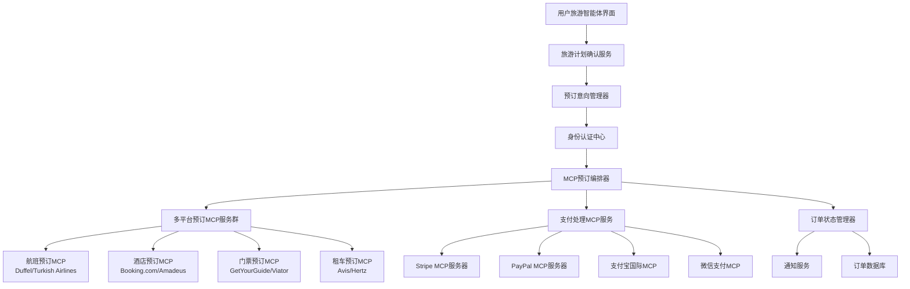

# 38旅游相关MCP订单AI支付方案

> 基于MCP生态的旅游计划自动预订、下单与AI支付解决方案

## 📋 文档概述

本文档详细阐述了基于Model Context Protocol (MCP)的旅游智能体自动预订订单和AI支付系统的完整技术方案。该方案允许用户确定旅游计划后，智能体自动完成航班、酒店等预订下单，并通过安全的支付流程完成交易。

## 🎯 核心需求分析

### **业务场景**
1. **旅游计划确认** → 用户通过智能体生成完整旅游规划
2. **预订意向确认** → 用户确认要预订的具体项目（航班、酒店、门票等）
3. **身份验证登录** → 安全的用户身份认证和授权
4. **自动批量下单** → AI智能体自动执行预订操作
5. **支付流程处理** → 安全便捷的支付确认和处理
6. **订单状态管理** → 实时订单跟踪和状态更新

### **技术挑战**
- **身份安全认证**：多平台账户登录和授权管理
- **支付安全保障**：PCI-DSS合规的支付处理
- **订单一致性**：确保所有预订项目的原子性操作
- **异常处理机制**：预订失败、支付失败的回滚策略
- **用户体验优化**：最小化用户干预，最大化自动化

## 🏗️ 系统架构设计

### **整体架构图**



### **核心组件详解**

#### 1. **旅游计划确认服务**
```typescript
interface TravelPlanConfirmation {
  planId: string;
  userId: string;
  destinations: Destination[];
  timeline: Timeline;
  bookingItems: BookingItem[];
  totalBudget: number;
  confirmationStatus: 'draft' | 'confirmed' | 'processing';
}

interface BookingItem {
  type: 'flight' | 'hotel' | 'activity' | 'transport';
  provider: string;
  details: any;
  price: number;
  priority: 'must_have' | 'preferred' | 'optional';
  status: 'pending' | 'confirmed' | 'failed';
}
```

#### 2. **身份认证中心**
```typescript
class AuthenticationCenter {
  private authSessions: Map<string, AuthSession> = new Map();
  
  async authenticateUser(platform: string, credentials: any): Promise<AuthToken> {
    // OAuth 2.0 / SAML 认证流程
    // 支持 Miles&Smiles, Booking.com, Stripe 等多平台
  }
  
  async validateSession(sessionId: string): Promise<boolean> {
    // 会话验证和续期
  }
  
  async getAuthenticatedAPIs(userId: string): Promise<AuthenticatedAPI[]> {
    // 返回用户已认证的预订平台API访问权限
  }
}
```

#### 3. **MCP预订编排器**
```typescript
class BookingOrchestrator {
  private mcpClients: Map<string, MCPClient> = new Map();
  private paymentProcessor: PaymentProcessor;
  
  async executeBookingPlan(plan: TravelPlanConfirmation): Promise<BookingResult> {
    const bookingTasks = this.createBookingTasks(plan);
    const results = await this.executeParallelBookings(bookingTasks);
    
    if (this.validateAllBookings(results)) {
      return await this.processPayment(results);
    } else {
      await this.rollbackBookings(results);
      throw new BookingFailureError(results);
    }
  }
  
  private async executeParallelBookings(tasks: BookingTask[]): Promise<BookingResult[]> {
    // 并行执行多个预订任务，提高效率
    return Promise.allSettled(tasks.map(task => this.executeBooking(task)));
  }
}
```

## 🔐 用户登录和身份验证方案

### **多平台身份认证架构**

#### 1. **统一身份认证入口**
```typescript
interface AuthenticationFlow {
  // 第一步：平台识别
  identifyRequiredPlatforms(bookingItems: BookingItem[]): PlatformRequirement[];
  
  // 第二步：用户授权
  requestUserAuthorization(platforms: PlatformRequirement[]): Promise<AuthorizationRequest>;
  
  // 第三步：OAuth认证
  executeOAuthFlow(platform: string): Promise<AuthToken>;
  
  // 第四步：会话管理
  createSecureSession(authTokens: AuthToken[]): Promise<SecureSession>;
}
```

#### 2. **支持的认证平台**

##### **航班预订认证**
```json
{
  "turkish_airlines": {
    "auth_type": "oauth2",
    "login_url": "https://auth.turkishairlines.com/oauth/authorize",
    "scope": ["flight_search", "booking_management"],
    "mcp_integration": "turkish-airlines-mcp"
  },
  "duffel": {
    "auth_type": "api_key",
    "required_verification": ["payment_method", "identity"],
    "mcp_integration": "flights-mcp"
  }
}
```

##### **酒店预订认证**
```json
{
  "booking_com": {
    "auth_type": "oauth2",
    "login_url": "https://account.booking.com/oauth2/authorize",
    "scope": ["reservations", "property_search"],
    "mcp_integration": "booking-mcp"
  },
  "amadeus_hotels": {
    "auth_type": "api_key_with_verification",
    "required_fields": ["passport", "payment_method"],
    "mcp_integration": "amadeus-hotels-mcp"
  }
}
```

#### 3. **认证流程实现**

```typescript
// 认证流程MCP服务器
class AuthenticationMCPServer {
  
  @mcp.tool()
  async loginToPlatform(params: {
    platform: string;
    userId: string;
    returnUrl: string;
  }): Promise<AuthResponse> {
    // 生成OAuth授权URL
    const authUrl = await this.generateAuthURL(params.platform, params.userId);
    
    return {
      status: 'auth_required',
      authUrl: authUrl,
      sessionId: this.createAuthSession(params.userId),
      expiresIn: 3600 // 1小时
    };
  }
  
  @mcp.tool()
  async checkAuthStatus(params: {
    sessionId: string;
    platform: string;
  }): Promise<AuthStatus> {
    const session = await this.getAuthSession(params.sessionId);
    
    if (session.isAuthenticated(params.platform)) {
      return {
        status: 'authenticated',
        accessToken: session.getToken(params.platform),
        permissions: session.getPermissions(params.platform)
      };
    }
    
    return { status: 'pending' };
  }
}
```

## 💳 AI支付流程设计

### **支付架构概览**

#### 1. **多渠道支付集成**
```typescript
interface PaymentChannelConfig {
  // Stripe MCP 集成
  stripe: {
    mcp_server: '@stripe/mcp',
    supported_methods: ['card', 'apple_pay', 'google_pay', 'bank_transfer'],
    supported_currencies: ['USD', 'EUR', 'GBP', 'CNY'],
    features: ['payment_intent', 'subscription', 'refund']
  };
  
  // PayPal MCP 集成
  paypal: {
    mcp_server: '@paypal/mcp',
    supported_methods: ['paypal_balance', 'credit_card', 'bank_account'],
    supported_currencies: ['USD', 'EUR', 'GBP', 'AUD'],
    features: ['express_checkout', 'recurring_payment', 'dispute_resolution']
  };
  
  // 支付宝国际 MCP
  alipay_global: {
    mcp_server: '@alipay/global-mcp',
    supported_methods: ['alipay_balance', 'china_bank_card'],
    supported_currencies: ['CNY', 'USD', 'EUR'],
    features: ['mobile_payment', 'cross_border']
  };
}
```

#### 2. **智能支付路由器**
```typescript
class SmartPaymentRouter {
  
  async selectOptimalPaymentMethod(params: {
    userId: string;
    amount: number;
    currency: string;
    country: string;
    bookingItems: BookingItem[];
  }): Promise<PaymentStrategy> {
    
    // 根据用户偏好、地理位置、金额大小选择最优支付方式
    const userPreferences = await this.getUserPaymentPreferences(params.userId);
    const regionalOptimal = this.getRegionalOptimalMethods(params.country);
    const amountBasedRecommendation = this.getAmountBasedRecommendation(params.amount);
    
    return this.calculateOptimalStrategy({
      userPreferences,
      regionalOptimal,
      amountBasedRecommendation,
      merchantSupport: await this.getMerchantSupportedMethods(params.bookingItems)
    });
  }
  
  async executePaymentPlan(strategy: PaymentStrategy): Promise<PaymentResult> {
    // 执行支付计划：可能包含分期、多卡支付、优惠券等
    const paymentTasks = strategy.paymentTasks;
    const results = [];
    
    for (const task of paymentTasks) {
      const result = await this.executeSinglePayment(task);
      results.push(result);
      
      if (!result.success) {
        // 支付失败，执行回滚
        await this.rollbackPayments(results.slice(0, -1));
        throw new PaymentFailureError(result.error);
      }
    }
    
    return { success: true, transactions: results };
  }
}
```

#### 3. **Stripe MCP 支付实现**
```typescript
// Stripe MCP 支付服务器实现
class StripeMCPPaymentServer {
  
  @mcp.tool()
  async createPaymentIntent(params: {
    amount: number;
    currency: string;
    customerId: string;
    bookingReference: string;
    metadata: Record<string, string>;
  }): Promise<PaymentIntentResponse> {
    
    const paymentIntent = await this.stripe.paymentIntents.create({
      amount: params.amount * 100, // Stripe使用最小货币单位
      currency: params.currency,
      customer: params.customerId,
      metadata: {
        booking_reference: params.bookingReference,
        booking_type: 'travel_package',
        ...params.metadata
      },
      automatic_payment_methods: {
        enabled: true,
      },
    });
    
    return {
      clientSecret: paymentIntent.client_secret,
      paymentIntentId: paymentIntent.id,
      status: paymentIntent.status
    };
  }
  
  @mcp.tool()
  async confirmPayment(params: {
    paymentIntentId: string;
    paymentMethodId: string;
    returnUrl: string;
  }): Promise<PaymentConfirmationResponse> {
    
    const confirmed = await this.stripe.paymentIntents.confirm(params.paymentIntentId, {
      payment_method: params.paymentMethodId,
      return_url: params.returnUrl,
    });
    
    if (confirmed.status === 'succeeded') {
      // 通知预订系统支付成功
      await this.notifyBookingSystem(confirmed);
    }
    
    return {
      status: confirmed.status,
      chargeId: confirmed.charges?.data[0]?.id,
      receiptUrl: confirmed.charges?.data[0]?.receipt_url
    };
  }
  
  @mcp.tool()
  async createRefund(params: {
    chargeId: string;
    amount?: number;
    reason: string;
  }): Promise<RefundResponse> {
    // 处理退款逻辑
    const refund = await this.stripe.refunds.create({
      charge: params.chargeId,
      amount: params.amount,
      reason: params.reason as any,
    });
    
    return {
      refundId: refund.id,
      status: refund.status,
      amount: refund.amount / 100
    };
  }
}
```

## 🤖 自动化下单流程

### **智能下单编排器**

#### 1. **订单依赖关系管理**
```typescript
class BookingDependencyManager {
  
  // 分析预订项目的依赖关系
  analyzeBookingDependencies(items: BookingItem[]): BookingGraph {
    const graph = new BookingGraph();
    
    // 航班必须先预订，确定行程时间
    const flights = items.filter(item => item.type === 'flight');
    const hotels = items.filter(item => item.type === 'hotel');
    const activities = items.filter(item => item.type === 'activity');
    
    // 构建依赖图
    flights.forEach(flight => {
      graph.addNode(flight);
      // 酒店依赖航班时间
      hotels.forEach(hotel => {
        if (this.isLocationDependent(flight, hotel)) {
          graph.addDependency(hotel, flight);
        }
      });
    });
    
    return graph;
  }
  
  // 生成最优预订序列
  generateOptimalBookingSequence(graph: BookingGraph): BookingSequence {
    return graph.topologicalSort()
                .groupByPriority()
                .optimizeForParallelExecution();
  }
}
```

#### 2. **自动预订执行器**
```typescript
class AutoBookingExecutor {
  
  async executeBookingSequence(sequence: BookingSequence): Promise<BookingResult> {
    const results = new Map<string, BookingStatus>();
    
    for (const phase of sequence.phases) {
      // 并行执行同一阶段的预订
      const phaseResults = await Promise.allSettled(
        phase.items.map(item => this.executeBooking(item))
      );
      
      // 检查阶段结果
      const failures = phaseResults.filter(r => r.status === 'rejected');
      if (failures.length > 0) {
        // 如果有必需预订失败，终止流程
        if (this.hasCriticalFailures(failures, phase)) {
          await this.rollbackCompletedBookings(results);
          throw new CriticalBookingFailureError(failures);
        }
      }
      
      // 更新结果
      phaseResults.forEach((result, index) => {
        results.set(phase.items[index].id, result);
      });
    }
    
    return new BookingResult(results);
  }
  
  private async executeBooking(item: BookingItem): Promise<BookingStatus> {
    const mcpClient = this.getMCPClient(item.provider);
    
    try {
      switch (item.type) {
        case 'flight':
          return await this.bookFlight(mcpClient, item);
        case 'hotel':
          return await this.bookHotel(mcpClient, item);
        case 'activity':
          return await this.bookActivity(mcpClient, item);
        default:
          throw new UnsupportedBookingTypeError(item.type);
      }
    } catch (error) {
      return new BookingStatus('failed', error);
    }
  }
}
```

#### 3. **具体预订实现**

##### **航班自动预订**
```typescript
class FlightAutoBooking {
  
  @mcp.tool()
  async autoBookFlight(params: {
    searchCriteria: FlightSearchParams;
    passengerDetails: PassengerInfo[];
    paymentMethodId: string;
    preferences: BookingPreferences;
  }): Promise<FlightBookingResult> {
    
    // 1. 搜索航班
    const searchResults = await this.searchFlights(params.searchCriteria);
    
    // 2. 智能选择最佳航班
    const selectedFlight = await this.selectOptimalFlight(
      searchResults,
      params.preferences
    );
    
    // 3. 创建预订
    const booking = await this.createFlightBooking({
      flightOffer: selectedFlight,
      passengers: params.passengerDetails,
      paymentMethod: params.paymentMethodId
    });
    
    // 4. 确认预订
    const confirmation = await this.confirmBooking(booking.id);
    
    return {
      bookingId: confirmation.bookingId,
      pnr: confirmation.pnr,
      status: 'confirmed',
      tickets: confirmation.tickets,
      totalPrice: selectedFlight.price
    };
  }
  
  private async selectOptimalFlight(
    flights: FlightOffer[],
    preferences: BookingPreferences
  ): Promise<FlightOffer> {
    
    // 多维度评分算法
    const scoredFlights = flights.map(flight => ({
      flight,
      score: this.calculateFlightScore(flight, preferences)
    }));
    
    // 选择最高分航班
    return scoredFlights
      .sort((a, b) => b.score - a.score)[0]
      .flight;
  }
  
  private calculateFlightScore(
    flight: FlightOffer,
    preferences: BookingPreferences
  ): number {
    let score = 0;
    
    // 价格权重 (40%)
    score += (preferences.maxPrice - flight.price) / preferences.maxPrice * 0.4;
    
    // 时间偏好权重 (30%)
    score += this.calculateTimePreferenceScore(flight, preferences) * 0.3;
    
    // 航空公司偏好权重 (20%)
    score += this.calculateAirlinePreferenceScore(flight, preferences) * 0.2;
    
    // 中转次数权重 (10%)
    score += (1 - flight.stops / 3) * 0.1;
    
    return Math.max(0, Math.min(1, score));
  }
}
```

##### **酒店自动预订**
```typescript
class HotelAutoBooking {
  
  @mcp.tool()
  async autoBookHotel(params: {
    searchCriteria: HotelSearchParams;
    guestDetails: GuestInfo[];
    flightBookingId?: string;
    preferences: HotelPreferences;
  }): Promise<HotelBookingResult> {
    
    // 1. 如果有航班预订，获取准确的入住退房时间
    let adjustedCriteria = params.searchCriteria;
    if (params.flightBookingId) {
      adjustedCriteria = await this.adjustDatesBasedOnFlight(
        params.searchCriteria,
        params.flightBookingId
      );
    }
    
    // 2. 搜索酒店
    const hotels = await this.searchHotels(adjustedCriteria);
    
    // 3. 智能筛选和排序
    const selectedHotel = await this.selectOptimalHotel(hotels, params.preferences);
    
    // 4. 创建预订
    const booking = await this.createHotelBooking({
      hotel: selectedHotel,
      guests: params.guestDetails,
      checkIn: adjustedCriteria.checkIn,
      checkOut: adjustedCriteria.checkOut
    });
    
    return {
      bookingId: booking.id,
      confirmationNumber: booking.confirmationNumber,
      hotel: selectedHotel,
      status: 'confirmed'
    };
  }
}
```

## 🔒 安全保障机制

### **数据安全和隐私保护**

#### 1. **敏感信息加密存储**
```typescript
class SecureDataManager {
  private encryption: AESEncryption;
  private keyManager: KeyManagementService;
  
  async storeSecureUserData(userId: string, data: SensitiveUserData): Promise<void> {
    // 使用用户特定密钥加密
    const userKey = await this.keyManager.getUserKey(userId);
    const encryptedData = await this.encryption.encrypt(JSON.stringify(data), userKey);
    
    // 存储到安全数据库
    await this.secureDb.store(userId, encryptedData);
  }
  
  async retrieveSecureUserData(userId: string): Promise<SensitiveUserData> {
    const encryptedData = await this.secureDb.retrieve(userId);
    const userKey = await this.keyManager.getUserKey(userId);
    const decryptedData = await this.encryption.decrypt(encryptedData, userKey);
    
    return JSON.parse(decryptedData);
  }
}
```

#### 2. **支付安全合规**
```typescript
interface PCIComplianceService {
  // PCI-DSS Level 1 合规
  validateCardData(cardData: CardData): Promise<ValidationResult>;
  tokenizeCardData(cardData: CardData): Promise<CardToken>;
  
  // 3D Secure 认证
  initiate3DSecure(paymentId: string): Promise<ThreeDSecureChallenge>;
  complete3DSecure(challengeId: string, response: string): Promise<AuthResult>;
  
  // 风险评估
  assessTransactionRisk(transaction: Transaction): Promise<RiskScore>;
}
```

#### 3. **审计和监控**
```typescript
class SecurityAuditService {
  
  async logSecurityEvent(event: SecurityEvent): Promise<void> {
    await this.auditLog.record({
      timestamp: new Date(),
      userId: event.userId,
      action: event.action,
      resource: event.resource,
      result: event.result,
      ipAddress: event.ipAddress,
      userAgent: event.userAgent,
      risk_score: await this.calculateRiskScore(event)
    });
  }
  
  async detectAnomalousActivity(userId: string): Promise<ThreatDetectionResult> {
    const recentActivity = await this.getRecentActivity(userId);
    const userProfile = await this.getUserBehaviorProfile(userId);
    
    return this.anomalyDetector.analyze(recentActivity, userProfile);
  }
}
```

## 📊 订单管理和状态跟踪

### **实时订单状态管理**

#### 1. **订单状态机**
```typescript
enum BookingStatus {
  DRAFT = 'draft',
  PAYMENT_PENDING = 'payment_pending',
  PAYMENT_PROCESSING = 'payment_processing',
  CONFIRMED = 'confirmed',
  PARTIALLY_CONFIRMED = 'partially_confirmed',
  CANCELLED = 'cancelled',
  FAILED = 'failed',
  REFUND_REQUESTED = 'refund_requested',
  REFUNDED = 'refunded'
}

class BookingStateMachine {
  private transitions: Map<BookingStatus, BookingStatus[]> = new Map([
    [BookingStatus.DRAFT, [BookingStatus.PAYMENT_PENDING, BookingStatus.CANCELLED]],
    [BookingStatus.PAYMENT_PENDING, [BookingStatus.PAYMENT_PROCESSING, BookingStatus.FAILED]],
    [BookingStatus.PAYMENT_PROCESSING, [BookingStatus.CONFIRMED, BookingStatus.PARTIALLY_CONFIRMED, BookingStatus.FAILED]],
    [BookingStatus.CONFIRMED, [BookingStatus.REFUND_REQUESTED, BookingStatus.CANCELLED]],
    // ... 其他状态转换
  ]);
  
  async transitionTo(bookingId: string, newStatus: BookingStatus): Promise<void> {
    const currentStatus = await this.getCurrentStatus(bookingId);
    
    if (!this.isValidTransition(currentStatus, newStatus)) {
      throw new InvalidStatusTransitionError(currentStatus, newStatus);
    }
    
    await this.updateBookingStatus(bookingId, newStatus);
    await this.notifyStatusChange(bookingId, currentStatus, newStatus);
  }
}
```

#### 2. **实时通知系统**
```typescript
class BookingNotificationService {
  
  async notifyBookingUpdate(update: BookingUpdate): Promise<void> {
    const notifications = [
      // 实时WebSocket通知
      this.websocketService.broadcast(update.userId, {
        type: 'booking_update',
        bookingId: update.bookingId,
        status: update.newStatus,
        details: update.details
      }),
      
      // 邮件通知
      this.emailService.sendBookingUpdateEmail(update),
      
      // SMS通知（重要状态变更）
      this.isImportantUpdate(update) ? 
        this.smsService.sendBookingAlert(update) : 
        Promise.resolve(),
        
      // 推送通知
      this.pushService.sendNotification(update.userId, {
        title: `订单状态更新`,
        body: `您的${update.bookingType}预订已${update.statusText}`,
        data: { bookingId: update.bookingId }
      })
    ];
    
    await Promise.allSettled(notifications);
  }
}
```

## 🚀 部署实施方案

### **MCP服务器集群部署**

#### 1. **Docker容器化部署**
```yaml
# docker-compose.yml
version: '3.8'
services:
  # 认证服务
  auth-mcp-server:
    build: ./services/auth-mcp
    environment:
      - REDIS_URL=redis://redis:6379
      - JWT_SECRET=${JWT_SECRET}
    ports:
      - "3001:3000"
    
  # Stripe支付服务  
  stripe-mcp-server:
    image: stripe/mcp-server:latest
    environment:
      - STRIPE_SECRET_KEY=${STRIPE_SECRET_KEY}
      - WEBHOOK_SECRET=${STRIPE_WEBHOOK_SECRET}
    ports:
      - "3002:3000"
      
  # 航班预订服务
  flights-mcp-server:
    build: ./services/flights-mcp
    environment:
      - DUFFEL_API_KEY=${DUFFEL_API_KEY}
      - TURKISH_AIRLINES_API_KEY=${TURKISH_AIRLINES_API_KEY}
    ports:
      - "3003:3000"
      
  # 酒店预订服务
  hotels-mcp-server:
    build: ./services/hotels-mcp
    environment:
      - BOOKING_COM_API_KEY=${BOOKING_COM_API_KEY}
      - AMADEUS_API_KEY=${AMADEUS_API_KEY}
    ports:
      - "3004:3000"
      
  # 订单管理服务
  order-management:
    build: ./services/order-management
    environment:
      - DATABASE_URL=${DATABASE_URL}
      - REDIS_URL=redis://redis:6379
    ports:
      - "3005:3000"
    depends_on:
      - postgres
      - redis
      
  # 基础设施
  postgres:
    image: postgres:15
    environment:
      POSTGRES_DB: travel_bookings
      POSTGRES_USER: ${DB_USER}
      POSTGRES_PASSWORD: ${DB_PASSWORD}
    volumes:
      - postgres_data:/var/lib/postgresql/data
      
  redis:
    image: redis:7-alpine
    ports:
      - "6379:6379"
      
volumes:
  postgres_data:
```

#### 2. **Claude Desktop配置**
```json
{
  "mcpServers": {
    "travel-auth": {
      "command": "node",
      "args": ["dist/auth-server.js"],
      "env": {
        "AUTH_SERVICE_URL": "http://localhost:3001",
        "SESSION_SECRET": "your_session_secret"
      }
    },
    "travel-payments": {
      "command": "npx",
      "args": ["-y", "@stripe/mcp"],
      "env": {
        "STRIPE_SECRET_KEY": "your_stripe_secret_key"
      }
    },
    "travel-bookings": {
      "command": "node", 
      "args": ["dist/booking-orchestrator.js"],
      "env": {
        "FLIGHTS_MCP_URL": "http://localhost:3003",
        "HOTELS_MCP_URL": "http://localhost:3004",
        "PAYMENTS_MCP_URL": "http://localhost:3002"
      }
    }
  }
}
```

### **关键代码实现**

#### 1. **主预订编排服务**
```typescript
// src/services/booking-orchestrator.ts
class TravelBookingOrchestrator {
  
  @mcp.tool()
  async executeTravelBookingPlan(params: {
    planId: string;
    userId: string;
    confirmationCode: string;
  }): Promise<BookingExecutionResult> {
    
    // 1. 验证用户确认码
    const isValid = await this.validateConfirmationCode(
      params.userId, 
      params.planId, 
      params.confirmationCode
    );
    
    if (!isValid) {
      throw new UnauthorizedBookingError('Invalid confirmation code');
    }
    
    // 2. 获取旅游计划详情
    const travelPlan = await this.getTravelPlan(params.planId);
    
    // 3. 检查用户认证状态
    const authStatus = await this.checkUserAuthentications(
      params.userId, 
      travelPlan.requiredPlatforms
    );
    
    if (!authStatus.allAuthenticated) {
      return {
        status: 'auth_required',
        missingAuthentications: authStatus.missing,
        authUrls: await this.generateAuthUrls(authStatus.missing)
      };
    }
    
    // 4. 执行预订流程
    const bookingResult = await this.executeBookings(travelPlan);
    
    // 5. 处理支付
    if (bookingResult.allSuccessful) {
      const paymentResult = await this.processPayments(bookingResult);
      return this.combineResults(bookingResult, paymentResult);
    }
    
    // 6. 处理部分失败
    return this.handlePartialFailure(bookingResult);
  }
  
  @mcp.tool()
  async getBookingStatus(params: {
    bookingId: string;
    userId: string;
  }): Promise<BookingStatusResponse> {
    
    const booking = await this.getBooking(params.bookingId);
    
    // 验证用户权限
    if (booking.userId !== params.userId) {
      throw new UnauthorizedAccessError();
    }
    
    // 获取实时状态
    const realTimeStatus = await this.getRealTimeBookingStatus(booking);
    
    return {
      bookingId: params.bookingId,
      status: realTimeStatus.status,
      items: realTimeStatus.items,
      totalAmount: booking.totalAmount,
      paymentStatus: realTimeStatus.paymentStatus,
      documents: realTimeStatus.documents,
      timeline: realTimeStatus.timeline
    };
  }
  
  @mcp.tool()
  async requestBookingCancellation(params: {
    bookingId: string;
    userId: string;
    reason: string;
  }): Promise<CancellationResponse> {
    
    const booking = await this.getBooking(params.bookingId);
    
    // 检查取消政策
    const cancellationPolicy = await this.checkCancellationPolicy(booking);
    
    if (!cancellationPolicy.canCancel) {
      return {
        status: 'cannot_cancel',
        reason: cancellationPolicy.reason,
        alternatives: cancellationPolicy.alternatives
      };
    }
    
    // 执行取消流程
    const cancellationResult = await this.executeCancellation(booking, params.reason);
    
    // 处理退款
    if (cancellationResult.successful && cancellationPolicy.refundAmount > 0) {
      await this.processRefund(booking, cancellationPolicy.refundAmount);
    }
    
    return {
      status: 'cancellation_processed',
      refundAmount: cancellationPolicy.refundAmount,
      processingTime: cancellationPolicy.processingTime
    };
  }
}
```

#### 2. **支付处理服务集成**
```typescript
// src/services/payment-processor.ts
class TravelPaymentProcessor {
  
  async processBookingPayments(
    bookings: BookingResult[], 
    paymentPreferences: PaymentPreferences
  ): Promise<PaymentResult> {
    
    // 1. 计算总金额和分组
    const paymentGroups = this.groupPaymentsByProvider(bookings);
    const totalAmount = this.calculateTotalAmount(paymentGroups);
    
    // 2. 选择支付策略
    const paymentStrategy = await this.selectPaymentStrategy(
      totalAmount,
      paymentPreferences
    );
    
    // 3. 执行支付
    const paymentResults = [];
    
    for (const group of paymentGroups) {
      const result = await this.processGroupPayment(group, paymentStrategy);
      paymentResults.push(result);
      
      // 如果支付失败，立即停止并回滚
      if (!result.successful) {
        await this.rollbackPayments(paymentResults.slice(0, -1));
        throw new PaymentProcessingError(result.error);
      }
    }
    
    return new PaymentResult(paymentResults);
  }
  
  private async processGroupPayment(
    group: PaymentGroup, 
    strategy: PaymentStrategy
  ): Promise<SinglePaymentResult> {
    
    switch (strategy.provider) {
      case 'stripe':
        return await this.processStripePayment(group, strategy);
      case 'paypal':
        return await this.processPayPalPayment(group, strategy);
      case 'alipay':
        return await this.processAlipayPayment(group, strategy);
      default:
        throw new UnsupportedPaymentProviderError(strategy.provider);
    }
  }
}
```

## 📈 监控和优化

### **性能监控指标**

```typescript
interface BookingSystemMetrics {
  // 成功率指标
  bookingSuccessRate: number;      // 预订成功率
  paymentSuccessRate: number;      // 支付成功率
  endToEndSuccessRate: number;     // 端到端成功率
  
  // 性能指标
  averageBookingTime: number;      // 平均预订时间
  averagePaymentTime: number;      // 平均支付时间
  systemResponseTime: number;      // 系统响应时间
  
  // 用户体验指标
  userSatisfactionScore: number;   // 用户满意度
  abandonnmentRate: number;        // 流程放弃率
  retryRate: number;               // 重试率
  
  // 业务指标
  totalBookingVolume: number;      // 总预订量
  totalRevenue: number;            // 总收入
  averageOrderValue: number;       // 平均订单价值
}
```

### **持续优化建议**

1. **机器学习优化**
   - 用户偏好学习
   - 价格预测模型
   - 智能推荐算法

2. **A/B测试框架**
   - 支付流程优化
   - 用户界面改进
   - 转化率提升

3. **扩展性设计**
   - 微服务架构
   - 水平扩展能力
   - 缓存策略优化

## 📋 总结

本方案提供了一个完整的基于MCP的旅游预订AI支付系统架构，具备以下核心优势：

### **技术优势**
- **标准化集成**：基于MCP协议的统一接口
- **高度自动化**：最小化用户干预的智能预订流程
- **安全可靠**：符合PCI-DSS标准的支付安全保障
- **可扩展性**：模块化架构支持快速集成新的预订平台

### **业务价值**
- **用户体验优化**：一站式旅游预订解决方案
- **转化率提升**：智能化的预订流程减少用户流失
- **成本效益**：自动化减少人工干预成本
- **市场优势**：创新的AI驱动预订体验

### **实施路线图**
1. **阶段一**：核心MCP服务器开发和基础认证系统
2. **阶段二**：支付集成和订单管理系统
3. **阶段三**：智能预订编排和用户界面
4. **阶段四**：监控优化和规模化部署

该方案为旅游行业的数字化转型提供了前瞻性的技术架构，将AI智能体的能力与实际业务流程深度融合，为用户提供前所未有的便捷旅游预订体验。
