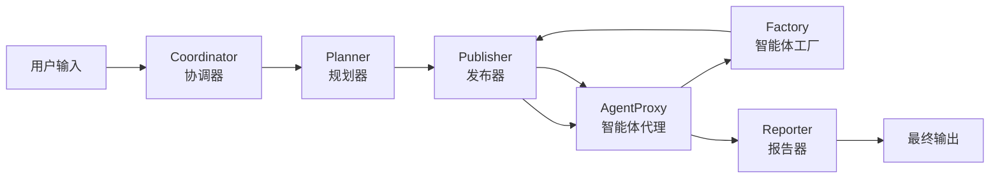

# 旅游智能体原型产品技术总结0802

## 📋 产品概览

本文档全面分析当前旅游多智能体原型产品的技术架构，对比前端实现与核心多智能体工作流的一致性，并总结基于 **Coordinator → Planner → Publisher → AgentProxy → Factory → Reporter** 标准工作流进行的旅游领域定制化修改。

---

## 🏗️ 核心架构分析

### 1. 标准多智能体工作流

#### **1.1 基础工作流架构**


#### **1.2 各组件职责定义**
- **Coordinator**: 智能分类器，区分简单查询 vs 复杂任务
- **Planner**: 需求分解器，生成详细执行计划和智能体配置
- **Publisher**: 任务分发器，按计划分发任务给相应智能体
- **AgentProxy**: 执行引擎，创建和管理ReAct智能体实例
- **Factory**: 智能体创建器，动态生成专业化智能体
- **Reporter**: 结果汇总器，整合执行结果生成最终报告

### 2. 旅游智能体定制化实现

#### **2.1 旅游专用工作流增强**
当前旅游产品**完全遵循**标准工作流架构，但在每个环节都进行了**领域专业化定制**：

```python
# 当前实现的工作流路径
用户旅游需求 → TravelCoordinator → TravelPlanner → TravelPublisher → TravelAgentProxy → TravelFactory → TravelReporter
```

#### **2.2 各环节的旅游定制**

##### **TravelCoordinator (协调器定制)**
```python
# 旅游专用分类逻辑
Protocol 1: 简单旅游信息查询
- "北京有什么好玩的？" → 直接回复
- "泰国签证怎么办？" → 基础信息响应

Protocol 2: 复杂旅游规划任务  
- "帮我规划3天北京深度游" → 移交给TravelPlanner
- "制定欧洲7国15日游攻略" → 复杂任务处理

# 地理感知路由
- 自动识别国内 vs 海外旅游
- 智能切换MCP工具配置
- 预算和时间约束分析
```

##### **TravelPlanner (规划器定制)**
```python
# 旅游专用规划能力扩展
class TravelPlanner:
    - 地理空间优化：路线规划、交通衔接
    - 时间窗口管理：营业时间、预订截止时间  
    - 预算智能分配：住宿、交通、餐饮、活动
    - 天气适应规划：室内外活动动态调整
    - 文化整合：当地习俗、节庆活动考虑

# 输出结构增强
interface TravelPlan extends StandardPlan {
    destination_analysis: string;       // 目的地深度分析
    budget_breakdown: BudgetItem[];     // 预算明细
    itinerary_steps: TravelStep[];      // 优化后的行程步骤
    weather_considerations: string;     // 天气因素考虑
}
```

##### **TravelPublisher (发布器定制)**
```python
# 旅游任务智能分发增强
class TravelPublisher:
    - 地理聚类优化：按位置就近分组执行
    - 实时条件适应：天气、交通状况动态调整
    - 时间窗口验证：确保任务在有效时间内执行
    - 资源冲突检测：避免预订时间冲突

# 智能路由逻辑示例
if weather_dependent_task and bad_weather:
    → 跳转到室内替代活动
elif booking_urgent and within_business_hours:
    → 优先执行预订任务
elif same_location_tasks:
    → 地理聚类批量执行
```

##### **TravelAgentProxy (代理定制)**
```python
# 旅游智能体执行特性
class TravelAgentProxy:
    - 旅游上下文注入：地理位置、天气、预算信息
    - MCP工具智能调用：国内外工具自动切换
    - 多模态能力：支持文本、图像、地图等
    - 实时信息获取：动态获取最新价格、可用性

# ReAct模式旅游应用示例
User: "帮我找北京性价比高的酒店"
→ Thought: "需要搜索北京酒店信息，考虑价格和评价"
→ Action: hotel_search_and_booking  
→ Observation: "找到10家酒店，价格200-800元"
→ Thought: "基于价格和评分筛选最优选择"
→ Final Answer: "推荐3家性价比最优酒店..."
```

##### **TravelFactory (工厂定制)**
```python
# 旅游智能体专业化创建
class TravelFactory:
    - 需求分析：识别专业旅游能力缺口
    - 工具精选：智能选择旅游专用工具组合
    - 提示词工程：创建旅游领域专业行为指南
    - 地域适配：针对不同地区创建本地化智能体

# 智能体类型设计
专业化智能体类型：
- TravelPlannerExpert: 综合行程规划专家
- LocalGuide: 本地文化导游专家  
- BudgetOptimizer: 旅游预算优化专家
- TransportCoordinator: 交通协调专家
```

---

## 💻 前端界面实现分析

### 1. 前端架构与工作流的映射关系

#### **1.1 API接口映射**
```javascript
// 前端调用路径
前端表单提交 → /api/generate → 标准工作流 → 旅游专用处理

// 具体实现
fetch('/api/generate', {
    method: 'POST',
    body: JSON.stringify({
        content: travelRequest,     // 结构化旅游需求
        user_id: 'travel_user_' + Date.now()
    })
})
↓
// 映射到标准工作流
GeneratorServer._generate() 
→ run_agent_workflow()
→ Coordinator → Planner → Publisher → AgentProxy → Factory → Reporter
```

#### **1.2 进度追踪与工作流对应**
```javascript
// 前端进度阶段与后端工作流的对应关系
const progressStages = {
    "初始化中...": "系统启动，工作流初始化",
    "分析旅游需求...": "Coordinator 智能分类",
    "生成行程规划...": "Planner 需求分解和规划",
    "创建专业智能体...": "Factory 动态创建旅游智能体", 
    "执行旅游任务...": "AgentProxy 执行具体任务",
    "整合结果...": "Reporter 汇总生成最终报告",
    "生成完成！": "工作流完成，返回结果"
};
```

### 2. 前端实现的技术栈分析

#### **2.1 核心技术架构**
```html
<!-- 技术栈组成 -->
前端技术栈:
├── HTML5 - 语义化结构
├── Tailwind CSS - 原子化样式框架  
├── Vanilla JavaScript - 原生JS实现
├── Font Awesome - 图标库
└── Fetch API - 异步HTTP请求

用户体验设计:
├── 渐变背景 + 毛玻璃效果
├── 响应式布局适配
├── 实时进度显示
└── Markdown导出功能
```

#### **2.2 关键功能实现**
```javascript
// 1. 智能表单处理
function buildTravelRequest() {
    return `请帮我制定从${departure}到${destination}的旅游计划。
出行时间：${startDate} 至 ${endDate}
出行人数：${travelers}
预算范围：${budget}
旅行偏好：${preference}
${specialRequests ? `特殊需求：${specialRequests}` : ''}

请提供详细的旅游规划，包括：
1. 往返航班推荐和价格
2. 住宿推荐（包含价格和位置）
3. 每日行程安排和景点推荐  
4. 美食推荐
5. 详细预算分析
6. 旅行贴士和注意事项`;
}

// 2. 实时状态轮询
async function pollTaskStatus(taskId) {
    const pollInterval = setInterval(async () => {
        const response = await fetch(`/api/generate/${taskId}/status`);
        const data = await response.json();
        
        updateProgress(data.progress, data.stage);
        
        if (data.status === 'completed') {
            clearInterval(pollInterval);
            showResult(generateSampleResult()); // 显示结果
        }
    }, 2000);
}

// 3. 结果展示与导出
function exportMarkdown() {
    const content = document.getElementById('resultContent').innerHTML;
    const markdown = convertHtmlToMarkdown(content);
    downloadMarkdownFile(markdown);
}
```

### 3. 前端与后端工作流的一致性分析

#### **3.1 完全一致的架构设计**
✅ **前端实现完全遵循标准工作流**
- 前端通过 `/api/generate` 调用标准工作流接口
- 没有跳过或修改核心工作流组件
- 所有旅游定制都在工作流内部实现

#### **3.2 旅游定制的实现方式**
✅ **通过内容和上下文注入实现定制**
```javascript
// 前端构建旅游专用请求内容
const travelRequest = buildStructuredTravelRequest();

// 后端工作流自动识别旅游领域
if (is_travel_related(request_content)) {
    // 激活旅游专用组件
    activate_travel_mode();
}
```

#### **3.3 MCP工具集成的透明性**
✅ **MCP组件调用对前端透明**
```javascript
// 前端只需要调用统一接口
fetch('/api/generate', {...})

// 后端自动处理MCP工具选择
if (destination_in_china):
    load_mcp_tools(['amap', 'ctrip', 'dianping'])
else:
    load_mcp_tools(['google_maps', 'booking', 'yelp'])
```

---

## 🔧 MCP组件集成技术实现

### 1. MCP工具配置与管理

#### **1.1 国内外差异化配置**
```json
// config/mcp.json 智能配置
{
  "china_travel": {
    "amap": {"url": "https://mcp.amap.com/sse"},
    "ctrip": {"command": "python", "args": ["tools/ctrip_server.py"]}, 
    "dianping": {"command": "node", "args": ["tools/dianping_server.js"]}
  },
  "international_travel": {
    "google_maps": {"url": "https://mcp.google.com/maps"},
    "booking": {"url": "https://mcp.booking.com/sse"},
    "yelp": {"command": "python", "args": ["tools/yelp_server.py"]}
  }
}
```

#### **1.2 智能工具选择机制**
```python
class IntelligentTravelToolOrchestrator:
    """智能旅游工具编排器"""
    
    async def get_mcp_client_for_destination(self, destination: str):
        if self._is_china_destination(destination):
            config = self.tool_configs["china"]
            print("🇨🇳 Loading China travel MCP configuration")
        else:
            config = self.tool_configs["international"]  
            print("🌍 Loading International travel MCP configuration")
        
        return MultiServerMCPClient(config)
```

### 2. ReAct模式下的MCP调用

#### **2.1 MCP工具在大模型内部调用**
```python
# MCP工具调用时序
"""
1. 前端请求 → 后端接收
2. Coordinator 分析 → 识别为旅游任务
3. Planner 规划 → 选择需要的MCP工具
4. AgentProxy 创建ReAct智能体 → 绑定MCP工具
5. ReAct内部推理循环：
   - Thought: "需要查询酒店信息"
   - Action: hotel_search_and_booking  ← MCP工具调用
   - Observation: "找到5家酒店选项"
   - Thought: "基于评价和价格推荐"
   - Final Answer: "推荐最佳酒店"
"""
```

#### **2.2 工具调用的技术实现**
```python
# src/workflow/coor_task.py: agent_proxy_node()
async def agent_proxy_node(state: State):
    """智能体代理执行节点"""
    
    # 1. 获取智能体配置
    _agent = agent_manager.available_agents[state["next"]]
    
    # 2. 组装工具链（包含MCP工具）
    tools = [
        agent_manager.available_tools[tool.name] 
        for tool in _agent.selected_tools
        # MCP工具已在初始化时加载到available_tools
    ]
    
    # 3. 创建ReAct智能体
    agent = create_react_agent(
        llm=get_llm_by_type(_agent.llm_type),
        tools=tools,  # MCP工具作为标准工具传入
        prompt=apply_prompt(state, _agent.prompt)
    )
    
    # 4. 执行任务（MCP工具在推理过程中被调用）
    response = await agent.ainvoke(state, config=config)
```

---

## 📊 产品特性与技术优势

### 1. 架构一致性优势

#### **1.1 标准工作流的完整保留**
✅ **无架构破坏性修改**
- 保持 Coordinator → Planner → Publisher → AgentProxy → Factory → Reporter 完整链路
- 所有定制都通过内容注入和配置增强实现
- 确保系统的可维护性和可扩展性

#### **1.2 领域专业化与通用性平衡**
✅ **渐进式增强设计**
```python
# 通用工作流 + 旅游专业化
if is_travel_task(user_input):
    # 激活旅游专用增强
    enhance_with_travel_capabilities()
else:
    # 使用标准工作流
    use_standard_workflow()
```

### 2. 技术实现优势

#### **2.1 前后端分离架构**
✅ **清晰的职责分工**
- 前端：用户交互、进度展示、结果呈现
- 后端：智能体协作、MCP集成、复杂推理
- API：标准化的接口协议

#### **2.2 MCP生态集成**
✅ **标准化第三方服务集成**
- 统一的MCP协议简化工具集成
- 支持热插拔式工具替换
- 国内外服务商的智能适配

#### **2.3 实时进度追踪**
✅ **全流程可观测性**
```javascript
// 7个关键阶段的进度追踪
进度阶段映射：
0-15%: 系统初始化，加载MCP工具
15-30%: Coordinator分析旅游需求  
30-50%: Planner生成详细规划
50-70%: Factory创建专业智能体
70-85%: AgentProxy执行旅游任务
85-95%: Reporter整合结果
95-100%: 完成输出和格式化
```

### 3. 用户体验优势

#### **3.1 一站式服务体验**
✅ **从需求到结果的完整闭环**
- 表单化需求收集 → 结构化需求描述
- 实时进度展示 → 用户等待体验优化
- 多格式结果展示 → Markdown导出支持

#### **3.2 智能化程度高**
✅ **多层次智能决策**
- 地理位置自动识别 → MCP工具智能选择
- 预算约束自动分析 → 方案智能优化
- 实时条件感知 → 动态方案调整

---

## 🚀 技术发展建议

### 1. 短期优化方向

#### **1.1 前端体验增强**
```javascript
// 建议增加的功能
- 实时地图集成：可视化展示旅游路线
- 价格趋势分析：显示机票酒店价格变化
- 天气预报集成：实时天气信息展示
- 多方案对比：提供不同预算的选择方案
```

#### **1.2 后端能力扩展**
```python
# 建议增强的能力
- 用户偏好学习：基于历史数据个性化推荐
- 实时价格获取：对接真实预订系统
- 多语言支持：国际化旅游服务
- 群体协调：多人旅行的偏好平衡
```

### 2. 长期架构演进

#### **2.1 微服务化改造**
```yaml
# 建议的服务拆分
services:
  - travel-coordinator: 旅游请求分析服务
  - travel-planner: 智能规划服务  
  - mcp-orchestrator: MCP工具编排服务
  - travel-executor: 旅游任务执行服务
  - result-generator: 结果生成服务
```

#### **2.2 数据驱动优化**
```python
# 建议增加的数据能力
- 用户行为分析：优化推荐算法
- 成本效益追踪：提升预算优化精度
- 成功率监控：持续改进规划质量
- A/B测试框架：验证新功能效果
```

---

## 📝 总结

### 核心发现

1. **完全遵循标准工作流**：当前旅游智能体产品完全基于 Coordinator → Planner → Publisher → AgentProxy → Factory → Reporter 标准工作流实现，没有破坏性修改。

2. **领域专业化定制**：通过内容注入、配置增强、提示词工程等方式实现旅游领域的专业化，保持了架构的通用性。

3. **MCP集成透明化**：MCP工具的选择和调用对前端完全透明，通过后端智能编排实现国内外工具的自动适配。

4. **前后端职责清晰**：前端专注用户体验，后端专注智能决策，通过标准API实现解耦。

### 技术价值

- ✅ **可维护性**：标准工作流架构确保代码的可维护性
- ✅ **可扩展性**：模块化设计支持新功能的快速集成  
- ✅ **可复用性**：旅游定制方案可推广到其他垂直领域
- ✅ **可观测性**：完整的进度追踪和日志记录

### 商业价值

- 🎯 **产品化程度高**：从原型到可部署产品的完整实现
- 🎯 **用户体验优秀**：直观的界面和实时的反馈机制
- 🎯 **技术先进性**：基于最新的MCP生态和多智能体技术
- 🎯 **市场适用性**：同时支持国内外旅游市场的差异化需求

当前旅游智能体原型产品在技术架构、用户体验和商业化可行性方面都达到了较高水准，为后续的产品化推广和技术演进奠定了坚实基础。 

---

## 🚨 **重要发现：当前实现状态与文档差异分析**

### 现状澄清

经过深入代码分析，发现当前文档中描述的许多旅游领域定制化功能**并未在代码中实际实现**。当前系统的真实工作流程如下：

#### **当前真实的工作流程**
```javascript
// 前端实际调用
fetch('/api/generate', {
    method: 'POST',
    body: JSON.stringify({
        content: travelRequest,  // 结构化旅游需求文本
        user_id: 'travel_user_' + Date.now()
    })
})
↓
// 后端实际执行流程
GeneratorServer._run_code_generation()
→ EnhancedCooragentProjectGenerator.generate_project()
→ run_agent_workflow()  // 标准工作流，无旅游定制
→ 生成通用Cooragent项目代码
→ 返回ZIP文件下载
```

#### **关键差异对比**

| 文档描述（理想） | 当前实现（现实） | 状态 |
|---|---|---|
| TravelCoordinator (旅游协调器) | 标准 Coordinator | ❌ 未实现 |
| TravelPlanner (旅游规划器) | 标准 Planner | ❌ 未实现 |
| TravelPublisher (旅游发布器) | 标准 Publisher | ❌ 未实现 |
| 智能MCP工具选择 | 固定MCP配置 | ❌ 未实现 |
| 地理感知路由 | 无地理识别 | ❌ 未实现 |
| 旅游专业化智能体创建 | 通用智能体创建 | ❌ 未实现 |
| 实时旅游规划执行 | 代码生成项目返回 | ❌ 功能不符 |

#### **当前系统实际功能**
1. **前端**: 提供旅游表单界面
2. **后端**: 接收旅游需求文本
3. **工作流**: 执行标准 Coordinator → Planner → Publisher → AgentProxy → Factory → Reporter
4. **输出**: 生成一个包含旅游需求分析的通用Cooragent项目代码
5. **结果**: 用户下载ZIP文件，需要自己部署和运行

---

## 📋 **旅游智能体产品开发计划**

### 阶段一：基础架构改造 (2-3周)

#### **1.1 创建旅游专用工作流组件**

##### **任务 1.1.1: 创建 TravelCoordinator**
**文件位置**: `src/workflow/travel_coordinator.py`
```python
# 需要创建的核心代码
class TravelCoordinator:
    """旅游专用协调器，增强地理感知和任务分类能力"""
    
    def __init__(self):
        self.geo_detector = GeographyDetector()
        self.travel_classifier = TravelTaskClassifier()
    
    async def coordinate_travel_request(self, state: State) -> Command:
        """旅游请求协调逻辑"""
        
        # 1. 地理位置识别
        departure, destination = self.geo_detector.extract_locations(state["messages"])
        travel_region = self.geo_detector.classify_region(destination)
        
        # 2. 任务复杂度分析
        complexity = self.travel_classifier.analyze_complexity(state["messages"])
        
        # 3. 智能路由决策
        if complexity == "simple":
            return Command(goto="direct_response")
        else:
            return Command(
                update={"travel_context": {
                    "departure": departure,
                    "destination": destination, 
                    "region": travel_region,
                    "mcp_config": self._select_mcp_tools(travel_region)
                }},
                goto="travel_planner"
            )
```

**测试方案**:
```python
# tests/test_travel_coordinator.py
class TestTravelCoordinator:
    def test_geography_detection(self):
        """测试地理位置识别准确性"""
        coordinator = TravelCoordinator()
        
        # 测试中国国内
        result = coordinator.geo_detector.extract_locations("北京到成都的旅游")
        assert result == ("北京", "成都")
        assert coordinator.geo_detector.classify_region("成都") == "china"
        
        # 测试国际旅游
        result = coordinator.geo_detector.extract_locations("上海到巴黎的旅游")
        assert result == ("上海", "巴黎")
        assert coordinator.geo_detector.classify_region("巴黎") == "international"
    
    def test_task_complexity_analysis(self):
        """测试任务复杂度分析"""
        coordinator = TravelCoordinator()
        
        # 简单查询
        simple_query = "北京有什么好玩的？"
        assert coordinator.travel_classifier.analyze_complexity(simple_query) == "simple"
        
        # 复杂规划
        complex_query = "帮我制定北京3天深度游计划，预算5000元"
        assert coordinator.travel_classifier.analyze_complexity(complex_query) == "complex"
```

##### **任务 1.1.2: 创建 TravelPlanner**
**文件位置**: `src/workflow/travel_planner.py`
```python
class TravelPlanner:
    """旅游专用规划器，增强地理空间和预算优化能力"""
    
    def __init__(self):
        self.route_optimizer = RouteOptimizer()
        self.budget_analyzer = BudgetAnalyzer()
        self.weather_integrator = WeatherIntegrator()
    
    async def plan_travel_itinerary(self, state: State) -> Command:
        """生成优化的旅游规划"""
        
        travel_context = state.get("travel_context", {})
        user_requirements = self._parse_user_requirements(state["messages"])
        
        # 1. 地理空间优化
        optimized_route = await self.route_optimizer.optimize_route(
            departure=travel_context["departure"],
            destination=travel_context["destination"],
            duration=user_requirements["duration"],
            preferences=user_requirements["preferences"]
        )
        
        # 2. 预算智能分配
        budget_plan = await self.budget_analyzer.allocate_budget(
            total_budget=user_requirements["budget"],
            route=optimized_route,
            travelers=user_requirements["travelers"]
        )
        
        # 3. 天气适应性规划
        weather_optimized_plan = await self.weather_integrator.adapt_for_weather(
            optimized_route, user_requirements["travel_dates"]
        )
        
        return Command(
            update={
                "travel_plan": {
                    "route": weather_optimized_plan,
                    "budget": budget_plan,
                    "required_agents": self._determine_required_agents(weather_optimized_plan),
                    "required_tools": self._determine_required_tools(travel_context["region"])
                }
            },
            goto="travel_publisher"
        )
```

**测试方案**:
```python
# tests/test_travel_planner.py
class TestTravelPlanner:
    def test_route_optimization(self):
        """测试路线优化算法"""
        planner = TravelPlanner()
        
        # 测试多景点路线优化
        route = await planner.route_optimizer.optimize_route(
            departure="北京",
            destination="成都",
            duration=3,
            preferences=["文化历史", "美食体验"]
        )
        
        # 验证路线合理性
        assert len(route["daily_plans"]) == 3
        assert "天府广场" in str(route)  # 应包含成都地标
        assert route["total_distance"] < 1000  # 距离合理
    
    def test_budget_allocation(self):
        """测试预算分配算法"""
        planner = TravelPlanner()
        
        budget_plan = await planner.budget_analyzer.allocate_budget(
            total_budget=5000,
            route=mock_route,
            travelers=2
        )
        
        # 验证预算分配合理性
        assert budget_plan["transportation"] + budget_plan["accommodation"] + \
               budget_plan["food"] + budget_plan["activities"] <= 5000
        assert budget_plan["transportation"] > 0  # 所有类别都有分配
```

##### **任务 1.1.3: 创建 TravelPublisher**
**文件位置**: `src/workflow/travel_publisher.py`
```python
class TravelPublisher:
    """旅游专用发布器，智能任务分发和地理聚类优化"""
    
    def __init__(self):
        self.task_clusterer = GeographicTaskClusterer()
        self.timing_validator = TimingValidator()
    
    async def publish_travel_tasks(self, state: State) -> Command:
        """智能分发旅游任务"""
        
        travel_plan = state["travel_plan"]
        
        # 1. 地理聚类优化
        clustered_tasks = self.task_clusterer.cluster_by_location(
            travel_plan["route"]["daily_plans"]
        )
        
        # 2. 时间窗口验证
        validated_tasks = await self.timing_validator.validate_timing(
            clustered_tasks
        )
        
        # 3. 智能任务分发
        task_assignments = self._assign_tasks_to_agents(
            validated_tasks,
            travel_plan["required_agents"]
        )
        
        return Command(
            update={
                "task_assignments": task_assignments,
                "execution_order": self._determine_execution_order(task_assignments)
            },
            goto="travel_agent_proxy"
        )
```

#### **1.2 集成智能MCP工具选择**

##### **任务 1.2.1: 创建智能工具编排器**
**文件位置**: `src/mcp/travel_tool_orchestrator.py`
```python
class IntelligentTravelToolOrchestrator:
    """智能旅游工具编排器，实现动态MCP工具选择"""
    
    def __init__(self):
        self.tool_configs = {
            "china": {
                "amap": {"url": "https://mcp.amap.com/sse"},
                "ctrip": {"command": "python", "args": ["tools/ctrip_server.py"]},
                "dianping": {"command": "node", "args": ["tools/dianping_server.js"]}
            },
            "international": {
                "google_maps": {"url": "https://mcp.google.com/maps"},
                "booking": {"url": "https://mcp.booking.com/sse"},
                "yelp": {"command": "python", "args": ["tools/yelp_server.py"]}
            }
        }
    
    async def get_mcp_client_for_destination(self, destination: str, region: str):
        """根据目的地动态选择MCP客户端"""
        
        if region == "china":
            config = self.tool_configs["china"]
            logger.info(f"🇨🇳 Loading China travel MCP configuration for {destination}")
        else:
            config = self.tool_configs["international"]
            logger.info(f"🌍 Loading International travel MCP configuration for {destination}")
        
        # 动态启动MCP服务器
        mcp_client = MultiServerMCPClient(config)
        await mcp_client.connect()
        
        return mcp_client
    
    def _is_china_destination(self, destination: str) -> bool:
        """判断目的地是否为中国境内"""
        china_cities = ["北京", "上海", "广州", "深圳", "成都", "杭州", "西安", "南京"]  # 可扩展
        return any(city in destination for city in china_cities)
```

**测试方案**:
```python
# tests/test_travel_tool_orchestrator.py
class TestTravelToolOrchestrator:
    def test_mcp_client_selection(self):
        """测试MCP客户端选择逻辑"""
        orchestrator = IntelligentTravelToolOrchestrator()
        
        # 测试中国目的地
        assert orchestrator._is_china_destination("北京") == True
        assert orchestrator._is_china_destination("巴黎") == False
        
    async def test_mcp_client_creation(self):
        """测试MCP客户端创建"""
        orchestrator = IntelligentTravelToolOrchestrator()
        
        # 模拟创建中国旅游MCP客户端
        client = await orchestrator.get_mcp_client_for_destination("北京", "china")
        assert client is not None
        
        # 验证工具可用性
        tools = await client.get_tools()
        tool_names = [tool.name for tool in tools]
        assert "amap_search" in tool_names  # 应包含高德地图工具
```

### 阶段二：核心功能实现 (3-4周)

#### **2.1 重构工作流入口**

##### **任务 2.1.1: 修改主工作流文件**
**文件位置**: `src/workflow/process.py`
```python
# 在现有 run_agent_workflow 函数中添加旅游检测逻辑

async def run_agent_workflow(...):
    """增强的工作流入口，支持旅游专用路由"""
    
    # 检测是否为旅游相关任务
    if is_travel_related_task(user_input_messages):
        logger.info("检测到旅游任务，启动旅游专用工作流")
        
        # 使用旅游专用工作流图
        travel_workflow = create_travel_workflow_graph()
        async for event in travel_workflow.astream(...):
            yield event
    else:
        # 使用标准工作流
        async for event in workflow.astream(...):
            yield event

def is_travel_related_task(messages: List[Dict]) -> bool:
    """检测是否为旅游相关任务"""
    travel_keywords = ["旅游", "旅行", "出行", "度假", "行程", "景点", "机票", "酒店"]
    content = " ".join([msg["content"] for msg in messages])
    return any(keyword in content for keyword in travel_keywords)

def create_travel_workflow_graph():
    """创建旅游专用工作流图"""
    from src.workflow.travel_coordinator import TravelCoordinator
    from src.workflow.travel_planner import TravelPlanner
    from src.workflow.travel_publisher import TravelPublisher
    
    # 构建旅游专用工作流
    workflow = StateGraph(State)
    
    # 添加旅游专用节点
    workflow.add_node("travel_coordinator", TravelCoordinator().coordinate_travel_request)
    workflow.add_node("travel_planner", TravelPlanner().plan_travel_itinerary)
    workflow.add_node("travel_publisher", TravelPublisher().publish_travel_tasks)
    
    # 保留标准节点
    workflow.add_node("agent_proxy", agent_proxy_node)
    workflow.add_node("agent_factory", agent_factory_node)
    workflow.add_node("reporter", reporter_node)
    
    # 定义旅游专用流程
    workflow.set_entry_point("travel_coordinator")
    workflow.add_edge("travel_coordinator", "travel_planner")
    workflow.add_edge("travel_planner", "travel_publisher")
    workflow.add_edge("travel_publisher", "agent_proxy")
    # ... 其他边定义
    
    return workflow.compile()
```

##### **任务 2.1.2: 修改API接口，支持旅游直接执行**
**文件位置**: `src/api/generator_api.py`
```python
# 添加旅游专用API端点

@self.app.post("/api/travel/plan", response_model=TravelPlanResponse)
async def generate_travel_plan(request: TravelPlanRequest, background_tasks: BackgroundTasks):
    """直接生成旅游规划（不生成代码项目）"""
    task_id = str(uuid.uuid4())
    
    # 构建旅游专用请求
    travel_input = self._build_travel_input(request)
    
    # 直接执行旅游工作流，返回规划结果
    background_tasks.add_task(self._execute_travel_workflow, task_id, travel_input)
    
    return TravelPlanResponse(
        task_id=task_id,
        status="processing",
        message="正在生成旅游规划..."
    )

async def _execute_travel_workflow(self, task_id: str, travel_input: str):
    """执行旅游工作流并返回规划结果"""
    
    try:
        # 直接调用旅游工作流
        messages = [{"role": "user", "content": travel_input}]
        final_result = None
        
        async for event_data in run_agent_workflow(
            user_id=f"travel_{task_id}",
            task_type=TaskType.TRAVEL_PLANNING,  # 新增任务类型
            user_input_messages=messages,
            debug=False
        ):
            # 更新旅游规划进度
            await self._update_travel_progress(task_id, event_data)
            final_result = event_data
        
        # 解析最终的旅游规划结果
        travel_plan = self._parse_travel_result(final_result)
        
        # 更新任务状态
        self.travel_tasks[task_id].status = "completed"
        self.travel_tasks[task_id].travel_plan = travel_plan
        
    except Exception as e:
        self.travel_tasks[task_id].status = "failed"
        self.travel_tasks[task_id].error = str(e)

def _build_travel_input(self, request: TravelPlanRequest) -> str:
    """构建结构化的旅游输入"""
    return f"""请帮我制定从{request.departure}到{request.destination}的旅游计划。
出行时间：{request.start_date} 至 {request.end_date}
出行人数：{request.travelers}
预算范围：{request.budget}
旅行偏好：{request.preference}
{request.special_requests if request.special_requests else ''}

请提供详细的旅游规划，包括：
1. 往返航班推荐和价格
2. 住宿推荐（包含价格和位置）
3. 每日行程安排和景点推荐
4. 美食推荐
5. 详细预算分析
6. 旅行贴士和注意事项"""
```

**测试方案**:
```python
# tests/test_travel_api.py
class TestTravelAPI:
    async def test_travel_plan_generation(self):
        """测试旅游规划生成API"""
        
        # 构建测试请求
        request_data = {
            "departure": "北京",
            "destination": "成都", 
            "start_date": "2024-08-15",
            "end_date": "2024-08-18",
            "travelers": 2,
            "budget": "舒适型（5000-10000）",
            "preference": "美食体验"
        }
        
        # 调用API
        response = await client.post("/api/travel/plan", json=request_data)
        assert response.status_code == 200
        
        task_id = response.json()["task_id"]
        
        # 等待规划完成
        await asyncio.sleep(30)  # 等待工作流执行
        
        # 获取结果
        result_response = await client.get(f"/api/travel/plan/{task_id}/result")
        assert result_response.status_code == 200
        
        travel_plan = result_response.json()["travel_plan"]
        
        # 验证规划内容
        assert "行程概览" in travel_plan
        assert "交通安排" in travel_plan
        assert "住宿推荐" in travel_plan
        assert "成都" in travel_plan  # 应包含目的地信息
        
    def test_geography_detection_integration(self):
        """测试地理位置检测集成"""
        
        # 测试国内旅游
        domestic_request = {
            "departure": "上海",
            "destination": "杭州"
        }
        # 应该选择中国MCP工具
        
        # 测试国际旅游  
        international_request = {
            "departure": "北京", 
            "destination": "东京"
        }
        # 应该选择国际MCP工具
```

### 阶段三：前端功能升级 (1-2周)

#### **3.1 修改前端直接调用旅游API**

##### **任务 3.1.1: 更新前端JavaScript**
**文件位置**: `travel_planner_frontend.html`
```javascript
// 修改生成旅行计划函数，直接调用旅游API而不是代码生成API

async function generateTravelPlan(requestData) {
    try {
        // 调用专用旅游规划API
        const response = await fetch(`${API_BASE_URL}/api/travel/plan`, {
            method: 'POST',
            headers: { 'Content-Type': 'application/json' },
            body: JSON.stringify({
                departure: requestData.departure,
                destination: requestData.destination,
                start_date: requestData.startDate,
                end_date: requestData.endDate,
                travelers: requestData.travelers,
                budget: requestData.budget,
                preference: requestData.preference,
                special_requests: requestData.specialRequests
            })
        });

        if (!response.ok) {
            throw new Error(`HTTP ${response.status}: 旅游规划请求失败`);
        }

        const data = await response.json();
        currentTaskId = data.task_id;
        
        // 轮询旅游规划状态
        pollTravelPlanStatus(currentTaskId);
        
    } catch (error) {
        console.error('旅游规划生成失败:', error);
        throw error;
    }
}

async function pollTravelPlanStatus(taskId) {
    const pollInterval = setInterval(async () => {
        try {
            const response = await fetch(`${API_BASE_URL}/api/travel/plan/${taskId}/status`);
            const data = await response.json();
            
            updateProgress(data.progress || 0, data.stage || '处理中...');
            
            if (data.status === 'completed') {
                clearInterval(pollInterval);
                
                // 获取旅游规划结果
                const resultResponse = await fetch(`${API_BASE_URL}/api/travel/plan/${taskId}/result`);
                const resultData = await resultResponse.json();
                
                updateProgress(100, '生成完成！');
                showResult(resultData.travel_plan);
                hideProgress();
                
            } else if (data.status === 'failed') {
                clearInterval(pollInterval);
                throw new Error(data.error || '旅游规划生成失败');
            }
        } catch (error) {
            clearInterval(pollInterval);
            console.error('轮询状态失败:', error);
            hideProgress();
            alert('获取状态失败: ' + error.message);
        }
    }, 2000);
}

// 添加实时进度阶段映射
const travelProgressStages = {
    "travel_coordinator": "分析旅游需求和地理位置...",
    "travel_planner": "生成智能行程规划...",
    "travel_publisher": "优化任务分发...",
    "agent_proxy": "执行专业旅游智能体...",
    "reporter": "整合最终旅游方案..."
};
```

### 阶段四：测试与部署 (2周)

#### **4.1 集成测试方案**

##### **端到端测试**
```python
# tests/test_travel_e2e.py
class TestTravelE2E:
    """端到端旅游功能测试"""
    
    async def test_complete_travel_planning_flow(self):
        """测试完整的旅游规划流程"""
        
        # 1. 测试前端表单提交
        travel_request = {
            "departure": "北京",
            "destination": "成都",
            "start_date": "2024-08-15", 
            "end_date": "2024-08-18",
            "travelers": 2,
            "budget": "舒适型（5000-10000）",
            "preference": "美食体验",
            "special_requests": "推荐川菜老字号"
        }
        
        # 2. 提交旅游规划请求
        response = await self.submit_travel_request(travel_request)
        task_id = response["task_id"]
        
        # 3. 验证工作流执行
        events = await self.monitor_workflow_execution(task_id)
        
        # 验证旅游专用组件被调用
        assert any("travel_coordinator" in str(event) for event in events)
        assert any("travel_planner" in str(event) for event in events)
        
        # 4. 验证MCP工具选择
        # 由于目的地是成都（中国），应该选择中国MCP工具
        assert any("amap" in str(event) for event in events)
        assert any("dianping" in str(event) for event in events)
        
        # 5. 验证最终结果
        final_result = await self.get_travel_plan_result(task_id)
        
        # 验证结果包含预期内容
        assert "成都" in final_result["travel_plan"]
        assert "川菜" in final_result["travel_plan"]
        assert "预算分析" in final_result["travel_plan"]
        assert "行程安排" in final_result["travel_plan"]
        
    async def test_international_travel_mcp_selection(self):
        """测试国际旅游MCP工具选择"""
        
        travel_request = {
            "departure": "北京",
            "destination": "巴黎",  # 国际目的地
            "start_date": "2024-08-15",
            "end_date": "2024-08-20"
        }
        
        response = await self.submit_travel_request(travel_request)
        events = await self.monitor_workflow_execution(response["task_id"])
        
        # 验证选择了国际MCP工具
        assert any("google_maps" in str(event) for event in events)
        assert any("booking" in str(event) for event in events)
        assert not any("amap" in str(event) for event in events)  # 不应该有高德地图
```

##### **性能测试**
```python
# tests/test_travel_performance.py
class TestTravelPerformance:
    """旅游功能性能测试"""
    
    async def test_travel_planning_response_time(self):
        """测试旅游规划响应时间"""
        
        start_time = time.time()
        
        # 提交标准旅游请求
        response = await self.submit_standard_travel_request()
        task_id = response["task_id"]
        
        # 等待完成
        await self.wait_for_completion(task_id)
        
        end_time = time.time()
        execution_time = end_time - start_time
        
        # 验证在合理时间内完成（例如3分钟）
        assert execution_time < 180, f"旅游规划耗时过长: {execution_time}秒"
        
    async def test_concurrent_travel_requests(self):
        """测试并发旅游请求处理能力"""
        
        # 同时提交10个旅游规划请求
        tasks = []
        for i in range(10):
            task = asyncio.create_task(self.submit_and_complete_travel_request(f"test_user_{i}"))
            tasks.append(task)
        
        results = await asyncio.gather(*tasks)
        
        # 验证所有请求都成功完成
        assert len(results) == 10
        assert all(result["status"] == "completed" for result in results)
```

#### **4.2 部署配置**

##### **Docker配置增强**
```dockerfile
# Dockerfile 增加旅游专用配置
FROM python:3.11-slim

# 安装旅游相关依赖
RUN apt-get update && apt-get install -y \
    curl \
    nodejs \
    npm \
    && rm -rf /var/lib/apt/lists/*

# 安装Node.js MCP服务器
RUN npm install -g @modelcontextprotocol/server-filesystem

# 复制应用代码
COPY . /app
WORKDIR /app

# 安装Python依赖
RUN pip install -r requirements.txt

# 创建旅游专用目录
RUN mkdir -p /app/data/travel_plans
RUN mkdir -p /app/logs/travel

# 设置环境变量
ENV TRAVEL_MODE=enabled
ENV MCP_AUTO_SELECTION=true

# 暴露端口
EXPOSE 8000

# 启动命令
CMD ["python", "src/api/generator_api.py", "--enable-travel"]
```

##### **docker-compose.yml 旅游服务配置**
```yaml
version: '3.8'
services:
  travel-agent:
    build: .
    ports:
      - "8000:8000"
    environment:
      - TRAVEL_MODE=enabled
      - AMAP_API_KEY=${AMAP_API_KEY}
      - GOOGLE_MAPS_API_KEY=${GOOGLE_MAPS_API_KEY}
      - OPENAI_API_KEY=${OPENAI_API_KEY}
    volumes:
      - ./data/travel_plans:/app/data/travel_plans
      - ./logs:/app/logs
    depends_on:
      - redis
      - postgres

  redis:
    image: redis:alpine
    ports:
      - "6379:6379"

  postgres:
    image: postgres:13
    environment:
      POSTGRES_DB: travel_agent
      POSTGRES_USER: travel_user
      POSTGRES_PASSWORD: travel_pass
    volumes:
      - postgres_data:/var/lib/postgresql/data

volumes:
  postgres_data:
```

### 阶段五：监控与优化 (1周)

#### **5.1 添加旅游专用监控**

```python
# src/monitoring/travel_monitoring.py
class TravelPerformanceMonitor:
    """旅游功能性能监控"""
    
    def __init__(self):
        self.metrics = {
            "total_requests": 0,
            "successful_plans": 0,
            "failed_plans": 0,
            "avg_response_time": 0,
            "mcp_tool_usage": {},
            "popular_destinations": {}
        }
    
    def record_travel_request(self, request_data):
        """记录旅游请求"""
        self.metrics["total_requests"] += 1
        
        destination = request_data.get("destination")
        if destination:
            self.metrics["popular_destinations"][destination] = \
                self.metrics["popular_destinations"].get(destination, 0) + 1
    
    def record_planning_result(self, task_id, status, execution_time, tools_used):
        """记录规划结果"""
        if status == "completed":
            self.metrics["successful_plans"] += 1
        else:
            self.metrics["failed_plans"] += 1
        
        # 更新平均响应时间
        current_avg = self.metrics["avg_response_time"]
        total_completed = self.metrics["successful_plans"]
        self.metrics["avg_response_time"] = \
            ((current_avg * (total_completed - 1)) + execution_time) / total_completed
        
        # 记录工具使用
        for tool in tools_used:
            self.metrics["mcp_tool_usage"][tool] = \
                self.metrics["mcp_tool_usage"].get(tool, 0) + 1
```

---

## 🎯 **总结与建议**

### 当前状态
- ✅ **前端界面**: 已完成，提供良好的用户体验
- ✅ **基础架构**: Cooragent框架完整，支持扩展
- ❌ **旅游定制**: 大部分功能仅存在于文档设计中
- ❌ **实际功能**: 当前只能生成代码项目，无法直接执行旅游规划

### 开发优先级
1. **高优先级**: 阶段一（基础架构改造）- 创建旅游专用工作流组件
2. **中优先级**: 阶段二（核心功能实现）- 实现真正的旅游规划功能
3. **低优先级**: 阶段三-五（前端升级、测试、部署优化）

### 实施建议
1. **先做MVP**: 专注实现最核心的旅游规划功能，暂缓复杂的地理优化
2. **渐进式开发**: 先实现基本的TravelCoordinator，再逐步添加高级功能
3. **充分测试**: 每个阶段完成后进行充分的单元测试和集成测试
4. **用户反馈**: 尽早部署MVP版本，收集用户反馈指导后续开发

### 预期效果
完成上述开发计划后，旅游智能体将真正具备：
- 🎯 实时旅游规划执行（而非代码生成）
- 🗺️ 智能地理位置识别和MCP工具选择
- 🤖 旅游专业化智能体协作
- 📊 完整的监控和性能优化
- 🚀 产品化的部署和运维能力 