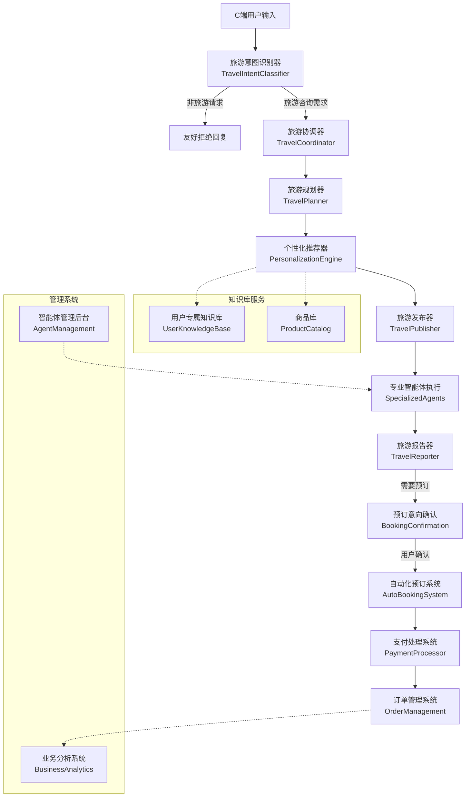
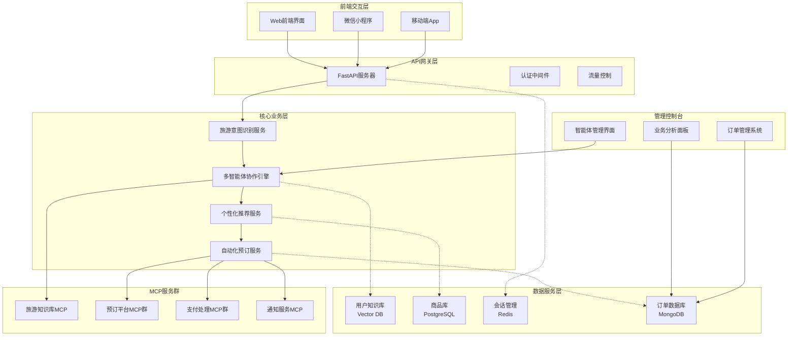

# 旅游多智能体产品需求分析方案

## 📋 产品概述

基于Cooragent多智能体协作平台的**C端旅游智能咨询与自动化预订产品**，通过旅游意图识别、专属知识库、智能体自动优化和一站式预订流程，为C端顾客提供个性化的旅游规划咨询服务。

### 核心价值主张
- **智能意图识别**：自动识别旅游需求，过滤非旅游咨询
- **个性化推荐**：基于用户专属知识库和商品库的精准匹配
- **智能体进化**：持续优化和自动化创建专业旅游智能体
- **一站式服务**：从咨询到下单的完整闭环体验
- **全程追踪**：详细记录用户咨询过程和业务转化

---

## 🎯 需求分析与解决方案

### 需求1：旅游意图识别和智能体流程控制

#### **现状分析**
当前Cooragent已有TravelCoordinator实现基本的旅游任务分类，但需要增强C端意图识别能力。

#### **解决方案**
```typescript
interface TravelIntentClassifier {
  // 旅游意图识别引擎
  analyzeTravelIntent(userInput: string): TravelIntentResult;
  
  // 支持的旅游意图类型
  supportedIntents: [
    'destination_planning',     // 目的地规划
    'itinerary_creation',      // 行程制作
    'budget_optimization',     // 预算优化
    'accommodation_search',    // 住宿查找
    'activity_recommendation', // 活动推荐
    'transportation_planning', // 交通规划
    'travel_consultation'      // 旅游咨询
  ];
  
  // 非旅游请求过滤
  filterNonTravelRequests(input: string): boolean;
}
```

#### **技术实现**
- **意图识别智能体**：基于现有TravelCoordinator增强，添加更精准的NLP分类
- **过滤机制**：在coordinator_node层面实现非旅游请求的早期过滤
- **动态路由**：根据意图类型自动路由到相应的专业智能体

### 需求2：用户专属知识库和商品库

#### **解决方案架构**
```typescript
interface UserTravelKnowledgeBase {
  // 用户专属旅游知识库
  personalKnowledge: {
    destinations: DestinationInfo[];     // 目的地信息
    accommodations: AccommodationInfo[]; // 住宿信息
    activities: ActivityInfo[];          // 活动信息
    restaurants: RestaurantInfo[];       // 餐厅信息
    transportation: TransportInfo[];     // 交通信息
  };
  
  // 商品库管理
  productCatalog: {
    packages: TravelPackage[];           // 旅游套餐
    hotels: HotelProduct[];              // 酒店产品
    flights: FlightProduct[];            // 航班产品
    activities: ActivityProduct[];       // 活动产品
    services: ServiceProduct[];          // 服务产品
  };
  
  // 知识库更新接口
  updateKnowledgeBase(category: string, data: any[]): Promise<void>;
  searchProducts(criteria: SearchCriteria): Promise<ProductResult[]>;
}
```

#### **技术实现**
- **向量数据库**：使用Chroma或Pinecone存储旅游知识向量
- **MCP知识库服务**：创建专门的MCP服务器管理用户知识库
- **智能匹配算法**：基于用户偏好和历史数据的个性化推荐

### 需求3：多智能体创建和迭代优化能力

#### **解决方案**
基于现有AgentFactory机制，增强旅游领域的智能体自动化创建：

```python
# 旅游智能体工厂增强
class TravelAgentFactory:
    def create_specialized_travel_agent(
        self,
        travel_domain: str,      # 'culture_tour', 'business_travel', 'family_trip'
        user_preferences: dict,
        performance_data: dict
    ) -> TravelAgent:
        """基于用户需求和历史表现数据创建专业旅游智能体"""
        
    def optimize_existing_agent(
        self,
        agent_id: str,
        performance_metrics: dict,
        user_feedback: dict
    ) -> OptimizationResult:
        """基于表现数据优化现有智能体"""
```

#### **技术实现**
- **保留现有agent_factory.py**：继承现有智能体工厂能力
- **增加旅游专业化**：添加旅游领域的prompt模板和工具配置
- **自动优化机制**：基于用户反馈和转化率自动调整智能体配置

### 需求4：后台管理系统

#### **管理控制台架构**
```typescript
interface TravelAgentManagementSystem {
  // 智能体管理
  agentManagement: {
    listAllAgents(): Promise<AgentInfo[]>;
    getAgentPerformance(agentId: string): Promise<PerformanceMetrics>;
    reviewAgent(agentId: string, action: 'approve' | 'reject' | 'optimize'): Promise<void>;
    setAgentWeight(agentId: string, weight: number): Promise<void>;
  };
  
  // 性能监控
  performanceMonitoring: {
    getConversionRates(): Promise<ConversionMetrics>;
    getCustomerSatisfaction(): Promise<SatisfactionMetrics>;
    getAgentEfficiency(): Promise<EfficiencyMetrics>;
  };
  
  // 审核工作流
  reviewWorkflow: {
    flagDuplicateAgents(): Promise<DuplicateReport[]>;
    identifyLowPerformingAgents(): Promise<LowPerformanceReport[]>;
    recommendAgentOptimizations(): Promise<OptimizationRecommendation[]>;
  };
}
```

#### **技术实现**
- **管理后台Web界面**：基于FastAPI + React构建
- **性能分析引擎**：集成现有tool_tracker和session管理
- **智能推荐算法**：基于转化率、用户满意度等指标自动评估

### 需求5：订单流程和自动化下单

#### **解决方案**
[[memory:4922258]] 基于现有的自动支付方案文档，实现完整的预订下单流程：

```typescript
interface TravelBookingOrchestrator {
  // 订单确认流程
  confirmBookingIntent(planId: string, userId: string): Promise<BookingConfirmation>;
  
  // 用户授权管理
  requestUserAuthorization(platforms: string[]): Promise<AuthorizationStatus>;
  
  // 自动化预订执行
  executeAutomatedBooking(
    bookingPlan: TravelPlan,
    authTokens: AuthToken[],
    paymentMethods: PaymentMethod[]
  ): Promise<BookingResult>;
  
  // 支付处理集成
  processPayments(
    bookingResults: BookingResult[],
    paymentStrategy: PaymentStrategy
  ): Promise<PaymentResult>;
}
```

#### **技术实现**
- **基于现有MCP支付方案**：集成Stripe、PayPal、支付宝等多渠道支付
- **预订平台集成**：航班、酒店、活动等预订平台的MCP服务器
- **订单状态管理**：实时跟踪预订状态和支付进度

### 需求6：咨询记录追踪

#### **解决方案**
基于现有SessionManager和tool_tracker，增强业务追踪能力：

```python
class TravelConsultationTracker:
    def track_consultation_session(
        self,
        user_id: str,
        session_id: str,
        consultation_data: dict
    ) -> TrackingResult:
        """跟踪用户咨询会话的完整过程"""
        
    def analyze_conversion_funnel(
        self,
        user_id: str,
        time_range: TimeRange
    ) -> ConversionAnalysis:
        """分析用户从咨询到订单的转化漏斗"""
        
    def generate_business_insights(
        self,
        period: str = "monthly"
    ) -> BusinessInsights:
        """生成业务洞察报告"""
```

#### **技术实现**
- **扩展现有session.py**：增加业务事件追踪能力
- **数据分析引擎**：基于用户行为数据的转化分析
- **可视化报表**：实时业务指标监控面板

---

## 🏗️ 核心智能体工作流程设计

### 工作流程架构图



### 核心智能体定义

#### 1. **旅游意图识别器 (TravelIntentClassifier)**
```yaml
角色: 智能的旅游需求识别专家
能力:
  - 自然语言意图分析
  - 旅游vs非旅游请求分类
  - 需求紧急程度评估
工具:
  - NLP分析工具
  - 旅游词典匹配
  - 意图分类模型
```

#### 2. **个性化推荐器 (PersonalizationEngine)**
```yaml
角色: 基于用户数据的个性化推荐专家
能力:
  - 用户偏好分析
  - 历史行为匹配
  - 商品智能推荐
工具:
  - 用户知识库查询
  - 商品库搜索
  - 协同过滤算法
```

#### 3. **自动化预订系统 (AutoBookingSystem)**
```yaml
角色: 智能的旅游产品预订执行专家
能力:
  - 多平台预订编排
  - 实时价格比较
  - 预订冲突检测
工具:
  - 航班预订MCP
  - 酒店预订MCP
  - 活动预订MCP
  - 支付处理MCP
```

---

## 🔧 技术架构设计

### 系统架构图



### 关键技术选型

#### **数据存储**
- **向量数据库**: Chroma/Pinecone (用户知识库)
- **关系数据库**: PostgreSQL (商品库、用户数据)
- **缓存数据库**: Redis (会话管理、实时数据)
- **文档数据库**: MongoDB (订单数据、日志)

#### **MCP服务扩展**
- **旅游知识库MCP**: 个性化知识检索服务
- **预订平台MCP群**: 航班、酒店、活动预订集成
- **支付处理MCP群**: 多渠道支付解决方案
- **通知服务MCP**: 实时消息推送服务

#### **AI/ML组件**
- **意图识别模型**: 基于BERT的多分类模型
- **推荐算法**: 协同过滤 + 内容过滤混合推荐
- **智能体优化**: 基于强化学习的智能体性能优化

---

## 📊 产品功能模块

### 1. **C端用户界面**

#### **主要功能**
- 智能旅游咨询对话
- 个性化旅游方案展示
- 一键预订确认
- 订单状态跟踪
- 个人偏好设置

#### **技术实现**
```typescript
interface UserInterface {
  chatInterface: {
    sendMessage(message: string): Promise<AgentResponse>;
    getConversationHistory(): Promise<ChatHistory>;
    clearConversation(): Promise<void>;
  };
  
  bookingInterface: {
    confirmBooking(planId: string): Promise<BookingConfirmation>;
    trackOrder(orderId: string): Promise<OrderStatus>;
    cancelOrder(orderId: string): Promise<CancellationResult>;
  };
  
  profileInterface: {
    updatePreferences(preferences: UserPreferences): Promise<void>;
    viewBookingHistory(): Promise<BookingHistory>;
    managePaymentMethods(): Promise<PaymentMethod[]>;
  };
}
```

### 2. **智能体管理模块**

#### **管理功能**
- 智能体性能监控
- 重复智能体识别
- 低效智能体审核
- 优秀智能体推荐
- 智能体配置优化

#### **技术实现**
```python
class AgentManagementModule:
    def monitor_agent_performance(self) -> PerformanceReport:
        """监控智能体性能指标"""
        
    def identify_duplicate_agents(self) -> DuplicateReport:
        """识别重复和相似的智能体"""
        
    def review_low_performing_agents(self) -> ReviewReport:
        """审核低效率智能体"""
        
    def recommend_high_value_agents(self) -> RecommendationReport:
        """推荐高价值智能体"""
```

### 3. **业务分析模块**

#### **分析维度**
- 用户咨询转化率
- 智能体性能排行
- 热门旅游目的地
- 收入和利润分析
- 用户满意度评估

#### **可视化界面**
- 实时数据看板
- 转化漏斗分析
- 热力图展示
- 趋势预测图表
- 详细报表导出

---

## 🚀 实施建议

### 开发阶段规划

#### **第一阶段 (1-2个月)：核心功能实现**
1. **意图识别系统**
   - 旅游vs非旅游请求分类
   - 基础意图识别模型训练
   - 集成到现有TravelCoordinator

2. **知识库系统**
   - 用户专属知识库设计
   - 商品库数据模型
   - 基础MCP知识库服务

3. **管理后台基础版**
   - 智能体列表和基础管理
   - 性能监控面板
   - 简单的审核工作流

#### **第二阶段 (2-3个月)：预订和支付集成**
1. **自动化预订系统**
   - 基于现有支付方案实现
   - 多平台预订MCP服务器
   - 订单状态管理系统

2. **支付流程集成**
   - 多渠道支付处理
   - 安全认证和授权
   - 风险控制机制

3. **咨询追踪系统**
   - 用户行为数据收集
   - 转化漏斗分析
   - 业务洞察报告

#### **第三阶段 (1-2个月)：智能化优化**
1. **智能体自动优化**
   - 基于表现数据的自动调优
   - A/B测试框架
   - 智能推荐算法优化

2. **个性化推荐增强**
   - 协同过滤算法
   - 实时推荐引擎
   - 用户画像建模

3. **高级管理功能**
   - 智能体重复检测
   - 自动化审核流程
   - 高级分析报表

### 技术风险评估

#### **高风险项**
- **支付安全合规**：需要PCI-DSS认证和安全审计
- **多平台API集成**：第三方API稳定性和变更风险
- **数据隐私保护**：GDPR/个人信息保护法合规

#### **中等风险项**
- **AI模型准确性**：意图识别和推荐算法的准确率
- **系统性能扩展**：高并发场景下的系统稳定性
- **用户体验一致性**：多端界面的体验统一

#### **低风险项**
- **基础架构搭建**：基于成熟的Cooragent框架
- **MCP服务集成**：标准化协议，集成相对容易
- **数据存储方案**：成熟的数据库技术栈

### 成本预算估算

#### **开发成本**
- **团队人员** (6个月)：前端2人 + 后端3人 + AI工程师2人 + 产品1人
- **基础设施**：云服务器、数据库、CDN等
- **第三方服务**：支付通道费用、API调用费用
- **合规认证**：安全认证、法律咨询费用

#### **运营成本** (年)
- **服务器和带宽**：根据用户规模弹性扩展
- **第三方API费用**：预订平台和支付通道费用
- **人工客服**：处理复杂问题和异常情况
- **营销推广**：用户获取和品牌推广

---

## 📈 预期收益分析

### 业务价值

#### **用户体验提升**
- **便捷性**：一站式旅游咨询和预订服务
- **个性化**：基于用户偏好的精准推荐
- **自动化**：减少人工干预，提升响应速度
- **透明度**：全程可追踪的服务过程

#### **运营效率优化**
- **成本降低**：自动化咨询减少人工成本
- **转化提升**：智能推荐提高预订转化率
- **数据驱动**：基于数据的决策和优化
- **规模扩展**：智能体可无限复制和扩展

### 技术价值

#### **AI能力积累**
- **旅游领域知识**：积累丰富的旅游业务know-how
- **多智能体协作**：提升复杂任务的协作能力
- **个性化推荐**：建立用户偏好预测模型
- **自动化流程**：完善端到端自动化能力

#### **平台生态建设**
- **MCP服务生态**：建立旅游行业的服务生态
- **数据资产**：积累用户行为和偏好数据
- **技术标准**：建立行业技术标准和最佳实践
- **合作伙伴网络**：与旅游供应商建立深度合作

---

## 📋 总结

本产品方案基于Cooragent的成熟技术架构，针对C端旅游咨询场景进行深度定制，具备以下核心优势：

### 技术优势
- **基于成熟框架**：充分利用Cooragent的多智能体协作能力
- **标准化集成**：基于MCP协议的可扩展服务架构
- **智能化程度高**：从意图识别到自动预订的全流程智能化
- **数据驱动优化**：基于用户行为的持续优化机制

### 商业价值
- **市场差异化**：AI驱动的个性化旅游咨询服务
- **用户体验领先**：一站式、自动化的服务体验
- **运营效率提升**：智能化减少人工成本，提高服务质量
- **数据资产积累**：建立用户偏好和行为的数据资产

### 实施可行性
- **技术风险可控**：基于成熟技术栈，风险较低
- **分阶段实施**：可按功能模块逐步实施，降低风险
- **投资回报明确**：通过提升转化率和降低成本实现盈利
- **扩展性强**：可扩展到其他垂直领域

该方案为旅游行业的智能化转型提供了前瞻性的技术架构，将AI智能体的能力与实际业务需求深度融合，为用户提供前所未有的便捷旅游服务体验。 