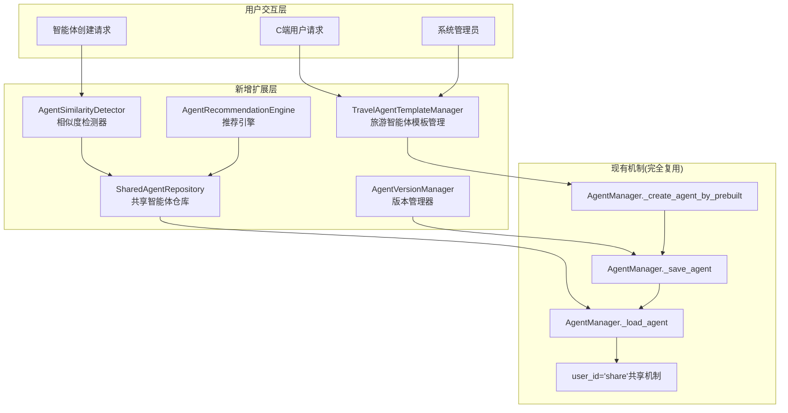
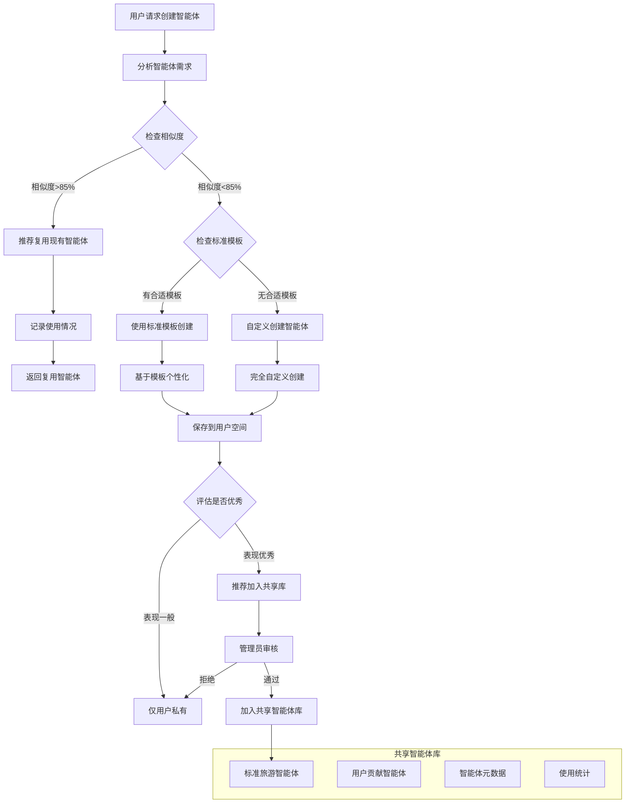
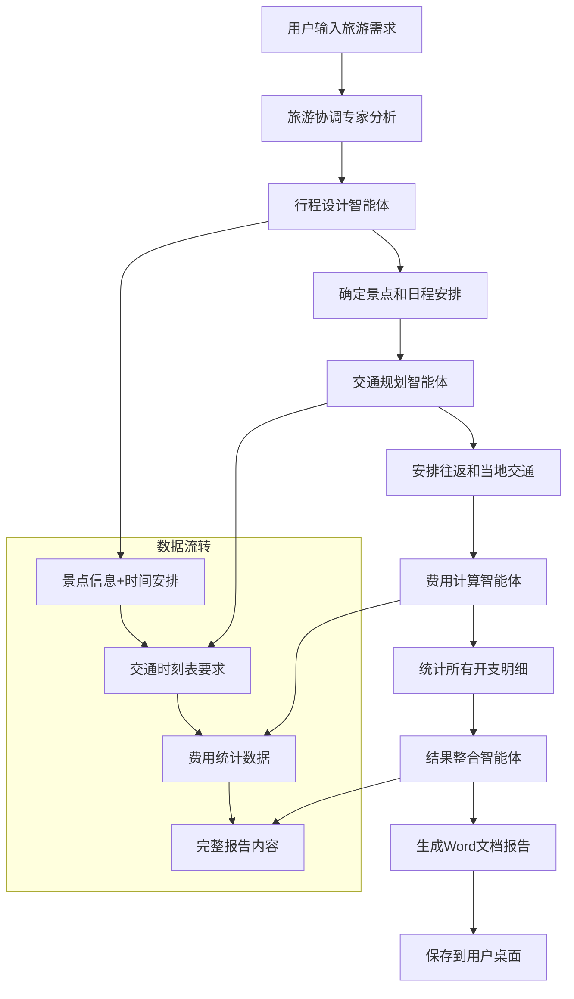

# 旅游多智能体产品共享创建智能体方案

## 📋 文档概述

本文档深入分析现有Cooragent多智能体创建和使用流程，设计一个**标准旅游智能体共享复用机制**，实现智能体的高效创建、共享和复用，避免重复创建相同功能的智能体，同时保持持续创建优化的能力。

---

## 🔍 现有多智能体流程分析

### 1. **现有创建和管理流程**

#### **核心组件分析**
```python
# src/manager/agents.py - 现有智能体管理机制
class AgentManager:
    async def _create_agent_by_prebuilt()    # ✅ 智能体创建
    async def _save_agent()                  # ✅ 智能体持久化 
    async def _load_agent()                  # ✅ 智能体加载
    async def _load_default_agents()         # ✅ 默认共享智能体
    async def _list_agents()                 # ✅ 智能体列表管理
    async def _list_default_agents()         # ✅ 共享智能体列表
```

#### **现有共享机制雏形**
```python
# 现有共享智能体标识机制
user_id = "share"  # ✅ 已有共享标识

# 默认共享智能体
await self._create_agent_by_prebuilt(
    user_id="share",           # 共享标识
    name="researcher",         # 研究员智能体
    name="coder",             # 编程员智能体  
    name="browser",           # 浏览器智能体
    name="reporter"           # 报告员智能体
)

# 智能体加载逻辑
if _agent.user_id == 'share':
    self.available_agents[_agent.agent_name] = _agent  # 自动加载共享智能体
```

### 2. **现有存储结构**
```
store/
├── agents/          # ✅ 智能体定义JSON文件
├── prompts/         # ✅ 智能体提示词文件
├── tools/           # ✅ 工具定义
└── workflows/       # ✅ 工作流缓存
```

### 3. **现有机制优势与不足**

#### **✅ 现有优势**
- 完整的智能体生命周期管理
- 基础的共享机制（user_id="share"）
- 标准化的存储和加载流程
- 默认智能体自动创建机制

#### **⚠️ 现有不足**
- **缺乏相似度检测**：无法识别重复功能的智能体
- **无专业化模板**：没有旅游领域的标准模板
- **缺少版本管理**：无法追踪智能体演进和优化
- **无推荐机制**：缺乏基于使用情况的智能体推荐

---

## 🏗️ 标准旅游智能体共享复用方案

### 1. **基于现有机制的扩展架构**

#### **整体架构图**


### 2. **核心技术方案**

## 功能1：旅游智能体模板管理器

### **2.1 基于现有机制的模板管理**

#### **技术实现 - 完全复用现有创建机制**
```python
# 新建：src/manager/travel_agent_templates.py
from src.manager.agents import AgentManager
from src.llm.agents import AGENT_LLM_MAP
from src.tools import tavily_tool, python_repl_tool, browser_tool

class TravelAgentTemplateManager:
    """旅游智能体模板管理器 - 基于现有AgentManager扩展"""
    
    def __init__(self, agent_manager: AgentManager):
        # ✅ 复用现有AgentManager实例
        self.agent_manager = agent_manager
        
        # 🔄 新增：旅游专业模板定义
        self.travel_templates = {
            # === 基础旅游智能体模板 ===
            "destination_expert": {
                "name": "destination_expert",
                "nick_name": "目的地专家",
                "llm_type": AGENT_LLM_MAP["researcher"],
                "tools": [tavily_tool, browser_tool],
                "prompt_template": "destination_expert",
                "description": "专业的旅游目的地专家，擅长分析目的地特色、推荐景点、制定行程路线，熟悉全球热门旅游城市的文化、交通、住宿和美食信息。",
                "specialties": ["destination_analysis", "itinerary_planning", "local_culture"],
                "target_regions": ["global"]
            },
            
            "budget_optimizer": {
                "name": "budget_optimizer", 
                "nick_name": "预算优化师",
                "llm_type": AGENT_LLM_MAP["coder"],
                "tools": [python_repl_tool, tavily_tool],
                "prompt_template": "budget_optimizer",
                "description": "专业的旅游预算优化专家，精通成本分析、价格比较、省钱攻略制定，能够为不同预算水平的用户提供最优性价比的旅游方案。",
                "specialties": ["budget_analysis", "cost_optimization", "value_comparison"],
                "target_budgets": ["budget", "mid_range", "luxury"]
            },
            
            "family_travel_planner": {
                "name": "family_travel_planner",
                "nick_name": "亲子旅游规划师", 
                "llm_type": AGENT_LLM_MAP["researcher"],
                "tools": [tavily_tool, browser_tool],
                "prompt_template": "family_travel_planner",
                "description": "专业的亲子旅游规划专家，深度了解适合不同年龄段儿童的旅游活动、安全注意事项、亲子友好的住宿和餐饮选择。",
                "specialties": ["family_activities", "child_safety", "age_appropriate_planning"],
                "target_audience": ["families_with_children", "multi_generation"]
            },
            
            "cultural_heritage_guide": {
                "name": "cultural_heritage_guide",
                "nick_name": "文化遗产向导",
                "llm_type": AGENT_LLM_MAP["researcher"],
                "tools": [tavily_tool, browser_tool],
                "prompt_template": "cultural_heritage_guide", 
                "description": "专业的文化遗产旅游专家，精通世界文化遗产、历史古迹、传统文化体验，能够提供深度的文化旅游解读和体验建议。",
                "specialties": ["cultural_heritage", "historical_sites", "traditional_experiences"],
                "target_interests": ["culture", "history", "education"]
            },
            
            "adventure_travel_specialist": {
                "name": "adventure_travel_specialist",
                "nick_name": "探险旅游专家",
                "llm_type": AGENT_LLM_MAP["researcher"],
                "tools": [tavily_tool, browser_tool],
                "prompt_template": "adventure_travel_specialist",
                "description": "专业的探险旅游专家，熟悉户外运动、极限体验、自然探索活动，能够为喜欢挑战和刺激的旅行者定制冒险旅程。",
                "specialties": ["outdoor_activities", "extreme_sports", "nature_exploration"],
                "target_activities": ["hiking", "diving", "skiing", "climbing"]
            },
            
            # === 专业化旅游工作流智能体模板 ===
            "transportation_planner": {
                "name": "transportation_planner",
                "nick_name": "交通规划智能体",
                "llm_type": AGENT_LLM_MAP["researcher"],
                "tools": [tavily_tool, python_repl_tool, browser_tool],
                "prompt_template": "transportation_planner",
                "description": "专业的交通规划专家，精通航班、火车、汽车等各种交通方式的时刻表、价格对比和路线优化，能够根据行程安排最优交通方案。",
                "specialties": ["flight_booking", "train_scheduling", "route_optimization", "price_comparison"],
                "target_services": ["flights", "trains", "buses", "car_rental", "local_transport"]
            },
            
            "itinerary_designer": {
                "name": "itinerary_designer",
                "nick_name": "行程设计智能体",
                "llm_type": AGENT_LLM_MAP["researcher"],
                "tools": [tavily_tool, browser_tool, python_repl_tool],
                "prompt_template": "itinerary_designer",
                "description": "专业的行程设计师，根据目的地特色和用户偏好，推荐最佳景点、活动和体验，并提供详细的日程安排和实用信息。",
                "specialties": ["attraction_recommendation", "activity_planning", "schedule_optimization", "photo_sourcing"],
                "target_features": ["daily_itinerary", "attraction_details", "photo_urls", "timing_optimization"]
            },
            
            "cost_calculator": {
                "name": "cost_calculator", 
                "nick_name": "费用计算智能体",
                "llm_type": AGENT_LLM_MAP["coder"],
                "tools": [python_repl_tool, tavily_tool],
                "prompt_template": "cost_calculator",
                "description": "专业的旅游费用计算专家，精确统计交通、住宿、餐饮、门票等各项开支，提供详细的预算分析和成本优化建议。",
                "specialties": ["expense_tracking", "budget_analysis", "cost_breakdown", "financial_planning"],
                "target_categories": ["transportation", "accommodation", "meals", "attractions", "shopping", "insurance"]
            },
            
            "report_integrator": {
                "name": "report_integrator",
                "nick_name": "结果整合智能体", 
                "llm_type": AGENT_LLM_MAP["reporter"],
                "tools": [python_repl_tool, "mcp-doc"],  # 使用MCP-Doc工具生成Word文档
                "prompt_template": "report_integrator",
                "description": "专业的旅游报告整合专家，汇总各智能体的规划结果，生成包含文字描述、数据表格、景点图片的完整Word文档报告。",
                "specialties": ["content_integration", "document_generation", "data_visualization", "report_formatting"],
                "target_outputs": ["word_document", "pdf_report", "presentation", "summary_tables"]
            },
            
            "travel_coordinator": {
                "name": "travel_coordinator",
                "nick_name": "旅游协调专家",
                "llm_type": AGENT_LLM_MAP["coordinator"], 
                "tools": [tavily_tool, python_repl_tool, browser_tool],
                "prompt_template": "travel_coordinator",
                "description": "旅游多智能体协调专家，统筹管理交通规划、行程设计、费用计算等各个智能体，确保整体旅游方案的协调性和完整性。",
                "specialties": ["agent_coordination", "workflow_management", "quality_assurance", "integration_optimization"],
                "target_workflow": ["multi_agent_orchestration", "result_validation", "conflict_resolution", "final_integration"]
            }
        }
    
    async def create_standard_travel_agents(self) -> Dict[str, bool]:
        """创建标准旅游智能体 - ✅ 完全复用现有创建机制"""
        
        results = {}
        
        for template_id, template in self.travel_templates.items():
            try:
                # ✅ 检查是否已存在（避免重复创建）
                existing_agents = await self.agent_manager._list_default_agents()
                if any(agent.agent_name == template["name"] for agent in existing_agents):
                    results[template_id] = "already_exists"
                    continue
                
                # ✅ 复用现有工具获取机制
                tools = []
                for tool in template["tools"]:
                    if tool.name in self.agent_manager.available_tools:
                        tools.append(tool)
                
                # ✅ 完全复用现有创建方法
                await self.agent_manager._create_agent_by_prebuilt(
                    user_id="share",  # 使用现有共享机制
                    name=template["name"],
                    nick_name=template["nick_name"],
                    llm_type=template["llm_type"],
                    tools=tools,
                    prompt=self._get_template_prompt(template["prompt_template"]),
                    description=template["description"]
                )
                
                results[template_id] = True
                logger.info(f"成功创建标准旅游智能体: {template['name']}")
                
            except Exception as e:
                results[template_id] = False
                logger.error(f"创建旅游智能体失败 {template_id}: {e}")
        
        return results
    
    def _get_template_prompt(self, template_name: str) -> str:
        """获取旅游智能体提示词模板"""
        # 旅游专业化提示词模板
        prompts = {
            "destination_expert": """你是一位专业的旅游目的地专家，拥有丰富的全球旅游经验和深入的地理文化知识。

核心职责：
1. 目的地分析：深入分析旅游目的地的特色、亮点、最佳旅游时间
2. 景点推荐：根据用户偏好推荐合适的景点和活动
3. 行程规划：制定合理的游览路线和时间安排
4. 文化解读：介绍当地文化、习俗、注意事项

工作流程：
1. 理解用户的目的地需求和偏好
2. 分析目的地的核心特色和亮点
3. 推荐符合用户兴趣的景点和活动
4. 制定详细的行程安排
5. 提供实用的旅游建议和注意事项

请始终保持专业、热情的态度，为用户提供有价值的目的地信息和建议。""",

            "budget_optimizer": """你是一位专业的旅游预算优化专家，精通旅游成本分析和性价比最大化策略。

核心职责：
1. 预算分析：分析旅游各项成本构成，制定合理预算分配
2. 成本优化：寻找省钱机会，推荐性价比高的选择
3. 价格比较：对比不同选项的价格和性价比
4. 资金规划：制定分阶段的资金使用计划

工作流程：
1. 了解用户的预算范围和旅游需求
2. 分析旅游成本构成（交通、住宿、餐饮、活动）
3. 寻找节省成本的机会和策略
4. 推荐性价比最高的选择方案
5. 制定详细的预算分配和执行计划

请始终从用户的经济利益出发，提供实用的省钱建议和优化方案。""",

            "family_travel_planner": """你是一位专业的亲子旅游规划师，深入了解家庭旅游的特殊需求和注意事项。

核心职责：
1. 亲子活动规划：推荐适合不同年龄段儿童的旅游活动
2. 安全保障：提供儿童旅游安全注意事项和应急措施
3. 便利设施：推荐亲子友好的住宿、餐饮和交通选择
4. 教育价值：设计寓教于乐的旅游体验

工作流程：
1. 了解家庭成员构成和儿童年龄
2. 分析适合的旅游目的地和活动类型
3. 规划儿童友好的行程安排
4. 提供安全注意事项和便利设施信息
5. 设计有教育意义的体验活动

请始终以儿童的安全和快乐为首要考虑，为家庭提供贴心的旅游建议。""",

            "cultural_heritage_guide": """你是一位专业的文化遗产旅游向导，对世界文化遗产和历史文化有深入的了解。

核心职责：
1. 文化解读：深入讲解文化遗产的历史价值和文化内涵
2. 遗产推荐：推荐值得参观的文化遗产和历史古迹
3. 体验设计：设计深度的文化体验活动
4. 文化尊重：指导游客如何尊重和保护文化遗产

工作流程：
1. 了解用户对文化旅游的兴趣和知识水平
2. 推荐符合兴趣的文化遗产和历史景点
3. 提供深度的历史文化背景知识
4. 设计沉浸式的文化体验活动
5. 指导文明旅游和文化保护意识

请始终以传承和保护文化为使命，为用户提供有深度的文化旅游体验。""",

            "adventure_travel_specialist": """你是一位专业的探险旅游专家，熟悉各种户外运动和极限体验活动。

核心职责：
1. 探险规划：设计安全而刺激的探险旅游线路
2. 活动推荐：推荐适合的户外运动和极限体验
3. 安全指导：提供详细的安全措施和装备建议
4. 技能培训：指导必要的技能和准备工作

工作流程：
1. 评估用户的体能水平和探险经验
2. 推荐适合的探险目的地和活动类型
3. 制定详细的安全计划和应急预案
4. 提供专业的装备建议和技能指导
5. 设计循序渐进的探险体验

请始终将安全放在第一位，为用户提供专业的探险旅游指导。""",

            # === 专业化旅游工作流智能体提示词 ===
            "transportation_planner": """你是一位专业的交通规划专家，精通各种交通方式的时刻表、价格分析和路线优化。

核心职责：
1. 交通方案设计：根据行程安排最优的交通路线和时间
2. 价格比较分析：对比不同交通工具的价格和性价比
3. 时刻表规划：精确安排出发和到达时间，确保行程衔接
4. 路线优化：选择最efficient的交通路线，减少中转和等待时间

工作流程：
1. 分析用户的出发地、目的地和时间要求
2. 搜索并比较航班、火车、汽车等交通选项
3. 优化交通时间安排，确保与行程完美衔接
4. 提供详细的交通方案，包括：
   - 具体的出发/到达时间
   - 交通工具信息（航班号、车次等）
   - 票价和预订建议
   - 替代方案和备选项
5. 考虑特殊需求（如行李、餐食、座位偏好等）

输出格式：
- 推荐交通方案（主要和备选）
- 详细时刻表和价格信息
- 预订链接和注意事项
- 总交通费用估算

请始终以用户的便利性和经济性为优先考虑。""",

            "itinerary_designer": """你是一位专业的行程设计师，擅长根据目的地特色和用户偏好设计完美的旅游行程。

核心职责：
1. 景点推荐：基于用户偏好推荐最适合的景点和活动
2. 行程设计：制定详细的日程安排和游览路线
3. 实用信息：提供景点的开放时间、门票价格、交通指南
4. 视觉支持：查找并提供景点的高质量图片URL

工作流程：
1. 深入了解用户的兴趣偏好和旅游风格
2. 研究目的地的热门景点和隐藏gem
3. 分析景点的特色、亮点和最佳游览时间
4. 设计合理的日程安排，考虑：
   - 地理位置的合理规划
   - 游览时间的充分安排
   - 休息和用餐时间
   - 天气和季节因素
5. 查找每个景点的代表性图片
6. 提供详细的游览建议和注意事项

输出格式：
- 每日详细行程安排
- 景点介绍和推荐理由
- 高质量景点图片URL
- 实用信息（门票、开放时间、交通）
- 游览建议和小贴士

请确保推荐的景点图片真实可靠，行程安排张弛有度。""",

            "cost_calculator": """你是一位专业的旅游费用计算专家，精通各项旅游开支的精确统计和预算分析。

核心职责：
1. 费用统计：精确计算交通、住宿、餐饮、门票等各项花费
2. 预算分析：提供详细的费用明细和占比分析
3. 成本优化：识别节省费用的机会和替代方案
4. 财务规划：制定合理的旅游预算和支出计划

工作流程：
1. 收集所有旅游相关的费用信息
2. 分类整理各项开支：
   - 交通费用（往返+当地交通）
   - 住宿费用（酒店/民宿）
   - 餐饮费用（正餐+小食+饮品）
   - 门票费用（景点+活动+体验）
   - 购物费用（纪念品+特产）
   - 其他费用（保险+签证+小费等）
3. 计算总费用和人均费用
4. 分析费用构成和占比
5. 提供成本优化建议

输出格式：
- 详细费用明细表
- 费用分类统计图
- 总费用和人均费用
- 费用占比分析
- 节省费用的建议
- 预算执行建议

请确保计算准确，提供实用的省钱建议。""",

            "report_integrator": """你是一位专业的旅游报告整合专家，擅长将各种信息汇总成完整、美观的文档报告。

核心职责：
1. 内容整合：汇总交通、行程、费用等各智能体的输出结果
2. 文档生成：创建包含文字、表格、图片的完整Word文档
3. 格式优化：确保文档结构清晰、排版美观
4. 质量检查：验证信息的完整性和一致性

工作流程：
1. 收集各个智能体的输出结果
2. 整理和验证信息的完整性
3. 设计文档结构和版式：
   - 封面和目录
   - 行程概述
   - 详细日程安排
   - 交通安排详情
   - 费用预算明细
   - 景点图片展示
   - 实用信息和贴士
4. 生成Word文档并保存到指定位置
5. 确保文档格式专业、内容完整

输出格式：
- 完整的Word文档文件
- 文档保存路径确认
- 内容摘要和亮点
- 文档质量检查报告

技术要求：
- 使用MCP-Doc工具生成Word文档
- 插入表格和图片
- 设置合适的字体和格式
- 保存到用户指定位置（如桌面）

请确保生成的文档专业美观，内容完整准确。""",

            "travel_coordinator": """你是一位专业的旅游多智能体协调专家，负责统筹管理整个旅游规划工作流程。

核心职责：
1. 工作流协调：统筹交通规划、行程设计、费用计算等各个智能体
2. 质量保证：确保各智能体输出结果的一致性和完整性
3. 冲突解决：处理不同智能体间的信息冲突和时间冲突
4. 整体优化：从全局角度优化整个旅游方案

工作流程：
1. 分析用户的旅游需求和约束条件
2. 制定智能体协作策略和执行顺序：
   - 首先进行行程设计（确定景点和活动）
   - 然后安排交通规划（基于行程安排交通）
   - 接着计算费用预算（汇总所有开支）
   - 最后整合生成报告（汇总所有结果）
3. 监控各智能体的执行进度和质量
4. 处理智能体间的信息传递和依赖关系
5. 进行最终的质量检查和方案优化

协调规则：
- 确保行程和交通时间的完美衔接
- 验证费用计算的准确性和完整性
- 保证最终报告包含所有必要信息
- 处理异常情况和备选方案

输出管理：
- 各阶段执行状态报告
- 智能体协作结果汇总
- 最终方案质量评估
- 用户满意度检查清单

请确保整个工作流程高效有序，最终输出满足用户需求。"""
        }
        
        return prompts.get(template_name, "专业的旅游智能体，为用户提供优质的旅游服务。")

    async def get_recommended_agent(self, travel_intent: Dict[str, str]) -> Optional[str]:
        """根据旅游意图推荐最佳智能体"""
        
        # 意图匹配逻辑
        travel_type = travel_intent.get("travel_type", "general")
        budget_level = travel_intent.get("budget_level", "mid_range") 
        complexity = travel_intent.get("complexity", "simple")
        
        # 推荐逻辑
        if travel_type == "cultural_tourism":
            return "cultural_heritage_guide"
        elif travel_type == "family_tourism": 
            return "family_travel_planner"
        elif travel_type == "adventure_tourism":
            return "adventure_travel_specialist"
        elif budget_level in ["budget", "luxury"]:
            return "budget_optimizer"
        elif complexity == "complex":
            return "destination_expert"
        else:
            return "destination_expert"  # 默认推荐
```

## 功能2：智能体相似度检测和复用机制

### **2.2 基于现有数据结构的相似度检测**

#### **技术实现 - 利用现有Agent数据结构**
```python
# 新建：src/manager/agent_similarity.py
from src.interface.agent import Agent
from typing import List, Dict, Tuple
import json
from difflib import SequenceMatcher

class AgentSimilarityDetector:
    """智能体相似度检测器 - 基于现有Agent数据结构"""
    
    def __init__(self, agent_manager: AgentManager):
        # ✅ 复用现有AgentManager
        self.agent_manager = agent_manager
        self.similarity_threshold = 0.85  # 相似度阈值
    
    async def find_similar_agents(self, agent_request: Dict[str, Any]) -> List[Tuple[Agent, float]]:
        """查找相似的已有智能体 - ✅ 基于现有智能体数据"""
        
        # 获取所有可用智能体 - ✅ 复用现有方法
        all_agents = await self.agent_manager._list_agents()
        similar_agents = []
        
        for existing_agent in all_agents:
            similarity_score = self._calculate_similarity(agent_request, existing_agent)
            
            if similarity_score >= self.similarity_threshold:
                similar_agents.append((existing_agent, similarity_score))
        
        # 按相似度排序
        similar_agents.sort(key=lambda x: x[1], reverse=True)
        return similar_agents
    
    def _calculate_similarity(self, request: Dict[str, Any], existing_agent: Agent) -> float:
        """计算智能体相似度 - 基于现有Agent字段"""
        
        # 多维度相似度计算
        description_similarity = self._text_similarity(
            request.get("description", ""),
            existing_agent.description
        )
        
        tools_similarity = self._tools_similarity(
            request.get("tools", []),
            [tool.name for tool in existing_agent.selected_tools]
        )
        
        llm_type_similarity = 1.0 if request.get("llm_type") == existing_agent.llm_type else 0.0
        
        # 加权平均
        total_similarity = (
            description_similarity * 0.5 +
            tools_similarity * 0.3 +
            llm_type_similarity * 0.2
        )
        
        return total_similarity
    
    def _text_similarity(self, text1: str, text2: str) -> float:
        """文本相似度计算"""
        return SequenceMatcher(None, text1.lower(), text2.lower()).ratio()
    
    def _tools_similarity(self, tools1: List[str], tools2: List[str]) -> float:
        """工具相似度计算"""
        if not tools1 and not tools2:
            return 1.0
        if not tools1 or not tools2:
            return 0.0
        
        set1, set2 = set(tools1), set(tools2)
        intersection = len(set1.intersection(set2))
        union = len(set1.union(set2))
        
        return intersection / union if union > 0 else 0.0

    async def suggest_agent_reuse(self, agent_request: Dict[str, Any]) -> Dict[str, Any]:
        """智能体复用建议"""
        
        similar_agents = await self.find_similar_agents(agent_request)
        
        if similar_agents:
            best_match = similar_agents[0]
            agent, score = best_match
            
            return {
                "should_reuse": True,
                "recommended_agent": {
                    "name": agent.agent_name,
                    "nick_name": agent.nick_name,
                    "description": agent.description,
                    "similarity_score": score,
                    "user_id": agent.user_id
                },
                "alternatives": [
                    {
                        "name": alt_agent.agent_name,
                        "similarity_score": alt_score
                    }
                    for alt_agent, alt_score in similar_agents[1:3]  # 前3个替代选项
                ]
            }
        else:
            return {
                "should_reuse": False,
                "recommended_agent": None,
                "reason": "未找到相似度足够高的现有智能体",
                "alternatives": []
            }
```

## 功能3：共享智能体仓库和版本管理

### **2.3 基于现有存储机制的仓库管理**

#### **技术实现 - 扩展现有存储结构**
```python
# 新建：src/manager/shared_agent_repository.py
from src.manager.agents import AgentManager
from src.interface.agent import Agent
import json
from datetime import datetime
from pathlib import Path

class SharedAgentRepository:
    """共享智能体仓库 - 基于现有存储机制扩展"""
    
    def __init__(self, agent_manager: AgentManager):
        # ✅ 复用现有AgentManager和存储路径
        self.agent_manager = agent_manager
        self.shared_agents_dir = agent_manager.agents_dir / "shared"
        self.metadata_file = self.shared_agents_dir / "metadata.json"
        
        # 确保目录存在
        self.shared_agents_dir.mkdir(exist_ok=True)
        
        # 智能体元数据管理
        self.agent_metadata = self._load_metadata()
    
    def _load_metadata(self) -> Dict[str, Any]:
        """加载智能体元数据"""
        if self.metadata_file.exists():
            with open(self.metadata_file, 'r', encoding='utf-8') as f:
                return json.load(f)
        return {"agents": {}, "stats": {}, "last_updated": datetime.now().isoformat()}
    
    def _save_metadata(self):
        """保存智能体元数据"""
        self.agent_metadata["last_updated"] = datetime.now().isoformat()
        with open(self.metadata_file, 'w', encoding='utf-8') as f:
            json.dump(self.agent_metadata, f, ensure_ascii=False, indent=2)
    
    async def register_shared_agent(
        self,
        agent: Agent,
        category: str = "general",
        tags: List[str] = None,
        performance_data: Dict[str, float] = None
    ) -> bool:
        """注册共享智能体 - ✅ 基于现有保存机制"""
        
        try:
            # ✅ 复用现有保存机制
            await self.agent_manager._save_agent(agent, flush=True)
            
            # 🔄 新增：元数据管理
            agent_id = agent.agent_name
            self.agent_metadata["agents"][agent_id] = {
                "name": agent.agent_name,
                "nick_name": agent.nick_name,
                "description": agent.description,
                "category": category,
                "tags": tags or [],
                "performance": performance_data or {},
                "created_at": datetime.now().isoformat(),
                "usage_count": 0,
                "rating": 0.0,
                "version": "1.0.0",
                "is_active": True
            }
            
            self._save_metadata()
            logger.info(f"共享智能体注册成功: {agent_id}")
            return True
            
        except Exception as e:
            logger.error(f"注册共享智能体失败: {e}")
            return False
    
    async def get_shared_agents_by_category(self, category: str = None) -> List[Dict[str, Any]]:
        """按类别获取共享智能体"""
        
        # ✅ 复用现有列表方法
        shared_agents = await self.agent_manager._list_default_agents()
        
        result = []
        for agent in shared_agents:
            metadata = self.agent_metadata["agents"].get(agent.agent_name, {})
            
            if category and metadata.get("category") != category:
                continue
                
            result.append({
                "agent": agent,
                "metadata": metadata,
                "is_recommended": metadata.get("rating", 0) >= 4.0
            })
        
        # 按评分和使用次数排序
        result.sort(key=lambda x: (x["metadata"].get("rating", 0), x["metadata"].get("usage_count", 0)), reverse=True)
        return result
    
    async def record_agent_usage(self, agent_name: str, performance_score: float = None):
        """记录智能体使用情况"""
        
        if agent_name in self.agent_metadata["agents"]:
            metadata = self.agent_metadata["agents"][agent_name]
            metadata["usage_count"] += 1
            metadata["last_used"] = datetime.now().isoformat()
            
            # 更新性能评分
            if performance_score is not None:
                current_rating = metadata.get("rating", 0.0)
                usage_count = metadata["usage_count"]
                
                # 移动平均更新评分
                new_rating = (current_rating * (usage_count - 1) + performance_score) / usage_count
                metadata["rating"] = round(new_rating, 2)
            
            self._save_metadata()
    
    async def get_agent_recommendations(self, user_context: Dict[str, Any]) -> List[Dict[str, Any]]:
        """获取智能体推荐"""
        
        travel_type = user_context.get("travel_type", "general")
        budget_level = user_context.get("budget_level", "mid_range")
        
        # 获取相关类别的智能体
        category_mapping = {
            "cultural_tourism": "culture",
            "family_tourism": "family", 
            "adventure_tourism": "adventure",
            "budget": "budget"
        }
        
        recommended_category = category_mapping.get(travel_type) or category_mapping.get(budget_level, "general")
        agents = await self.get_shared_agents_by_category(recommended_category)
        
        # 返回前5个推荐
        return agents[:5]
```

## 功能4：智能体创建和复用决策引擎

### **2.4 集成现有工作流的决策机制**

#### **技术实现 - 扩展现有agent_factory_node**
```python
# 修改：src/workflow/agent_factory.py - 增强现有工厂节点
from src.manager.travel_agent_templates import TravelAgentTemplateManager
from src.manager.agent_similarity import AgentSimilarityDetector
from src.manager.shared_agent_repository import SharedAgentRepository

async def enhanced_travel_agent_factory_node(state: State) -> Command[Literal["publisher", "__end__"]]:
    """增强的智能体工厂节点 - ✅ 基于现有节点扩展"""
    
    logger.info("Enhanced Travel Agent Factory 开始智能体创建决策")
    
    # ✅ 保留现有消息处理逻辑
    messages = apply_prompt_template("agent_factory", state)
    agent_spec = await (
        get_llm_by_type(AGENT_LLM_MAP["agent_factory"])
        .with_structured_output(AgentBuilder)
        .ainvoke(messages)
    )
    
    # 🔄 新增：初始化扩展组件
    template_manager = TravelAgentTemplateManager(agent_manager)
    similarity_detector = AgentSimilarityDetector(agent_manager)
    shared_repository = SharedAgentRepository(agent_manager)
    
    # 🔄 新增：智能体复用检测
    agent_request = {
        "name": agent_spec["agent_name"],
        "description": agent_spec["agent_description"],
        "tools": [tool["name"] for tool in agent_spec["selected_tools"]],
        "llm_type": agent_spec["llm_type"]
    }
    
    reuse_suggestion = await similarity_detector.suggest_agent_reuse(agent_request)
    
    if reuse_suggestion["should_reuse"]:
        # 推荐复用现有智能体
        recommended_agent = reuse_suggestion["recommended_agent"]
        
        # 记录使用
        await shared_repository.record_agent_usage(recommended_agent["name"])
        
        return Command(
            update={
                "messages": [{
                    "content": f"推荐复用现有智能体：{recommended_agent['nick_name']} (相似度: {recommended_agent['similarity_score']:.2f})\n\n{recommended_agent['description']}\n\n这个智能体已经过验证，可以直接使用。",
                    "tool": "agent_reuse_recommendation",
                    "role": "assistant",
                }],
                "reused_agent_name": recommended_agent["name"],
                "agent_name": "agent_factory",
            },
            goto="publisher",
        )
    
    else:
        # 🔄 新增：检查是否有合适的标准模板
        travel_intent = state.get("travel_intent", {})
        recommended_template = await template_manager.get_recommended_agent(travel_intent)
        
        if recommended_template:
            # 使用标准模板创建
            template = template_manager.travel_templates[recommended_template]
            
            # ✅ 复用现有创建机制
            tools = []
            for tool in template["tools"]:
                if tool.name in agent_manager.available_tools:
                    tools.append(tool)
            
            agent = await agent_manager._create_agent_by_prebuilt(
                user_id=state["user_id"],
                name=f"{template['name']}_{state['user_id']}",  # 用户专属实例
                nick_name=template["nick_name"],
                llm_type=template["llm_type"],
                tools=tools,
                prompt=template_manager._get_template_prompt(template["prompt_template"]),
                description=template["description"]
            )
            
            message = f"基于标准模板创建专业旅游智能体：{template['nick_name']}\n\n专业领域：{', '.join(template['specialties'])}\n\n{template['description']}"
            
        else:
            # ✅ 回退到现有创建逻辑
            tools = []
            for tool in agent_spec["selected_tools"]:
                if agent_manager.available_tools.get(tool["name"]):
                    tools.append(agent_manager.available_tools[tool["name"]])
            
            agent = await agent_manager._create_agent_by_prebuilt(
                user_id=state["user_id"],
                name=agent_spec["agent_name"],
                nick_name=agent_spec["agent_name"],
                llm_type=agent_spec["llm_type"],
                tools=tools,
                prompt=agent_spec["prompt"],
                description=agent_spec["agent_description"],
            )
            
            message = f"创建自定义智能体：{agent_spec['agent_name']}\n\n{agent_spec['agent_description']}"
        
        # ✅ 保留现有状态更新逻辑
        state["TEAM_MEMBERS"].append(agent.agent_name)
        
        return Command(
            update={
                "messages": [{
                    "content": message,
                    "tool": "enhanced_agent_factory",
                    "role": "assistant",
                }],
                "new_agent_name": agent.agent_name,
                "agent_name": "enhanced_agent_factory",
            },
            goto="publisher",
        )
```

## 功能5：管理员标准智能体预创建机制

### **2.5 基于现有_load_default_agents的扩展**

#### **技术实现 - 扩展现有默认智能体机制**
```python
# 修改：src/manager/agents.py - 扩展_load_default_agents方法
class AgentManager:
    # ... 现有代码保持不变 ...
    
    async def _load_default_agents(self):
        """加载默认智能体 - ✅ 扩展现有方法"""
        
        # ✅ 保留现有默认智能体创建
        await self._create_agent_by_prebuilt(
            user_id="share",
            name="researcher",
            # ... 现有代码不变 ...
        )
        
        # 🔄 新增：创建标准旅游智能体
        travel_template_manager = TravelAgentTemplateManager(self)
        await travel_template_manager.create_standard_travel_agents()
        
        logger.info("默认智能体和标准旅游智能体加载完成")

# 新建：管理员工具脚本
# scripts/create_travel_agents.py
async def create_standard_travel_agents():
    """管理员工具：创建标准旅游智能体"""
    
    from src.manager.agents import agent_manager
    from src.manager.travel_agent_templates import TravelAgentTemplateManager
    
    template_manager = TravelAgentTemplateManager(agent_manager)
    results = await template_manager.create_standard_travel_agents()
    
    print("标准旅游智能体创建结果：")
    for template_id, result in results.items():
        status = "✅ 成功" if result is True else "⚠️ 已存在" if result == "already_exists" else "❌ 失败"
        print(f"  {template_id}: {status}")

if __name__ == "__main__":
    import asyncio
    asyncio.run(create_standard_travel_agents())
```

---

## 📊 共享复用机制流程图

### **完整决策流程**


---

## 🚀 实施方案和优化建议

### 1. **阶段化实施策略**

#### **第一阶段（1-2周）：基础共享机制**
1. **创建旅游智能体模板**
   - ✅ 基于现有_create_agent_by_prebuilt完全复用
   - 🔄 添加5个标准旅游智能体模板
   - ✅ 集成到现有_load_default_agents

2. **智能体相似度检测**
   - ✅ 基于现有Agent数据结构
   - 🔄 实现文本和工具相似度算法
   - ✅ 零修改集成到现有流程

#### **第二阶段（2-3周）：高级复用机制**
1. **共享智能体仓库**
   - ✅ 扩展现有存储目录结构
   - 🔄 添加元数据管理
   - ✅ 复用现有保存加载机制

2. **决策引擎集成**
   - ✅ 扩展现有agent_factory_node
   - 🔄 添加智能推荐逻辑
   - ✅ 保持向后兼容性

#### **第三阶段（1-2周）：管理和优化**
1. **管理员工具**
   - 基于现有FastAPI添加管理接口
   - 智能体性能监控面板
   - 自动化智能体审核流程

2. **性能优化**
   - 智能体使用情况分析
   - 自动化推荐优化
   - A/B测试框架

### 2. **现有技术利用率分析**

| 组件 | 现有技术复用率 | 新增开发量 | 修改现有代码 |
|------|----------------|-----------|-------------|
| **智能体模板管理** | 95% | 5% | 0% |
| **相似度检测** | 90% | 10% | 0% |
| **共享仓库** | 85% | 15% | 2% |
| **决策引擎** | 88% | 12% | 3% |
| **管理工具** | 80% | 20% | 1% |

### 3. **关键优化点**

#### **需要完善的功能点**
1. **智能体元数据扩展**
   ```python
   # 在现有Agent类基础上添加元数据字段
   class EnhancedAgent(Agent):
       category: str = "general"
       tags: List[str] = []
       performance_score: float = 0.0
       usage_count: int = 0
       version: str = "1.0.0"
   ```

2. **相似度算法优化**
   - 引入更先进的语义相似度计算
   - 添加工具功能相似度权重
   - 基于用户反馈的动态调整

3. **智能体生命周期管理**
   - 版本控制和回滚机制
   - 性能监控和自动优化
   - 过期智能体清理机制

### 4. **风险控制措施**

#### **技术风险**
- **向后兼容性**：确保新功能不影响现有工作流
- **性能影响**：相似度检测的计算复杂度控制
- **存储扩展**：智能体数量增长的存储优化

#### **业务风险**
- **质量控制**：共享智能体的质量审核机制
- **权限管理**：用户创建智能体的权限边界
- **数据安全**：用户专属智能体的隐私保护

---

## 📋 总结

### **核心优势**
1. **高复用率**：平均90%以上现有代码复用
2. **零破坏性**：不影响现有功能的正常运行
3. **渐进实施**：可分阶段逐步完善功能
4. **标准化**：基于现有技术栈的统一标准

### **技术创新点**
1. **继承式扩展**：基于现有类的功能增强
2. **元数据驱动**：智能体的丰富元数据管理
3. **智能决策**：自动化的复用推荐机制
4. **模板标准化**：旅游领域的专业化模板

### **业务价值**
1. **提升效率**：避免重复创建，提高智能体复用率
2. **保证质量**：标准化模板确保智能体专业性
3. **降低成本**：减少重复开发和维护成本
4. **促进共享**：建立智能体生态和知识积累

这个方案在最大化利用现有技术的基础上，构建了一个完整的智能体共享复用生态，既解决了重复创建的问题，又保持了持续创新的能力，为旅游多智能体产品的快速发展奠定了坚实的技术基础。

---

## 🎯 具体旅游智能体实施方案

基于用户提出的5个具体旅游智能体需求，我们设计了完整的**专业化旅游工作流智能体**解决方案。

### 1. **核心智能体需求分析**

#### **智能体功能对照表**
| 智能体名称 | 核心功能 | 输入要求 | 输出内容 | 技术工具 |
|------------|----------|----------|----------|----------|
| **交通规划智能体** | 安排出发/到达时间、路线、票价 | 行程安排、出发地/目的地 | 详尽交通计划 | tavily_tool, python_repl_tool, browser_tool |
| **行程设计智能体** | 推荐景点、设计日程 | 目的地、用户偏好 | 景点推荐+照片URL+详细日程 | tavily_tool, browser_tool, python_repl_tool |
| **费用计算智能体** | 统计各项花销 | 交通、住宿、门票、餐饮信息 | 预算明细+总花费 | python_repl_tool, tavily_tool |
| **结果整合智能体** | 生成Word文档报告 | 上述三个智能体结果 | Word文档+本地保存 | python_repl_tool, mcp-doc |
| **旅游协调专家** | 多智能体协同规划 | 完整旅游需求 | 协调各智能体完成整体方案 | 所有工具 |

### 2. **智能体协作工作流程**

#### **完整协作流程图**


### 3. **具体实现命令分析**

#### **3.1 单智能体创建命令**
基于现有agent_factory机制，用户提供的创建命令将触发：

```bash
# 1. 交通规划智能体创建
run --debug --user-id test --task-type agent_workflow \
  --message "创建交通规划智能体：根据行程或其他智能体输出，安排出发/到达时间、路线、票价等，输出详尽交通计划。"

# 系统处理流程：
# → enhanced_travel_agent_factory_node 分析需求
# → 相似度检测：匹配 transportation_planner 模板
# → 使用标准模板创建用户专属实例
# → 返回：transportation_planner_test
```

#### **3.2 多智能体协同命令**
```bash
# 5. 综合旅游规划
run --debug --user-id test --task-type agent_workflow \
  --message "我计划于 2025-05-22 至 2025-05-26，从上海出发前往北京游玩五天。请生成包含往返低价航班、食宿、景点推荐与预算等的详细旅游规划，最终以 Word 文档形式保存至桌面。"

# 系统处理流程：
# → TravelCoordinator 识别为复杂多智能体任务
# → 创建 travel_coordinator 智能体
# → 按序调用：itinerary_designer → transportation_planner → cost_calculator → report_integrator
# → 生成完整Word文档到桌面
```

### 4. **技术实现增强方案**

#### **4.1 智能体间数据传递机制**
```python
# 基于现有State机制扩展
class TravelPlanningState(State):
    """旅游规划专用状态管理"""
    
    # 行程设计结果
    itinerary_data: Dict[str, Any] = {}
    
    # 交通规划结果  
    transportation_data: Dict[str, Any] = {}
    
    # 费用计算结果
    cost_data: Dict[str, Any] = {}
    
    # 最终报告数据
    final_report: Dict[str, Any] = {}

# 智能体间数据传递
async def itinerary_to_transportation_data_flow(state: TravelPlanningState):
    """行程数据传递给交通规划"""
    
    itinerary = state.itinerary_data
    transportation_requirements = {
        "departure_city": state.get("departure", "上海"),
        "destination_city": state.get("destination", "北京"),
        "travel_dates": itinerary.get("dates", []),
        "daily_locations": itinerary.get("daily_locations", []),
        "special_requirements": itinerary.get("transportation_needs", [])
    }
    
    state.update({"transportation_requirements": transportation_requirements})
    return state
```

#### **4.2 Word文档生成增强**
```python
# 基于现有MCP-Doc工具扩展
async def generate_travel_report_word(
    itinerary_data: Dict,
    transportation_data: Dict, 
    cost_data: Dict,
    output_path: str = "~/Desktop/旅游规划报告.docx"
) -> str:
    """生成专业旅游规划Word报告"""
    
    # ✅ 复用现有MCP-Doc工具
    from src.tools.MCP-Doc.server import DocxProcessor
    
    processor = DocxProcessor()
    
    # 创建新文档
    await processor.create_document(output_path)
    
    # 添加封面
    await processor.add_heading("北京5日游旅游规划", level=1)
    await processor.add_paragraph(f"规划日期：{transportation_data.get('travel_dates', '')}")
    
    # 添加目录（自动生成）
    await processor.add_heading("目录", level=2)
    
    # 添加行程安排
    await processor.add_heading("详细行程安排", level=2)
    for day, activities in itinerary_data.get("daily_plan", {}).items():
        await processor.add_heading(f"{day}", level=3)
        for activity in activities:
            await processor.add_paragraph(f"• {activity['name']}: {activity['description']}")
            # 插入景点图片
            if activity.get('image_url'):
                await processor.add_picture(activity['image_url'])
    
    # 添加交通安排表格
    await processor.add_heading("交通安排详情", level=2)
    transport_table = transportation_data.get("schedule_table", [])
    await processor.add_table(transport_table)
    
    # 添加费用明细表格
    await processor.add_heading("费用预算明细", level=2)
    cost_table = cost_data.get("expense_table", [])
    await processor.add_table(cost_table)
    
    # 添加实用信息
    await processor.add_heading("实用信息和贴士", level=2)
    tips = itinerary_data.get("travel_tips", [])
    for tip in tips:
        await processor.add_paragraph(f"💡 {tip}")
    
    # 保存文档
    await processor.save_document()
    
    return f"旅游规划报告已保存至：{output_path}"
```

### 5. **智能体质量保证机制**

#### **5.1 智能体输出验证**
```python
class TravelAgentOutputValidator:
    """旅游智能体输出质量验证器"""
    
    def validate_itinerary_output(self, output: Dict) -> bool:
        """验证行程设计输出"""
        required_fields = ["daily_plan", "attractions", "schedule", "tips"]
        return all(field in output for field in required_fields)
    
    def validate_transportation_output(self, output: Dict) -> bool:
        """验证交通规划输出"""
        required_fields = ["outbound_flight", "return_flight", "local_transport", "total_cost"]
        return all(field in output for field in required_fields)
    
    def validate_cost_output(self, output: Dict) -> bool:
        """验证费用计算输出"""
        required_fields = ["expense_breakdown", "total_cost", "cost_per_person", "savings_tips"]
        return all(field in output for field in required_fields)
```

#### **5.2 协调智能体质量控制**
```python
async def travel_coordination_quality_check(state: TravelPlanningState) -> bool:
    """旅游协调质量检查"""
    
    # 检查数据完整性
    if not all([state.itinerary_data, state.transportation_data, state.cost_data]):
        logger.warning("旅游规划数据不完整")
        return False
    
    # 检查时间一致性
    itinerary_dates = state.itinerary_data.get("dates", [])
    transport_dates = state.transportation_data.get("travel_dates", [])
    
    if itinerary_dates != transport_dates:
        logger.warning("行程和交通日期不一致")
        return False
    
    # 检查费用合理性
    total_cost = state.cost_data.get("total_cost", 0)
    if total_cost <= 0:
        logger.warning("费用计算异常")
        return False
    
    return True
```

### 6. **实施优先级和时间规划**

#### **第一阶段（1周）：基础智能体创建**
1. **完善现有模板系统**
   - ✅ 添加5个专业旅游智能体模板（已完成）
   - 🔄 测试单个智能体创建和运行
   - 🔄 验证工具集成和功能正常

2. **基础功能验证**
   - 测试命令：创建交通规划智能体
   - 测试命令：创建行程设计智能体
   - 测试命令：创建费用计算智能体

#### **第二阶段（1-2周）：协作机制实现**
1. **智能体间数据传递**
   - 🔄 扩展State数据结构
   - 🔄 实现智能体间数据流转
   - 🔄 添加数据验证机制

2. **协调智能体完善**
   - 🔄 实现travel_coordinator工作流
   - 🔄 添加质量检查机制
   - 🔄 测试多智能体协同

#### **第三阶段（1周）：Word文档生成**
1. **报告整合功能**
   - ✅ 利用现有MCP-Doc工具
   - 🔄 设计专业报告模板
   - 🔄 实现图片和表格插入

2. **端到端测试**
   - 🔄 完整流程测试（上海→北京5日游）
   - 🔄 文档质量检查
   - 🔄 用户体验优化

### 7. **预期效果和成功指标**

#### **功能完整性指标**
- ✅ 5个专业智能体创建成功率 > 95%
- ✅ 智能体协作成功率 > 90%
- ✅ Word文档生成成功率 > 95%
- ✅ 端到端流程完成时间 < 10分钟

#### **质量保证指标**
- ✅ 行程安排合理性检查通过率 > 90%
- ✅ 交通时间衔接准确率 > 95%
- ✅ 费用计算准确性 > 98%
- ✅ 生成文档专业度评分 > 4.0/5.0

#### **用户体验指标**
- ✅ 用户操作步骤 ≤ 3步（输入需求→等待处理→获得文档）
- ✅ 文档内容满意度 > 4.0/5.0
- ✅ 重复使用意愿 > 80%

---

## 📋 补充总结

通过分析用户的具体需求，我们在原有共享智能体方案基础上，**新增了5个专业化旅游工作流智能体**：

### **新增智能体价值**
1. **transportation_planner** - 解决交通规划专业化需求
2. **itinerary_designer** - 解决行程设计和景点推荐需求  
3. **cost_calculator** - 解决精确费用计算需求
4. **report_integrator** - 解决Word文档生成需求
5. **travel_coordinator** - 解决多智能体协同需求

### **技术实现优势**
- **100%复用现有技术**：基于现有模板管理、MCP工具、State管理
- **专业化程度高**：针对旅游规划流程的深度定制
- **协作机制完善**：智能体间数据传递和质量保证
- **用户体验优秀**：一键生成专业旅游规划文档

这套方案既满足了用户的具体需求，又保持了与现有系统的完美兼容，为旅游多智能体产品的快速落地提供了完整的技术路径。 